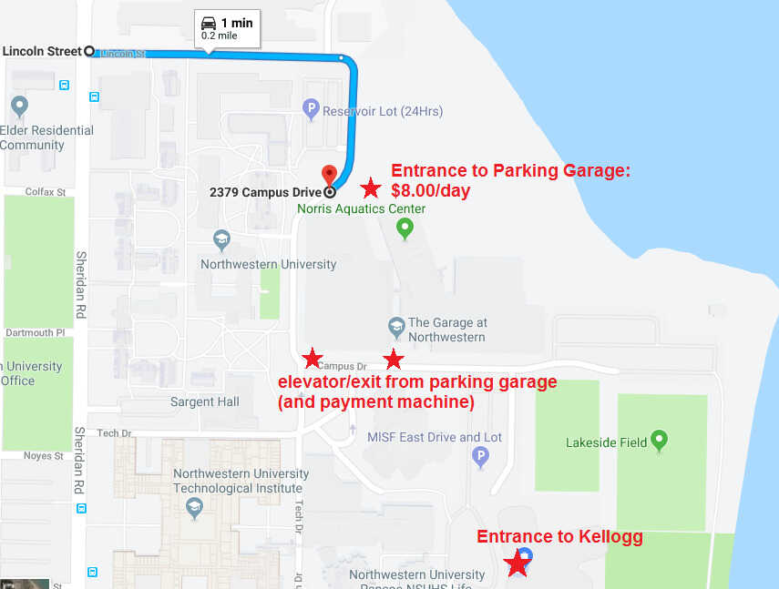

# Driving Directions

## UBER/CAB:
To reach the Kellogg Global Hub from Sheridan Road, turn east on Lincoln Street.  Drive on Lincoln street until you pass the North Parking garage, then turn left to stay on Campus Drive.  Turn right into the parking lot, and drive through the parking lot to the Kellogg dropoff loop.

## DRIVING & PARKING:
Follow the directions above, but stop and park in the North Parking Garage.  Exit from southeast end of the parking garage, and walk southeast to Kellogg Global Hub.  On weekends and after 4pm, you may park in the parking lot adjacent to Kellogg Global Hub (see directions above).

