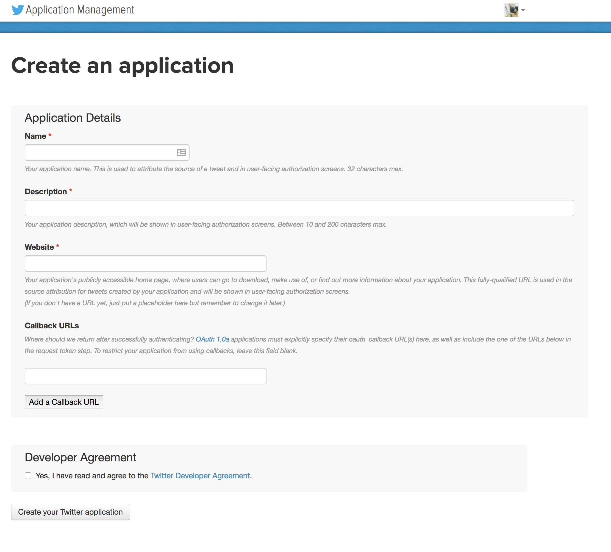

<br>
**Chris Bail**  
**Duke University**  
**[www.chrisbail.net](http://www.chrisbail.net)**  

# Introduction

Application Programming Interfaces, or APIs, have become one of the most important ways to access and transfer data online--- and increasingly APIs can even analyze your data as well. Compared to screen-scraping data, which is often illegal, logistically difficult (or both), APIs are a useful tool to make custom requests for data in manner that is well structured and considerably easier to work with than the HTML or XML data described in my previous tutorials.

# What is an Application Programming Interface?

APIs are tools for building apps or other forms of software. Software developers can combine these tools in various ways---or combine them with tools from other APIs---in order to generate even more useful tools. Most of us use such apps each day. For example, if you install the Spotify app within your Facebook page to share music with your friends, this app is extracting data from Spotify's API and then posting it to your Facebook page by communicating with Facebook's API. There are countless examples of this on the internet at present--- thanks in large part to the advent of Web 2.0, or the historical moment where the internet websites became became much more intertwined and dependent.

The number of APIs that are publicly available has expanded dramatically over the past decade, as the figure below shows. At the time of this writing, the website [Programmable Web](https://www.programmableweb.com/apis/directory) lists more than 19,638 APIs from sites as diverse as Google, Amazon, YouTube, the New York Times, del.icio.us, LinkedIn, and many others. Though the core function of most APIs is to provide software developers with access to data, many APIs now analyze data as well. This might include facial recognition APIs, voice to text APIs, APIs that produce data visualizations, and so on.

<br>


# How does an API work?

In order to illustrate how an API works, it will be useful to start with a very simple one. Suppose we want to use the Google Maps API to geo-code a named entity--- or tag the name of a place with latitude and longitude coordinates. The way that we do this, is to write a URL address that a) names the API; and b) includes the text of the query we want to make. If we Googled "Google Maps API Geocode" we would eventually be pointed towards the documentation for that API and learn that The base-URL for the Google Maps API is https://maps.googleapis.com. We want to use the geocoding function of this API, so we need a URL that points to this more specific part of the API: https://maps.googleapis.com/maps/api/geocode/json?address=. We can then add a named entity to the end of the URL such as "Duke" as follows: https://maps.googleapis.com/maps/api/geocode/json?address=Duke. Take a moment and cut and paste that URL into a web browser. You should see a web page that looks like this:

<br>


What we are seeing is something called JSON data. Though it may look somewhat messy at first glance--- lots of brackets, colons, commas, and indendation patterns---it is in fact very highly structured, and capable of storing complex types of data. Here, we can see that our request to geocode "Duke" not only identified the city within which it is located (Durham), but also the County, Country, and---towards the end of the page---the latitude and longitude data we were looking for. We will learn how to extract that piece of information later. The goal of the current discussion is to give you an idea of what an API is and how they work. 

# API Credentials

Though anyone can make a request to the Google Maps API, getting data from Facebook's API (which Facebook calls the "Graph" API) is considerably more difficult. This is because---with good reason---Facebook does not want a software developer to collect data about people whom they do not have a connection with on Facebook. In order to prevent this, Facebook's Graph API---and many other APIs---require you to obtain "credentials" or codes/passwords that identify you and determine which types of data you are allowed to access. To illustrate this further, let's take a look at a tool Facebook built to help people learn about APIs. It's called the [Graph API explorer](https://developers.facebook.com/tools/explorer).

<br>


If you have a Facebook account--- and if you were logged in--- Facebook will generate credentials for you automatically in the form of something called an "Access Token." In the screenshot above, this appears in a bar towards the top of the screen. This code will give you temporary authorization to make requests from Facebook's Graph API---but ONLY for data that you are allowed to access. The bar that begins with "GET" allows us to make a request from the API. You may notice that there is some jargon---some of it describes the current version of Facebook's API (3.0), and another part of it describes my numeric Facebook ID. Finally, take note of the pane on the lower right side of the screenshot which describes the output of my API call that would appear in my web browser, had I constructed a URL as we did with the Google example above. If we wanted to do the same thing with the Facebook Graph API, we would have to identify the appropriate URL *and* include our access token at the end of the URL. If we did not do this, we would receive an error in our browser telling us we do not have permission to make the request.

Credentials may not only determine your access to people with whom you are connected on a social network, but also other privileges you may have vis-a-vis an API. For example, many APIs charge money for access to their data or services, and thus you will only receive your credentials after setting up an account. As we will see below, some sites also require you to have multiple types of credentials which can be described using a variety of verbiage such as "tokens","keys", or "secrets."

**Now YOU try it!!!**

The Graph API explorer allows you to search for different fields. Take a moment and try to see whether you can make a call for other types of information about yourself, or someone else. If you do not find the information you want, it may be that a) the data does not exist; b) the data exists but you do not have access to it; or c) you have used the wrong syntax to make your query. Don't worry if you can't get the query language right for now--- as you will soon see, there are a number of R packages that will save you the trouble for sites such as Facebook.


# Rate Limiting

Before we make any more calls to APIs, we need to become familiar with an important concept called "Rate Limiting." The credentials in the previous section not only define what type of information we are allowed to access, but also how often we are allowed to make requests for such data. These are known as "rate limits." If we make too many requests for data within too short a period of time, an API will temporarily block us from collected data for a period of time that can range from 15 minutes to 24 hours or more, depending upon the API. Rate limiting is necessary so that APIs are not overwhelmed by too many requests that occur at the same time, which would slow down access to data for everyone. Rate limiting also enables large companies such as Google, Facebook, or Twitter, to prevent developers from collecting large amounts of data that could either compromise their user's confidentiality or threaten their business model (since data has such immense value in today's economy).


The exact timing of rate limiting is not always public, since knowing such time increments could enable developers to "game" the system and make rapid requests as soon as rate limiting has ended. Some APIs, however, allow you to make an API call or query in order to learn how many more requests you can make within a given time period before you are rate limited. 


# An Example with Twitter's API

To illustrate the process of obtaining credentials and better understanding rate limiting, I will now present a worked example of how to obtain different types of data from the Twitter API. The first step in this process is to obtain credentials from Twitter that will allow you to make API calls. Twitter, like many other websites, requires you to create an account in order to receive credentials. To do this, we need to visit https://apps.twitter.com. There, you will have to create a developer account. You will be asked for your mobile phone number because two-factor authentication helps Twitter prevent people from obtaining a large number of different credentials using multiple accounts that could be use to collect large amounts of data without being rate limited---or, for other nefarious purposes such as creating armies of bots that produce spam or attempt to influence elections.

Once you've logged in, click the "Create New App" button at the top right of the screen. Our goal is not to create a fully fledged app at this point, but simply to obtain the credentials necessary to begin making some simple calls to the Twitter API:

<br>


You can name your app whatever you want, describe it however you want, and put in the name of any website you like. The two important things you must do are 1) put the following text in the "Callback URL" text box: `http://127.0.0.1:1410` This number describes the location where the API will return your data-- in this case, it is your web browser (but it could be another site where you want to store the results of the data.); 2) You must uncheck the "Enable Callback Locking" button on the same page. Note: at the time of this writing, Twitter is discussing removing this check box, so you may need to search the documentation of the `rtweet` package for more information if the authentication functions below do not work.

If you followed the steps above, the name of your application should now appear. Click on it, and then click on the "Keys and Access Tokens" tab in order to get your credentials. Unfortunately, Twitter makes developers get two different types of credentials which are listed on that page. These are blurred out in the screenshot below because I do not want people who read this web page to have access to my credneitals, which they could then abuse in various ways: 

<br>


The next step is to define your credentials as string variables in R, which we will then use to authenticate ourselves with the Twitter API. Make sure to select the entire string (by triple clicking),  and make sure that you do not accidentally leave out the first or last digit (or add spaces):

```{r, eval=FALSE}
app_name<-"YOURAPPNAMEHERE"
consumer_key<-"YOURKEYHERE"
consumer_secret<-"YOURSECRETHERE"
```


Next, we are going to install an R package from Github called `rtweet` that helps us make calls to Twitter's API. More specifically, it provides a long list of functions that both a) construct API URL queries for different types of information; and b) parses the resulting data into neat formats. In order to authenticate you may also need to install the `httpuv` package as well (if so, you will receive an error message about this package). If you have never installed a package from Github before you will need the `devtools` package to do this.

```{r, eval=FALSE}
library(devtools)
install_github("mkearney/rtweet")
```

Now, we are ready to authenticate ourselves vis-a-vis Twitter's API. To do this, we are going to use `rtweet`'s `create_token` function, which makes an API call that passes the credentials we defined above, and then opens a web browser with an authentication dialogue that you must authorize by clicking the blue "authorize" button. You should then receive the following message `Authentication complete. Please close this page and return to R.`

```{r, eval=FALSE}
library(rtweet)
create_token(app=app_name, consumer_key=consumer_key, consumer_secret=consumer_secret)
```

Now, we can take full advantage of all of the many useful functions within the `rtweet` function for collecting data from Twitter. Let's begin by extracting 3,000 tweets that use the hashtag #korea.

```{r, echo=FALSE}
library(rtweet)
```

```{r}
korea_tweets<-search_tweets("#Korea", n=50, include_rts = FALSE)
```

This code creates a dataframe called `korea_tweets` which we may then browse. Let's take a look at the first ten tweets, which `rtweet` stores as a variable called `text`.

```{r}
head(korea_tweets$text)
```

Note that this API call also generated a lot of other interesting variables, including the name and screen name of the user, the time of their post, and a variety of other metrics including links to media content and user profiles. A small number of users also enable geolocation of their tweets-- and if that information is available it will appear in this dataset. Here is the full list of variables we collected via our API call above:

```{r}
names(korea_tweets)
```

As a brief aside, the `rtweet` function also interfaces nicely with ggplot and other visualization libraries to produce nice plots of the results above. For instance, let's make a plot of the frequency of tweets about Korea over the past few days:

```{r}
library(ggplot2)
ts_plot(korea_tweets, "3 hours") +
  ggplot2::theme_minimal() +
  ggplot2::theme(plot.title = ggplot2::element_text(face = "bold")) +
  ggplot2::labs(
    x = NULL, y = NULL,
    title = "Frequency of Tweets about Korea from the Past Day",
    subtitle = "Twitter status (tweet) counts aggregated using three-hour intervals",
    caption = "\nSource: Data collected from Twitter's REST API via rtweet"
  )

```

The `search_tweets` function also has a number of useful options or arguments as well. For instance, we can restrict the geographic location of tweets to the United States and English-language tweets using the code below. The code also restricts the results to non-retweets and focuses upon the most recent tweets, rather than a mixture of popular and recent tweets, which is the defualt setting.

```{r}
nk_tweets <- search_tweets("korea",
  "lang:en", geocode = lookup_coords("usa"), 
  n = 1000, type="recent", include_rts=FALSE
  )
```

`rtweet` also enables one to geocode tweets for users who allow Twitter to track their location:

```{r}
geocoded <- lat_lng(nk_tweets)
```

We can then plot these results as follows (you may need to install the `maps` package to do this):

```{r}
library(maps)
par(mar = c(0, 0, 0, 0))
maps::map("state", lwd = .25)
with(geocoded, points(lng, lat, pch = 20, cex = .75, col = rgb(0, .3, .7, .75)))
```

We don't see all 100 tweets in this diagram for an important reason--- we are only looking at people who allow Twitter to track their location (and this is roughly 1 in 100 people at the time of this writing).

Twitter's API is also very useful for collecting data about a given user. Let's take a look at Bernie Sander's Twitter page: http://www.twitter.com/SenSanders. There we can see Senator Sander's description and profile, the full text of his tweets, and---if we click several links---the names of the people he follows, those who follow him, and the tweets which he has "liked."

First, let's get his 5 most recent tweets: 

```{r}
sanders_tweets <- get_timelines(c("sensanders"), n = 5)
head(sanders_tweets$text)
```

Note that you are limited to requesting the last 3,200 tweets, so obtaining a complete database of tweets for a person who tweets very often may not be feasible, or you may need to purchase the data from Twitter itself:

Next, let's get some broader information about Sanders using the `lookup_users` function: 
```{r}
sanders_twitter_profile <- lookup_users("sensanders")
```

This creates a dataframe with a variety of additional variables. For example:

```{r}
sanders_twitter_profile$description
```

```{r}
sanders_twitter_profile$location
```


```{r}
sanders_twitter_profile$location
```


```{r}
sanders_twitter_profile$followers_count
```

We can also use the `get_favorites()` function to identify the Tweets Sanders has recently "liked."

```{r}
sanders_favorites<-get_favorites("sensanders", n=5)
sanders_favorites$text
```

We can also get a list of the people who Sanders follows like this:

```{r}
sanders_follows<-get_followers("sensanders")
```

This produces the user IDs of those followers, and we could get more information about them if we want using the `lookup_users` function. If we were interested in creating a larger social network analysis dataset centered around Sanders, we could scrape the followers of his followers within a loop.

Looping is an efficient way of collecting a large amount of data, but it will also trigger rate limiting. As I mentioned above, however, Twitter enables users to check their rate limits. The `rate_limit()` function in the rtweets package does this as follows:

```{r}
rate_limits<-rate_limit()
head(rate_limits[,1:4])
```

In the code above I created a dataframe that describes the total number of calls I can make within a given deadline (called reset). In this case, it is 15 minutes. In order to prevent rate limiting within a large loop, it is common practice to employ R's `Sys.sleep` function, which tells R to sleep for a certain number of seconds before proceeding to the next iteration of a loop. One example of how you could handle this within a loop is using the following type of `if` statement:

```{r}
follower_limits<-rate_limits[rate_limits$query=="friends/following/ids",]
if(follower_limits$remaining==0){
  Sys.sleep(15*60)
}
```

`rtweet` has a number of other useful functions which I will mention in case they might be useful to readers. `get_trends()` will identify the trending topics on Twitter in a particular area:

```{r}
get_trends("New York")
```

`rtweet` can even control your Twitter account. For example, you can post messages to your Twitter feed from R as follows:

```{r, eval=FALSE}
post_tweet("I love APIs")
```

I have used this function in past work with bots. See for example, [this paper](https://osf.io/preprints/socarxiv/4ygux).

**Now YOU Try it!!!**

To reinforce the skills you've learned in this section, try the following: 1) Collect the most recent 100 tweets from CNN; 2) determine how many people follow CNN on twitter; and, 3) determine if CNN is currently tweeting about any subjects that are trending in your area.

**Wrapping API calls within a Loop**

Very often, one may wish to wrap API calls such as those we have made thus far into a loop to collect data about a long list of users. To illustrate this, let's open a list of the Twitter handles of elected officials in the U.S. that I posted on my Github site:

```{r}
#load list of twitter handles for elected officials
elected_officials<-read.csv("https://cbail.github.io/Elected_Officials_Twitter_Handles.csv",
                            stringsAsFactors = FALSE)
head(elected_officials)
```

As you can see, the second column of this .csv file includes the Twitter "screen names" or handles we need to make API requests about each elected official. Let's grab each official's most recent 100 tweets, and combine them into a single large dataset of recent tweets by elected officials in the U.S. 

```{r, eval=FALSE}
#create empty container to store tweets for each elected official
elected_official_tweets<-as.data.frame(NULL)

for(i in 1:nrow(elected_officials)){
  
  # #first, check rate limits
  rate_limits<-rate_limit()
  limit<-rate_limits[rate_limits$query=="statuses/user_timeline",]
  if(limit$remaining==0){
    Sys.sleep(15*60)
  }

  #pull tweets
  tweets<-get_timeline(elected_officials$screen_name[i], n=100)
  
  #populate dataframe
  elected_official_tweets<-rbind(elected_official_tweets, tweets)
  
  #pause for one second to further prevent rate limiting
  Sys.sleep(1)
  
  #print number/iteration for debugging/monitoring progress
  print(i)
}

```

Note the "if" loop above that makes the loop pause if the `rate_limit` call indicates that we are not allowed to make any more queries from the API for user "statuses," which is what we are pulling with the `rtweet` `get_timeline()` function.


# An Example with Facebook's API

Twitter is a popular source for collecting online data because the vast majority of users make the content of their accounts public. The opposite is true for Facebook, which means one can only a) analyze one's own social network; b) analyze publicly available "fan pages"; or c) develop an app that allows you to request permission to access users' data. In the code below we are going to focus on a and b.

To work with Facebook, we need to once again obtain credentials. We can do that by creating an app at this link: https://developers.facebook.com and following a similar procedure to the one we used for Twitter above OR we can get a temporary "access token" via the graph explorer tool we used above: https://developers.facebook.com/tools/explorer/ Simply cut and paste the authentication token from that page into the code below


```{r, echo=FALSE, eval=FALSE}
library(Rfacebook)
token <- "EAACEdEose0cBAKgxXQ26Mdmh8bLZBI8iHbbpyHfl7xohdl7sP5WzmYaAfgVPfu6m0C5ZCVQ9LBSbqDMfdRShqJH8ulFmADjbRjvMZAQgYx5qJsKzr0OUJm42aP9iZC22wlaXUmO6vQFK8x9YO8aGE8Xwe0esAAPUqzPo8yRw488wNZCYpzmZC1Phi1itRO2PQZD"
```


```{r, eval=FALSE}
install.packages("Rfacebook")
library(Rfacebook)
token <- "INSERTYOURNUMBERHERE"
```

Now let's make our first call- asking the API for some basic information about ourselves and passing the token we defined above as an argument to the `getUsers` function:

```{r, eval=FALSE}
getUsers("me", token=token)
```

And then, if you are interested, you could obtain your "likes" on Facebook and a number of other pieces of data:

```{r, eval=FALSE}
my_likes <- getLikes(user="me", token=token)
```

Because mining our own Facebook data--- or that of our friends--- will be of little interest to most people, let's look at some public Facebook fan pages instead. For example, let's take a look at the Duke University's page: https://www.facebook.com/DukeUniv/

```{r, eval=FALSE}
duke_fb<-getPage("DukeUniv", token=token)
```

This function produced a dataset with the 25 most recent posts from Duke (we could have asked for more by specifying an `n` argument.

```{r, eval=FALSE}
head(duke_fb$message)
```

**Now YOU try it**

Find out which organization has more Facebook likes: CNN or the New York Times. Also, find out which of both organization's 100 most recent posts have received the most "likes."


# Challenges of Working with APIs

By now it is hopefully clear that APIs are an invaluable resource for collecting data from the internet. At the same time, it may also be clear that the process of obtaining credentials, avoiding rate limiting, and understanding the unique jargon employed by those who create each API can mean a lot of hours sifting through the documentation of an API---particularly where there are not well functioning R packages for interfacing with the API in question. If you have to develop your own custom code to work with an API--- or if you need information that is not obtainable using functions within an R package, you may find it useful to browse the source code of the R functions we have discussed above in order to see where they pass the API query language necessary to produce the results we worked with above.


# A list of APIs of interest

There are numerous databases that describe popular APIs on the web, including the aforementioned Programmable Web, but also a variety of crowd-source and user generated lists as well:

https://www.programmableweb.com/
https://github.com/toddmotto/public-apis
https://apilist.fun/

The R OpenSci site also has a list of R packages that work with APIs:

https://ropensci.org/packages/

Happy coding!


