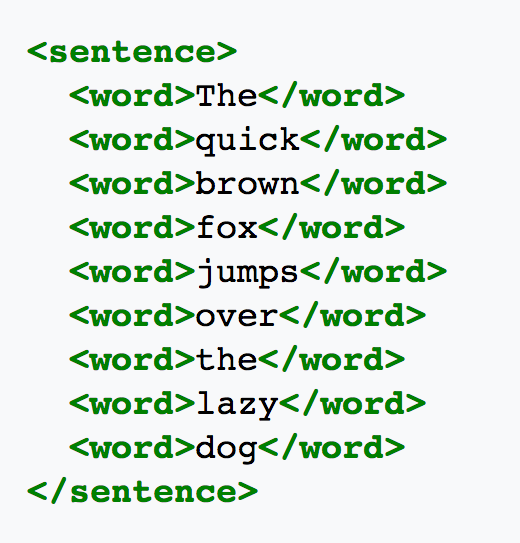

Basic Text Analysis
========================================================
author: Chris Bail, Duke University
date: SICSS, Day 3
transition: none
autosize: true

Character Encoding
========================================================

Tokenization
========================================================

========================================================

# **TEXT PRE-PROCESSING**

Text Pre-processing: PUNCTUATION
========================================================

Text Pre-processing: PUNCTUATION
========================================================

Text Pre-processing: WORD-CASE
========================================================

Text Pre-processing: NUMBERS
========================================================

Text Pre-processing: STEMMING
========================================================

