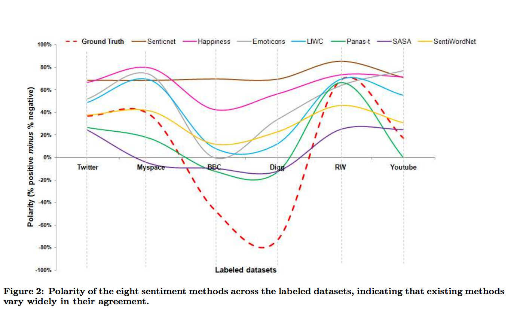

<style>
.reveal section p {
  color: black;
  font-size: .7em;
  font-family: 'Helvetica'; #this is the font/color of text in slides
}


.section .reveal .state-background {
    background: white;}
.section .reveal h1,
.section .reveal p {
    color: black;
    position: relative;
    top: 4%;}

.wrap-url pre code {
  word-wrap:break-word;
}

</style>


Dictionary-Based Analysis
========================================================
author: Chris Bail 
date: Duke University
autosize: true
transition: fade  
  website: https://www.chrisbail.net  
  github: https://github.com/cbail  
  Twitter: https://www.twitter.com/chris_bail

Word Counting
========================================================


Word Counting w/Trump Tweets
========================================================
class: wrap-url
&nbsp;


```r
load(url("https://cbail.github.io/Trump_Tweets.Rdata"))
library(tidytext)
library(dplyr)
tidy_trump_tweets<- trumptweets %>%
    select(created_at,text) %>%
    unnest_tokens("word", text)
```

Without Stop words
========================================================


```r
data("stop_words")
trump_tweet_top_words<-
   tidy_trump_tweets %>%
      anti_join(stop_words) %>%
        count(word) %>%
        arrange(desc(n))
trump_tweet_top_words<-
  trump_tweet_top_words[-grep("https|t.co|amp|rt",
                              trump_tweet_top_words$word),]
top_20<-trump_tweet_top_words[1:20,]
```

Plot
========================================================


```r
library(ggplot2)
ggplot(top_20, aes(x=word, y=n, fill=word))+
  geom_bar(stat="identity")+
  theme_minimal()+
  theme(axis.text.x = element_text(angle = 90, hjust = 1))+
  ylab("Number of Times Word Appears in Trump's Tweets")+
  xlab("")+
  guides(fill=FALSE)
```

Plot
========================================================
&nbsp;


Term Frequency Inverse Document Frequency
========================================================


Term Frequency Inverse Document Frequency
========================================================


tf-idf
========================================================


```r
tidy_trump_tfidf<- trumptweets %>%
    select(created_at,text) %>%
      unnest_tokens("word", text) %>%
        anti_join(stop_words) %>%
           count(word, created_at) %>%
              bind_tf_idf(word, created_at, n)
```


tf-idf
========================================================


```r
top_tfidf<-tidy_trump_tfidf %>%
  arrange(desc(tf_idf))

top_tfidf$word[1]
```

```
[1] "standforouranthem"
```


Creating your own dictionary
========================================================


Creating your own dictionary
========================================================


```r
economic_dictionary<-c("economy","unemployment","trade","tariffs")
```


Applying the dictionary
========================================================


```r
library(stringr)
economic_tweets<-trumptweets[str_detect(trumptweets$text, economic_dictionary),]
head(economic_tweets$text, 2)
```

```
[1] "Great talk with my friend President Mauricio Macri of Argentina this week. He is doing such a good job for Argentina. I support his vision for transforming his country’s economy and unleashing its potential!"                                                         
[2] "The Washington Post and CNN have typically written false stories about our trade negotiations with China. Nothing has happened with ZTE except as it pertains to the larger trade deal. Our country has been losing hundreds of billions of dollars a year with China..."
```

Sentiment Analysis
========================================================


Sentiment Analysis
========================================================


Sentiment Analysis
========================================================


```r
head(get_sentiments("afinn"))
```

```
# A tibble: 6 x 2
  word       score
  <chr>      <int>
1 abandon       -2
2 abandoned     -2
3 abandons      -2
4 abducted      -2
5 abduction     -2
6 abductions    -2
```


Sentiment Analysis
========================================================


```r
trump_tweet_sentiment <- tidy_trump_tweets %>%
  inner_join(get_sentiments("bing")) %>%
    count(created_at, sentiment) 

head(trump_tweet_sentiment)
```

```
# A tibble: 6 x 3
  created_at          sentiment     n
  <dttm>              <chr>     <int>
1 2017-02-05 22:49:42 positive      2
2 2017-02-06 03:36:54 positive      4
3 2017-02-06 12:01:53 negative      3
4 2017-02-06 12:01:53 positive      1
5 2017-02-06 12:07:55 negative      2
6 2017-02-06 16:32:24 negative      3
```


Create Date Object 
========================================================


```r
tidy_trump_tweets$date<-as.Date(tidy_trump_tweets$created_at, 
                                          format="%Y-%m-%d %x")
```

Aggregate Negative Sentiment by Day
========================================================

```r
trump_sentiment_plot <-
  tidy_trump_tweets %>%
    inner_join(get_sentiments("bing")) %>% 
      filter(sentiment=="negative") %>%
          count(date, sentiment)
```


Plot
========================================================

```r
library(ggplot2)

ggplot(trump_sentiment_plot, aes(x=date, y=n))+
  geom_line(color="red")+
    theme_minimal()+
      ylab("Frequency of Negative Words in Trump's Tweets")+
        xlab("Date")
```

Plot
========================================================


Compare with Approval Rating
========================================================
class: wrap-url

```r
trump_approval<-read.csv("https://projects.fivethirtyeight.com/trump-approval-data/approval_topline.csv")

trump_approval$date<-as.Date(trump_approval$modeldate, format="%m/%d/%Y")

approval_plot<-
  trump_approval %>%
    filter(subgroup=="Adults") %>%
      filter(date>min(trump_sentiment_plot$date)) %>% 
          group_by(date) %>%
              summarise(approval=mean(approve_estimate))
```


Plot
========================================================


```r
#plot
ggplot(approval_plot, aes(x=date, y=approval))+
  geom_line(group=1)+
    theme_minimal()+
      ylab("% of American Adults who Approve of Trump")+
        xlab("Date")
```

Plot
========================================================


Linguistic Inquiry Word Count (LIWC)
========================================================


Linguistic Inquiry Word Count (LIWC)
========================================================


So many Sentiments...
========================================================




When should One Use Dictionary-Based Analysis?
========================================================


