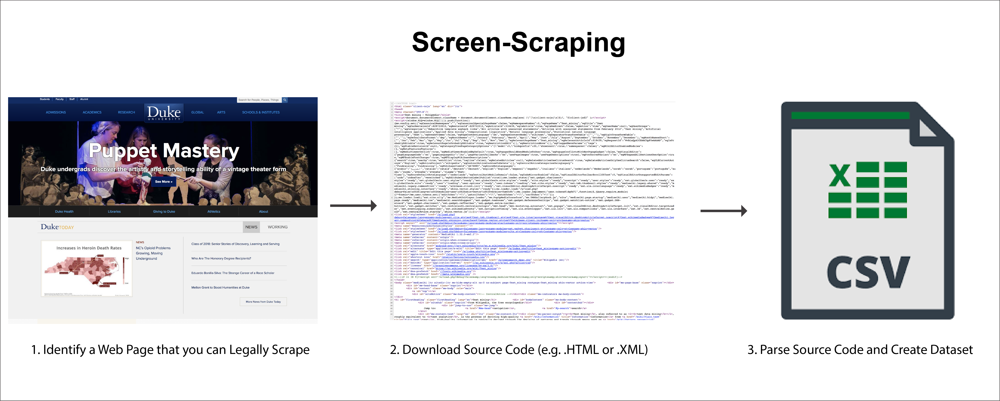
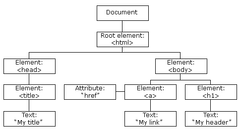
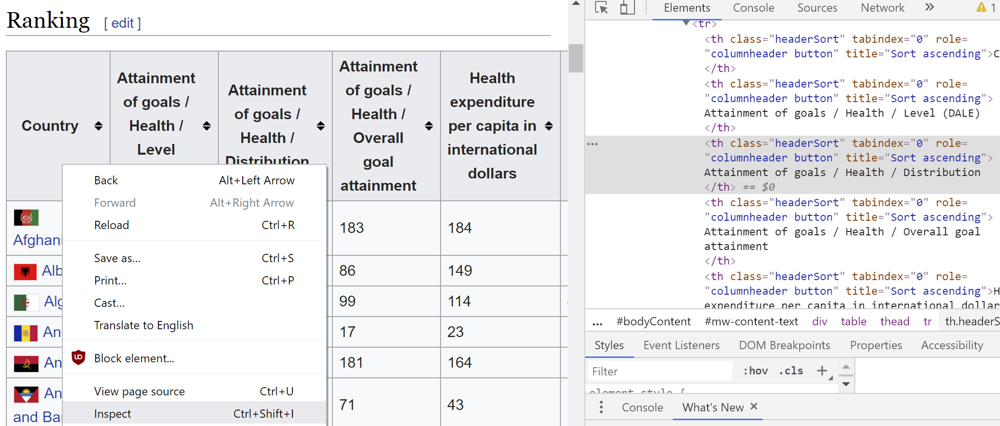
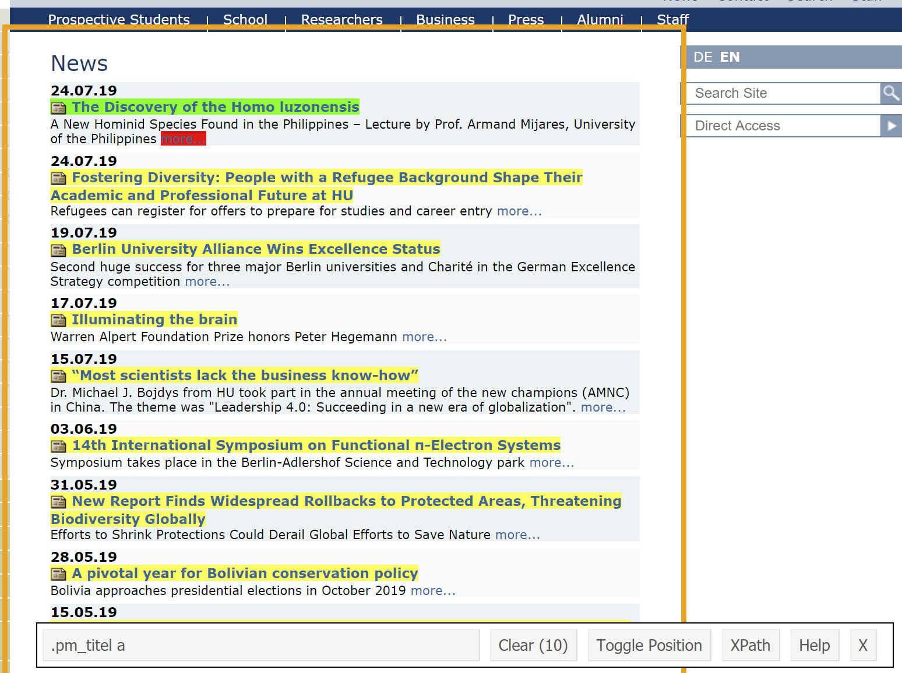

```{r setup, include=FALSE}
# note to students: you can ignore the content of this code chunk
knitr::opts_chunk$set(echo = TRUE, warning = FALSE, message = FALSE,
                      tidy = FALSE, fig.align = "center")

def.chunk.hook  <- knitr::knit_hooks$get("chunk")
knitr::knit_hooks$set(chunk = function(x, options) {
  x <- def.chunk.hook(x, options)
  ifelse(options$size != "normalsize", paste0("\\", 
                          options$size,"\n\n", x, "\n\n \\normalsize"), x)
})

hook_output <- knitr::knit_hooks$get('output')
knitr::knit_hooks$set(output = function(x, options) {
  if (!is.null(n <- options$linewidth)) {
    x = knitr:::split_lines(x)
    if (any(nchar(x) > n)) x = strwrap(x, width = n)
    x = paste(x, collapse = '\n')
  }
  hook_output(x, options)
})
```

# What is screen-scraping?

## Retrieving and processing human-readable information


```{r, out.width='100%', echo = FALSE}

```

## Is screen-scraping legal?

There's a number of things you can do to check whether site-owners permit scraping:

-  communicate with responsible persons
-  check ``robots.txt`` file
-  check terms of service

Whether scraping is legal might depend on other factors, such as your country of residence. If unsure, you should consult professional legal advice.

## robots.txt

- policy that specifies rules about automated data collection on the site
- example: https://www.ted.com/robots.txt

```
User-agent: *
Disallow: /latest
Disallow: /latest-talk
Disallow: /latest-playlist
Disallow: /people
Disallow: /profiles
Disallow: /conversations
Disallow: /themes/rss
```

## Terms of Service

Example : https://www.researchgate.net/terms-of-service

"In connection with using or accessing the Service, you shall not:

- Impose an unreasonable or disproportionately large administrative burden on ResearchGate}
- Use any robot, spider, scraper, data mining tools, data gathering and extraction tools, or other automated means to access our Service for any purpose, except with the prior express permission of ResearchGate in writing}
- Employ any mechanisms, software, or scripts when using the Service"


## Warning: screen-scraping can be frustrating

- modern web technologies (e.g. Javascipt) make scraping difficult
- what you care about are often elements deeply nested in html structure
- websites change all the time
- my advice: use screen-scraping as a last resort method for data collection

# Screen-scraping with R

## Install and load R packages

We need the package [tidyverse](https://www.tidyverse.org/), which includes a range of packages for data manipulation (e.g. `dplyr`) as well as `rvest` for reading websites into R:

```{r, eval = FALSE, size = 'scriptsize'}
install.packages('tidyverse')
```

Afterwards, you can load all `tidyverse` core packages and `rvest`:

```{r, size = 'scriptsize'}
library(tidyverse)
library(rvest)
```


## Simple example - scraping a wikipedia page

We are going to begin by scraping this very simple web page from Wikipedia: 


```{r, out.width='90%', echo = FALSE}
knitr::include_graphics('figures/who_rankings.png')
```

https://en.wikipedia.org/w/index.php?title=World_Health_Organization_ranking_of_health_systems_in_2000

## Human-readable vs machine-readable

```{r, out.width='90%', echo = FALSE}
knitr::include_graphics('figures/source_code.png')
```

## Extracting HTML

Passing the url as character (string) to the rvest function `read_html()`:

```{r, size = 'scriptsize', linewidth = 80}
wikipedia_page <- read_html("https://en.wikipedia.org/w/index.php?title=World_Health_Organization_ranking_of_health_systems_in_2000") # get html

wikipedia_page # inspect object
```

## Parsing HTML

Think of HTML as a tree

```{r, out.width='90%', echo = FALSE}

```


## Parsing HTML

Inspect tool:

```{r, out.width='100%', echo = FALSE}

```


## XPath

Use [XPath](https://en.wikipedia.org/wiki/XPath) to select table:

```{r, out.width='70%', echo = FALSE}
knitr::include_graphics('figures/xpath.png')
```


## XPath in R

Pass xpath string to function `html_node()`:

```{r, size = 'scriptsize'}
wiki_section <- html_node(wikipedia_page, 
           xpath = '//*[@id="mw-content-text"]/div/table[2]')
head(wiki_section)
```

## Convert to DataFrame

Use `html_table()` to convert html table to a Data Frame:

```{r, size = 'scriptsize'}
health_df <- html_table(wiki_section)
head(health_df[,(1:2)])
```

## CSS selectors as alternative to XPath

- One alternative for XPath is the use of [CSS](https://en.wikipedia.org/wiki/Cascading_Style_Sheets) selectors
- [Selector Gadget](http://selectorgadget.com/) is a useful interactive tool for finding CSS selectors: http://selectorgadget.com
- Selector Gadget can either be installed as a Chrome plugin or as a bookmark


## Selector Gadget

- The idea of selector gadget is to select elements that you want to scrape (shown in green and yellow color) and the gadget returns the  corresponding css selector
- You can also click on other elements to exclude those (they will show up in red)
- See the rvest vignette for more details: https://cran.r-project.org/web/packages/rvest/vignettes/selectorgadget.html


## Example - Humboldt University Berlin news

```{r, out.width='80%', echo = FALSE}

```


https://www.hu-berlin.de/en/press-portal/nachrichten-en

## Using the CSS selector in R

Steps:

- parse web page
- choose nodes by css selector
- extract links via attribute (*href*)

```{r,  size = 'scriptsize', linewidth = 80}
hu <- "https://www.hu-berlin.de/en/press-portal/nachrichten-en"
hu_html <- read_html(hu)
css_nodes <- html_nodes(hu_html, css = '.pm_titel a')
urls <-  html_attr(css_nodes, 'href')
urls[1:3]
```


## Same result using the pipe operator

You can think of the pipe operator as a 'and then' statement.   
RStudio hotkey: `CTRL/CMD + Shift + M`

```{r, size = 'scriptsize', linewidth = 80}
urls <- hu %>% 
  read_html() %>% 
  html_nodes('.pm_titel a') %>% 
  html_attr('href')
urls[1:3]
```

## Looping over news articles

We could further automate the process of visiting each url and extracting the texts of news articles. Possible intermediate steps:

- use SelectorGadget to find the css selector for the text of news articles
- write function to read and parse url
- apply function to urls


## Looping over news articles

The following function takes an url for a hu berlin news articles as an input and returns the corresponding text:

```{r, size = 'scriptsize'}
get_content <- function(url) {
  print(url) # show url
  text <- read_html(url) %>% # parse url
  html_nodes('#content') %>% # find news content
  html_text() # extract text
  Sys.sleep(1) # sleep for 1 second
  return(text) # return text
}
```

## Looping over news articles

Applying the function to the first three URL's:

```{r, size = 'scriptsize', linewidth = 80}
texts <- urls[1:3] %>% 
  map_chr(get_content) # apply function to each url

str_sub(texts[1], 1, 250) # 250 characters of first article
```


## If everything else fails: browser automation

- if everything else fails, one final solution for screen-scraping might be browser automation
- in many cases where browser automation would be required, websites would not permit automated data collection
- setting up browser automation is more complicated than using `rvest`. 
- if you are inerested in browser automation, check out RSelenium: https://cran.r-project.org/web/packages/RSelenium/


## When should you use screen-scraping? 

- consider legal concerns
- consider ethical concerns
- examine other data sources (e.g. API's)
- use Screen-Scraping as last resort

## 

\begin{center}
\LARGE{Questions?}
\end{center}
