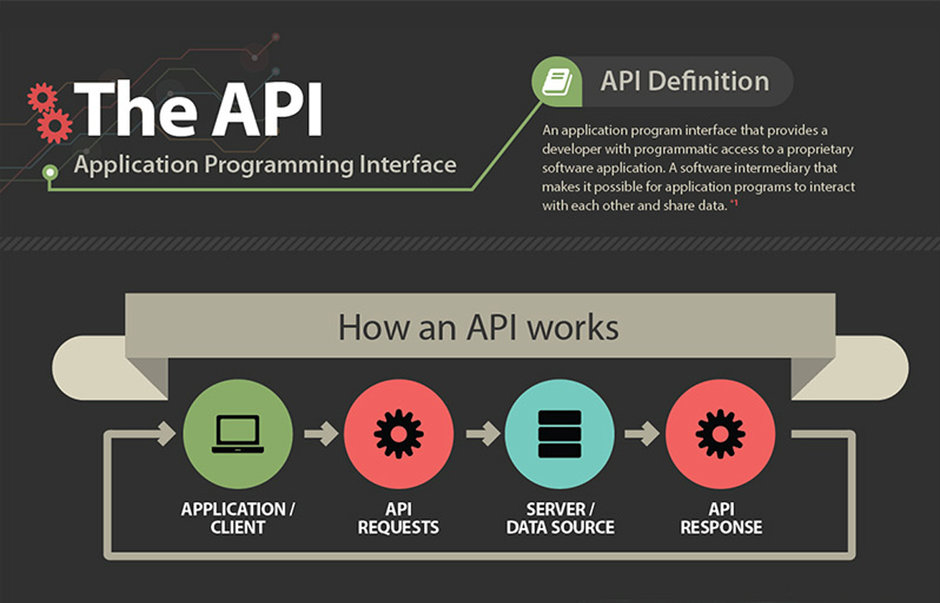
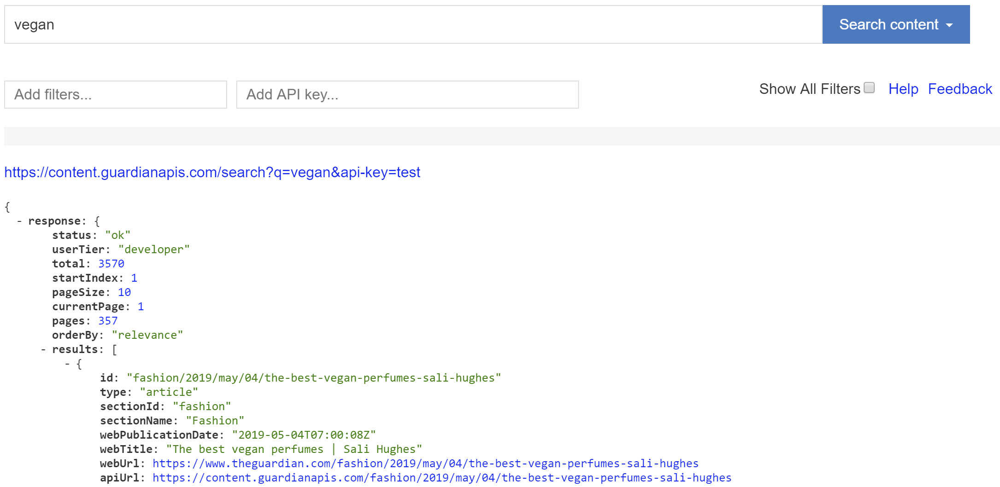
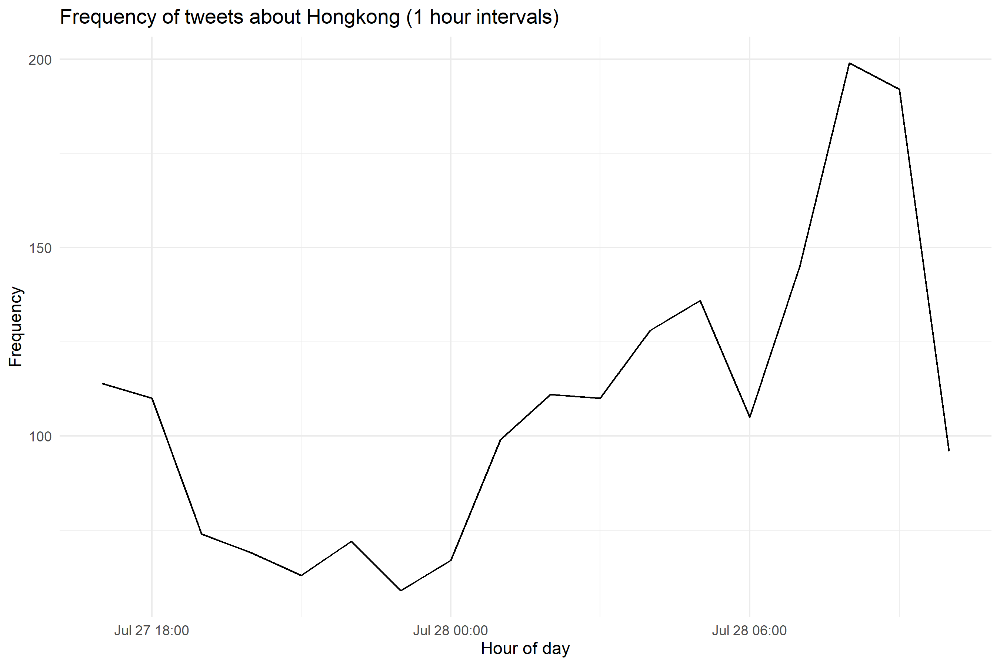
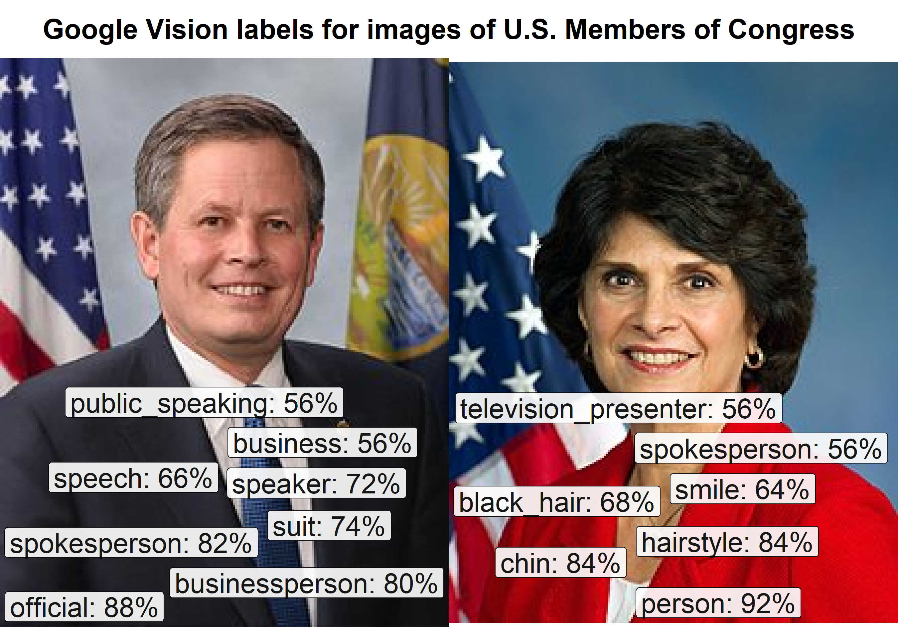

```{r setup, include=FALSE}
# note to students: you can ignore the content of this code chunk
knitr::opts_chunk$set(echo = TRUE, warning = FALSE, message = FALSE,
                      tidy = FALSE, fig.align = "center")

def.chunk.hook  <- knitr::knit_hooks$get("chunk")
knitr::knit_hooks$set(chunk = function(x, options) {
  x <- def.chunk.hook(x, options)
  ifelse(options$size != "normalsize", paste0("\\", 
                          options$size,"\n\n", x, "\n\n \\normalsize"), x)
})

hook_output <- knitr::knit_hooks$get('output')
knitr::knit_hooks$set(output = function(x, options) {
  if (!is.null(n <- options$linewidth)) {
    x = knitr:::split_lines(x)
    if (any(nchar(x) > n)) x = strwrap(x, width = n)
    x = paste(x, collapse = '\n')
  }
  hook_output(x, options)
})
```


# Application Programming Interfaces

## What is an API?

 
 ```{r, out.width='90%', echo = FALSE}

```

\tiny{\url{https://www.govtech.com/applications/Whats-an-API-and-Why-Do-You-Need-One.html}}

## Growth of APIs

```{r, out.width='90%', echo = FALSE}
knitr::include_graphics('figures/api_growth.png')
```

 

\tiny{\url{https://www.programmableweb.com/news/apis-show-faster-growth-rate-2019-previous-years/research/2019/07/17}}

## Strengths and weaknesses of APIs

Advantages:

- accessing APIs is legal and in most cases well defined( e.g. 10,000 requests per day)
- we do not have to apply scraping procedures for unstructured data (e.g. web pages)
- for some APIs R packages make it very easy to collect data (e.g. `rtweet`)

Disadvantages: 

- we first have to learn how to use the API (some documentation are good, others are bad)
- Many APIs require authenification and / or are not available for free
     
# Working with APIs in R

## Required packages

```{r, eval = FALSE}
install.packages(c('usethis', 'httr', 'rtweet'))
```


## Example - Guardian API

http://open-platform.theguardian.com/explore

- the [Guardian API](http://open-platform.theguardian.com/explore/) allows to retrieve meta data and full texts from articles of the british newspaper in structured `JSON`format.
- we can access data from different endpoints (see documentation), e.g. `/content`

## Example - Guardian API explorer

 ```{r, out.width='100%', echo = FALSE}

```

## Guardian API

For communication with the API we need:

- an API key
- the correct base URL
- a set of parameters accoring to the *rules* of the API. Parameters will influence what kind of data the API returns.

## Guardian API - credentials

To retrieve a Guardian API key, fill out the developer register form: https://open-platform.theguardian.com/access/

An easy way to include api keys in R scripts is to store them as strings:

```{r}
guardian_key <- "your_api_key"
```

If you share your script, this has the advantage that others can see (and use) your key.

## Guardian API - credentials

A better way is to store the key in your R environment with `usethis::edit_r_environ()` and to reload it afterwards:

```{r}
guardian_key <- Sys.getenv('guardian_api_key')
substr(guardian_key, 1, 10) # first 10 characters of API key
```


## Guardian API - parameters

The API document explains what parameters can be used to work with the API: https://open-platform.theguardian.com/documentation/search

```{r}
base <- 'http://content.guardianapis.com/search'
params <- list('api-key' = guardian_key, # API key
               'page-size' = 50, # number of results
               'q' = 'vegan') # search query
```

## Guardian API - sending a request

We will use the R package [httr](https://cran.r-project.org/web/packages/httr/index.html) to retrieve Guardian articles with the `GET()` function.

```{r, size = 'scriptsize' , linewidth = 80}
library(httr)
guardian_request <- GET(base, query = params)
```

 [HTTP status code](https://en.wikipedia.org/wiki/List_of_HTTP_status_codes) (200 means "OK"):

```{r, size = 'scriptsize', linewidth = 80}
guardian_request$status_code
```

## Guardian API - parse JSON data

- [JSON](https://en.wikipedia.org/wiki/JSON) is one of the most common data formats returned by APIs
- the R package [jsonlite](https://cran.r-project.org/web/packages/jsonlite/index.html) is useful for converting `JSON` data to R data structures

```{r}
library(jsonlite)
json_data <- fromJSON(content(guardian_request, as = "text"))
names(json_data)
```

## Guardian API - nested structures

JSON files can be nested several layers deep. For the guardian API, article data is returned under the key `results`, which in turn has to be accessed through `response` (see documentation).

```{r}
df <- json_data$response$results
df$webTitle[1:3]
```

## Guardian API - pagination

- besides rate limits, the Guardian API (and many others) has a maximum number of items that can be retrieved with one single call
- to retrieve more data, pagination can be used inside a loop

```{r, size = 'scriptsize', linewidth = 80}
json_data$response$currentPage # current page
json_data$response$pageSize # items per request
json_data$response$pages # total number of pages
```

## Guardian API - example pagination function

```{r, size = 'tiny'}
library(tidyverse)
get_guardian_articles <- function(query, max_pages = 5) {
  # parameters
  base <- 'http://content.guardianapis.com/search'
  params <- list(
    'api-key' = guardian_key,
    'page-size' = 50,
    'page' = 1,
    'q' = query
  )
  # first request
  req <- GET(base, query = params)
  data <- fromJSON(content(req, 'text'))
  df <- data$response$results
  # remaining pages
  for (page in 2:data$response$pages) {
    if (page <= max_pages) {
      params$page <- page
      req <- GET(base, query = params)
      data <- fromJSON(content(req, 'text'))
      df <- bind_rows(df, data$response$results)
    }
  }
  return(df)
}
```


## Using API-specific R packages

- data from most API's can be retrieved with http requests and by applying loops (pagination) 
- some packages like [rtweet](https://cran.r-project.org/web/packages/GuardianR/index.html) make it easier to work with APIs
- not all R packages (including those for APIs) are regularly maintained. Before using API-specific R packages, check whether developers are still active and the documentation is sufficient.
- `rtweet`is an example for a well-maintained package with active developers: https://github.com/mkearney/rtweet

## Twitter's API


Using the Twitter API requires a developer account which can be used to create a Twitter application. This application in turn allows to create credentials used to acces the API.

documentation: https://developer.twitter.com/en/docs.html


## Twitter - apply for developer account

 ```{r, out.width='90%', echo = FALSE}
knitr::include_graphics('figures/twitter_dialogue.png')
```

Guide: https://www.carstenschwemmer.com/files/twitter_developer_application.pdf

## The waiting is the hardest part...

```{r, out.width='80%', echo = FALSE}
knitr::include_graphics('figures/twitter_waiting.png')
```

## Your Twitter app

- go to apps.twitter.com to create app
- use https://127.0.0.1:1410 as callback url for your Twitter app

## Your Twitter app

```{r, out.width='80%', echo = FALSE}
knitr::include_graphics('figures/twitter_apppage.png')
```


## Twitter credentials

```{r, out.width='90%', echo = FALSE}
knitr::include_graphics('figures/twitter_credentials_blurred.png')
```

## Twitter credentials - simple

```{r, eval=FALSE}
app_name <- "YOURAPPNAMEHERE"
consumer_key <- "YOURKEYHERE"
consumer_secret <- "YOURSECRETHERE"
access_token <- "YOURACCESSTOKENHERE"
access_token_secret <- "YOURACCESSTOKENSECRETHERE"
```

## Twitter credentials - better

reminder: `usethis::edit_r_environ()` to set R environment variables

```{r}
app_name <- Sys.getenv('twitter_app_name')
consumer_key <-Sys.getenv('twitter_consumer_key')
consumer_secret <- Sys.getenv('twitter_consumer_secret')
access_token <- Sys.getenv('twitter_access_token')
access_token_secret <- Sys.getenv('twitter_access_secret')
```

## Authenticate yourself with Twitter API

```{r, results = 'hide'}
library(rtweet)
library(tidyverse) # for data analysis
create_token(app = app_name, 
             consumer_key = consumer_key, 
             consumer_secret = consumer_secret, 
             access_token = access_token,
             access_secret = access_token_secret,
             set_renv = TRUE)
```

## Your first Twitter API call

```{r, size = 'scriptsize', linewidth = 80}
hk_tweets <- search_tweets("#hongkong", 
              n = 2000, include_rts = FALSE)
names(hk_tweets)[1:20]
```

## Tweets are parsed into a DataFrame

```{r, size = 'scriptsize', linewidth = 80}
cat(hk_tweets$text[1])
```

## Visualizing frequencies

`rtweet` includes a function for visualizing frequencies of tweets over a specified time:

```{r eval=FALSE, fig.height=6, fig.width=9, size = 'scriptsize'}
ts_plot(hk_tweets, "1 hour") + theme_minimal() +
  labs(x = 'Hour of day', y = 'Frequency',
  title = "Frequency of tweets about Hongkong (1 hour intervals)")
```

## Visualizing frequencies

```{r, out.width='100%', echo = FALSE}

```

## Get Tweets from individual account

```{r, size = 'scriptsize', linewidth = 80}
sanders_tweets <- get_timeline("sensanders", n = 3)
cat(sanders_tweets$text[1])
```

## Get general information about a user

```{r, size = 'scriptsize', linewidth = 80}
sanders_twitter_profile <- lookup_users("sensanders")

cat(sanders_twitter_profile$description)

sanders_twitter_profile$followers_count
```

## Get users' favorites

```{r, size = 'scriptsize', linewidth = 80}
sanders_favorites <- get_favorites("sensanders", n = 3)
cat(sanders_favorites$text[1])
```

## Get trending topics by location

```{r, size = 'footnotesize', width = 60}
trends <- get_trends("United Kingdom")
trends$trend[1:3]
```

## Check your Twitter rate limits

```{r}
rate_limits <- rate_limit()
head(rate_limits[,1:4])
```

## Post content

You can also posts tweets, like tweets, or follow users with `rtweet`:

```{r, eval=FALSE}
post_tweet("I love APIs")
```

**Note: this is very useful if you are building a bot**


## Wrapping API calls within a loop

```{r, size = 'scriptsize', linewidth = 60}
#load list of twitter handles for elected officials
url <- "https://cbail.github.io/Elected_Officials_Twitter_Handles.csv"
elected_officials <- read_csv(url)
head(elected_officials)
```

## Wrapping API calls within a loop

```{r, eval=FALSE}
# create empty container to store tweets
elected_df <- data_frame()

for(i in 1:nrow(elected_officials)){
  # pull tweets
  tweets <- get_timeline(elected_officials$screen_name[i], 
                         n = 100)
  # populate dataframe
  elected_df <- bind_rows(elected_df, tweets)
  # pause for one second to further prevent rate limiting
  Sys.sleep(1)
  # print number/iteration for monitoring progress
  print(i)
}
```


## There are also APIs that do analysis for you!

For example, image recognition services such as [Google Vision](https://cloud.google.com/vision/):

```{r, out.width='90%', echo = FALSE}

```

## R Packages for APIs

Here are a few:

  - `RgoogleMaps`
  - `rOpenSci`(combines many different APIs e.g. the Internet Archive)
  - `WDI`
  - `rOpenGov`
  - `rtimes`
  - `imgrec`
  - `plumber` (build your own API)

Many more are available but not yet on CRAN (install from github or using devtools)
 

## Lists of APIs of interest

https://github.com/public-apis/public-apis

https://www.programmableweb.com/   

https://apilist.fun/

https://ropensci.org/packages/

##

\begin{center}
\LARGE{Questions?}
\end{center}
