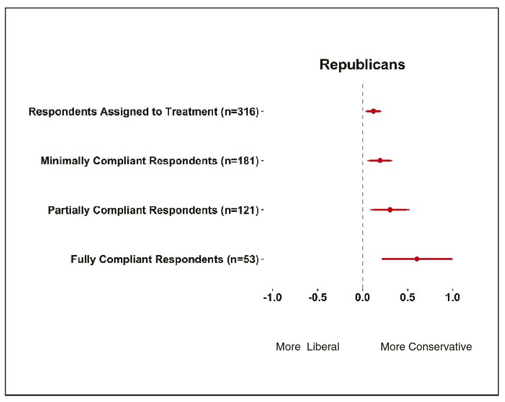

```{r setup, include=FALSE}
# note to students: you can ignore the content of this code chunk
knitr::opts_chunk$set(echo = TRUE, warning = FALSE, message = FALSE,
                      tidy = FALSE, fig.align = "center")

def.chunk.hook  <- knitr::knit_hooks$get("chunk")
knitr::knit_hooks$set(chunk = function(x, options) {
  x <- def.chunk.hook(x, options)
  ifelse(options$size != "normalsize", paste0("\\", 
                          options$size,"\n\n", x, "\n\n \\normalsize"), x)
})

hook_output <- knitr::knit_hooks$get('output')
knitr::knit_hooks$set(output = function(x, options) {
  if (!is.null(n <- options$linewidth)) {
    x = knitr:::split_lines(x)
    if (any(nchar(x) > n)) x = strwrap(x, width = n)
    x = paste(x, collapse = '\n')
  }
  hook_output(x, options)
})
```


# Apps

## Recall the weaknesses of digital trace data

- incomplete    
- inaccessible    
- non-representative   
- drifting    
- algorithmic confounding   
- dirty   
- sensitive   

## What are the alternatives?

- survey response rates continue to drop 

- many important questions require longitudinal/relational/qualitative data  

- digital trace data have a number of major advantages in comparison to conventional sources (big, always on, non-reactive)  

## Apps can address limitations of digital trace data
 
- **incomplete**  
- **inaccessible**  
- **non-representative**  
- drifting  
- algorithmic confounding  
- **dirty**  
- **sensitive**  

## Example: the Viralgorithm


```{r, out.width='90%', echo = FALSE}
knitr::include_graphics('figures/viralgorithm.png')
```

40% of all organizations contacted installed the app

## Social media survey apps (SMSA)

A web or mobile-based tool built by researchers in order to:  

- collect public and/or private data produced by social media users from an API
- collect supplemental information from such users (e.g. demographics) using more conventional survey methods
- offer something back to the user as an incentive to share their data (e.g. analysis or financial incentives)  

For additional information, see:

[Bail, Christopher A. 2015. "Taming Big Data: Using App Technology to Study Organizational Behavior on Social Media." Sociological Methods and Research: 1-29](https://drive.google.com/file/d/0Byvk0A8Ic21YMC1SNHIzWU5jSXc/view) 

## Workflow of Viralgorithm


```{r, out.width='60%', echo = FALSE}
knitr::include_graphics('figures/viralgorithm_workflow.png')
```


## More examples

[Bail, Christopher A. 2016. "Combining Network Analysis and Natural Language Processing to Examine how Advocacy Organizations Stimulate Conversation on Social Media." Proceedings of the National Academy of Sciences, 113:42 11823-11828](http://www.pnas.org/content/pnas/113/42/11823.full.pdf?with-ds=yes)

[Bail, Christopher A. 2016. "Emotional Feedback and the Viral Spread of Social Media Messages about Autism Spectrum Disorders." American Journal of Public Health 106(7): 1173-1180](https://ajph.aphapublications.org/doi/pdf/10.2105/AJPH.2016.303181)

[Bail, Christopher A., Taylor W. Brown, and Marcus Mann. 2017. “Channeling Hearts and Minds: Cognitive-Emotional Currents and Public Deliberation on Social Media.” American Sociological Review, 82(6) 1188-1213](https://drive.google.com/file/d/179SpJoLuyOyOgOFEenlziOPmfkVLjnFH/view)


## Challenges of building apps

- significant coding skills required (html, css, cloud-computing, reactive programming)  

- competitive environment for attention (apps are no longer "new")

- concerns about data sharing/privacy  

- compelling incentives are hard to identify  and particularly challenging for studies of sensitive topics; financial incentives may be an important option going forward. 

## Building apps with R Shiny

Shiny is a tool that enables people to build, compile, and host interactive web apps

```{r, out.width='30%', echo = FALSE}
knitr::include_graphics('figures/shiny.png')
```

https://shiny.rstudio.com/

## Building apps with R Shiny

- Advantages: 

    - takes care of many technical details in the background
    - excellent tutorials available (https://shiny.rstudio.com/tutorial/)
    - many example apps to learn from (https://shiny.rstudio.com/gallery/)
- Main disadvantage: does not run natively on mobile platforms
- Some alternatives: Python kivy, Google Flutter

## Shiny example app

```{r, eval = FALSE}
install.packages('shiny')
```

```{r, eval = FALSE}
library(shiny)
runExample("01_hello")
```


# Bots

## Example: anti-racism bots

```{r, out.width='70%', echo = FALSE}
knitr::include_graphics('figures/munger_bot.png')
```


[Munger, Kevin. 2017. "Tweetment Effects on the Tweeted: Experimentally Reducing Racist Harassment." Political Behavior.](https://dx.doi.org/10.1007/s11109-016-9373-5)

## Example: anti-racism bots

"I conduct an experiment which examines the impact of group norm promotion and social sanctioning on racist online harassment. I employ an intervention designed to reduce the use of anti-black racist slurs by white men on Twitter. I collect a sample of Twitter users who have harassed other users and use accounts I control (“bots”) to sanction the harassers. By varying the identity of the bots between in-group (white man) and out-group (black man) and by varying the number of Twitter followers each bot has, I find that subjects who were sanctioned by a high-follower white male significantly reduced their use of a racist slur."

## Using bots to study social media & polarization

[Bail, Christopher, Lisa Argyle, Taylor Brown, John Bumpuss, Haohan Chen, M.B. Fallin Hunzaker, Jaemin Lee, Marcus Mann, Friedolin Merhout, and Alexander Volfovsky. 2018. "Exposure to Opposing Viewscan Increase Political Polarization: Evidence from a Large-Scale Field Experiment on Social Media." Proceedings of the National Academy of Sciences. 155(37): 9216-9221](https://www.pnas.org/content/115/37/9216)

## Using bots to study social media & polarization

```{r, out.width='80%', echo = FALSE}
knitr::include_graphics('figures/bail_research_design.png')
```

## Using bots to study social media & polarization

```{r, out.width='80%', echo = FALSE}

```

## How to build bots in R

Simple example: 

```{r, size = 'scriptsize', linewidth = 80, eval = FALSE}
library(rtweet) # assumes credentials are loaded
for (i in 1:24){
  # search for 50 recent tweets about computational social science
  css_tweets <- search_tweets("Computational Social Science", 
                              n = 50, include_rts = FALSE)
  # randomly pick one tweet id
  lucky_tweet <- sample(css_tweets$status_id, 1)
  # post retweet
  post_tweet(retweet_id = lucky_tweet)
  # wait for 1 hour (3600 seconds)
  Sys.sleep(3600)
}
```

## Making a bot interactive

```{r, out.width='80%', echo = FALSE}
knitr::include_graphics('figures/munger_flow.png')
```


## Run Rstudio in the cloud (e.g. for hosting shiny apps or bots)

```{r, out.width='80%', echo = FALSE}

```


Tutorial by Chris Bail: https://cbail.github.io/Running_R_in_the%20Cloud.html

## Building apps and bots for social research

- apps and bots can be used to adress many shortcomings of digital trace data
- high risk, high reward
- be mindful of ethical issues in app & bot-based research


##

\begin{center}
\LARGE{Questions?}
\end{center}
