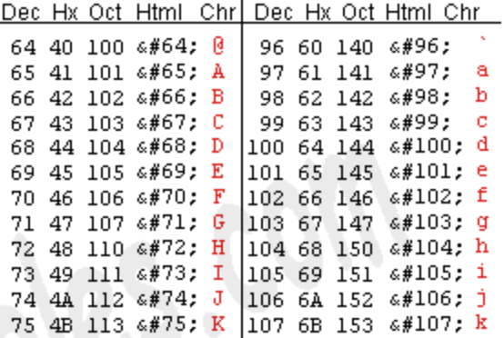
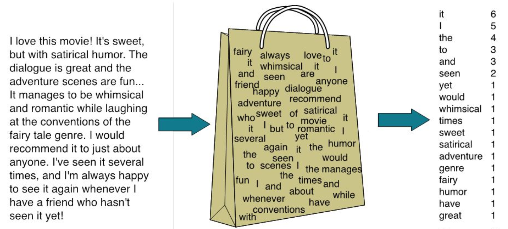
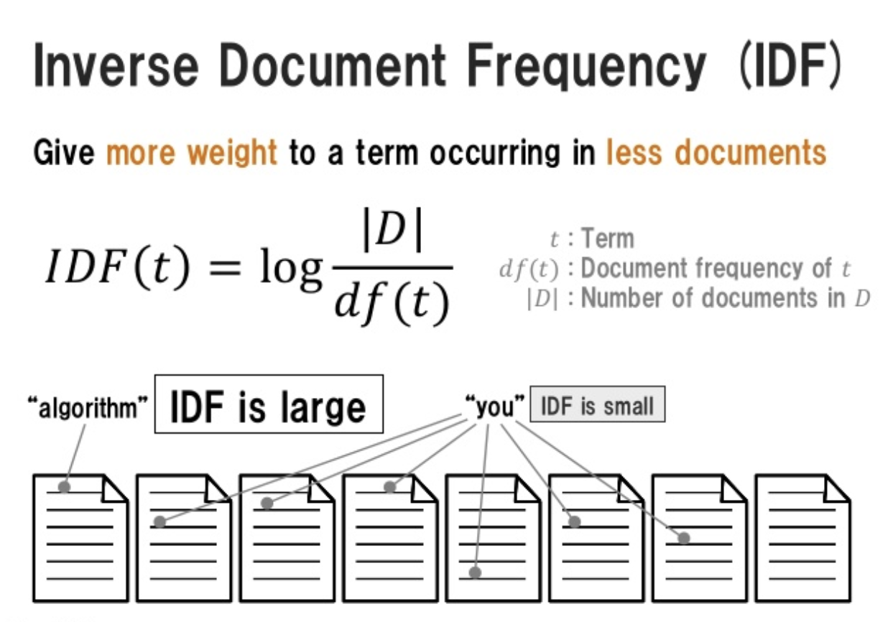

```{r setup, include=FALSE}
# note to students: you can ignore the content of this code chunk
knitr::opts_chunk$set(echo = TRUE, warning = FALSE, message = FALSE,
                      tidy = FALSE)

def.chunk.hook  <- knitr::knit_hooks$get("chunk")
knitr::knit_hooks$set(chunk = function(x, options) {
  x <- def.chunk.hook(x, options)
  ifelse(options$size != "normalsize", paste0("\\", 
                          options$size,"\n\n", x, "\n\n \\normalsize"), x)
})

hook_output <- knitr::knit_hooks$get('output')
knitr::knit_hooks$set(output = function(x, options) {
  if (!is.null(n <- options$linewidth)) {
    x = knitr:::split_lines(x)
    if (any(nchar(x) > n)) x = strwrap(x, width = n)
    x = paste(x, collapse = '\n')
  }
  hook_output(x, options)
})
```

## Before we start

These are the new packages that we will need today:

```{r, eval = FALSE}
install.packages(c('stm', 'stminsights', 'textdata',  
                   'quanteda', 'caret'))
```

Here is the location for lecture materials (including datasets):
https://github.com/compsocialscience/summer-institute/tree/master/2019/bamberg/materials


# Basics of quantitative text analysis

## Character encoding

Computers store text in form of digits. For each character, e.g. `a`, there is a corresponding sequence of numbers used for [character encoding](https://en.wikipedia.org/wiki/Character_encoding).

```{r, out.width='60%', echo = FALSE, fig.align = 'center'}

```

\tiny{\url{https://www.asciitable.com/}}


## Character encoding

Today, many different standards for text encoding exist (e.g. ASCII, UTF-8, UTF-16, Latin-1, ..). If you read textual data and declare the wrong encoding, some characters will not be parsed correctly:

```{r, size = 'footnotesize', linewidth = 60}
all_good <- readLines('encoding_issues_utf8.txt',
                     encoding = 'UTF-8')
all_good

suffering <- readLines('encoding_issues_utf8.txt',
                       encoding = 'latin1')
suffering
```


## Character encoding - advice

- store your data in one consistent encoding to avoid headaches
-  `utf-8` is commonly used and the default encoding for many R packages (e.g. `tidyverse`). 
- if you don't know the encoding of a text, try several encodings and qualitatively inspect results.


## Text is complex

- "Time flies like an arrow, fruit flies like a banana."
- "Make peace, not war; make war, not peace."
- quantitative models (need to) simplify textual data and will fail to capture some complexity

## How can we deal with this complexity?

\begin{large}
"We destroy language to turn it into data" - Ken Benoit, IC2S2 2019
\end{large}

## Tokens

"Make love, not war." -> `c('make', 'love', 'not', 'war')`  

- tokens define semantic elements of strings; important for many applications of text analysis (e.g. counting)
- predominantly separated by white space and punctuation marks
- converting text to tokens raises several questions:

    - what unit of analysis? words? sentences? 
    - which rules (algorithms) shall be used to define tokens?
    - which tokens are not useful for the analysis?
    

## From tokens to "bag of words" (bow)

- disassembling texts into tokens is the foundation for the [bag of words](https://en.wikipedia.org/wiki/Bag-of-words_model) model (bow)
- bow is a very simplified representation of text where only token frequencies are considered
- advantages: easy to implement, scales well, often good enough
- disadvantages: discards language properties like [polisemy](https://en.wikipedia.org/wiki/polysemy) and word order

## Bag of words - example

```{r, out.width='100%', echo = FALSE, fig.align = 'center'}

```


## First dataset for today

-  we will be using a sample from a [Kaggle](https://www.kaggle.com/c/donorschoose-application-screening) Data Science for Good challenge
- [DonorsChoose.org](https://DonorsChoose.org) provided the data and hosts an online platform where teachers can post requests for resources and people can make donations to these projects
- the goal of the original challenge was to match previous donors with campaigns that would most likely inspire additional donations
- the dataset includes request texts and context information. A description of variables is available [here](https://www.kaggle.com/donorschoose/io/discussion/56030)

## What could we learn from this data?

Examples of questions we might ask: 

- how has classroom technology use changed over time? How does it differ by geographic location and the age of students?
- how do the requests of schools in urban areas compare to those in rural areas?
- what predicts whether a project will be funded?
- how do the predictors of funding success vary by geographic location? Or by economic status of the students?


## Loading packages and data

```{r, size = 'footnotesize', linewidth = 60}
library(tidyverse)
df <- read_csv('data/donors_choose_sample.csv')
df %>% pull(project_title) %>%  head(5)
```


```{r, include = FALSE}
# the preprocessing in this cell is not related to textual data
# and will not be included in the slides
# we will need it later for more sophisticated techniques
library(lubridate)
df$date <- ymd(df$project_posted_date)
min_date <- min(df$date) %>% 
  as.numeric()
df$date_num <- as.numeric(df$date) - min_date

df <- df %>% mutate(gender = case_when(
  teacher_prefix %in% c('Mrs.', 'Ms.') ~ 'Female',
  teacher_prefix == 'Mr.' ~ 'Male',
  TRUE ~ 'Other/Non-binary'),
  funded = ifelse(project_current_status == 'Fully Funded', 
                  1, 0))
```

## Text example for one donation request

```{r, size = 'tiny', linewidth = 80}
cat(df$project_essay[1])
```

## Preparing texts

We use a [regular expression](https://en.wikipedia.org/wiki/Regular_expression) to clean up the donation texts:

```{r}
# remove noise
df$project_essay <- str_replace_all(df$project_essay, 
        pattern = '<!--DONOTREMOVEESSAYDIVIDER-->', 
        replacement = '\n\n') 
# validate
str_detect(df$project_essay[1], 
           '<!--DONOTREMOVEESSAYDIVIDER-->')
```


## Text analysis using quanteda


```{r, out.width='30%', echo = FALSE, fig.align = 'center'}

```


- a variety of R packages support quantitative text analyses. We will focus on [quanteda](https://quanteda.io/), which is created and maintained by social scientists behind the Quanteda Initiative
- other packages that might be interesting for you: `koRpus`, `tidytext`, `tm`, `polmineR`

## Quanteda corpus object

You can create a quanteda corpus from (1) a character vector or (2) a data frame, which automatically includes meta data as document variables:


```{r, size = 'footnotesize', linewidth = 80}
library(quanteda)
donor_corp <- corpus(df, text_field = 'project_essay', 
                 docid_field = 'project_id')
docvars(donor_corp)$text <- df$project_essay # store unprocessed text
ndoc(donor_corp) # no. of documents
```

## Keywords in context (KWIC)

Corpus objects can be used to discover [keywords in context](https://en.wikipedia.org/wiki/Key_Word_in_Context) (KWIC):

```{r, size = 'scriptsize', linewidth = 70}
kwic_donor <- kwic(donor_corp, pattern = c("ipad"),
                      window = 5) # context window
head(kwic_donor, 3)
```


## Tokenization

Tokens can be created from a corpus or character vector. The documentation (`?tokens()`) illustrates several options, e.g. for the removal of punctuation

```{r, linewidth = 60}
donor_tokens <- tokens(donor_corp)
donor_tokens[[1]][1:20] # text 1, first 20 tokens
```

## Basic form of tokens

- after tokenization text, some terms with similar semantic meaning might be regarded as different features (e.g. `love`, `loving`)
- one solution is the application of [stemming](https://en.wikipedia.org/wiki/Stemming), which tries to reduce words to their basic form:

```{r}
words <- c("love", "loving", "lovingly", 
           "loved", "lover", "lovely")
char_wordstem(words, 'english')
```

## To stem or not to stem?

- whether stemming generates useful features or not varies by use case
- in the context of topic modeling, a [recent study](https://www.transacl.org/ojs/index.php/tacl/article/view/868/196) suggests that stemmers produce no meaningful improvement (for English language)
- an alternative is [lemmatization](https://en.wikipedia.org/wiki/Lemmatisation), available via packages likes [spacyr](https://cran.r-project.org/web/packages/spacyr/index.html) and [udpipe](https://cran.r-project.org/web/packages/udpipe/index.html)


## Stopwords

Multiple preprocessing steps can be chained via the pipe operator, e.g normalizing to lowercase and removing common English stopwords:

```{r, size = 'footnotesize', linewidth = 60}
donor_tokens <- donor_tokens %>% 
tokens_tolower() %>% 
tokens_remove(stopwords('english'), 
              padding = TRUE) # keep empty strings

donor_tokens[[1]][1:10]
```

## Detecting collocations (phrases)

- collocations are sequences of tokens which symbolize shared semantic meaning, e.g. `United States`
- Quanteda can detect collocations with log-linear models. An important parameter is the minimum collocation frequency, which can be used to fine-tune results (see also `textstat_select()`)

```{r, size = 'footnotesize', linewidth=60}
colls <- textstat_collocations(donor_tokens,
         min_count = 200) # minimum frequency
donor_tokens_c <- tokens_compound(donor_tokens, colls) %>% 
                  tokens_remove('') # remove empty strings
donor_tokens_c[[1]][1:5] # first five tokens of first text
```

## Document-Feature Matrix (DFM)

- most models for automated text analysis require matrices as an input format
- a common variant which directrly translates to the bag of words format is the [document term matrix](https://en.wikipedia.org/wiki/Document-term_matrix) (in quanteda: document-feature matrix):

 doc_id     I     like     hate    currywurst
--------  ---   ------   ------  -------------
     1     1      1         0         1
     2     1      0         1         1

## Creating a Document-Feature Matrix (dfm)

- problem: textual data is highly dimensional -> dfms's potentially grow to millions of rows & columns -> matrices for large text corpora don't fit in memory
- features are not uniformly distributed (see e.g. [Zipf's law](https://en.wikipedia.org/wiki/Zipf%27s_law)), most cells contain zeroes
- solution: sparse data format, which does not include zero counts. Quanteda natively implements DFM's as [sparse matrices](https://en.wikipedia.org/wiki/Sparse_matrix) 

## DFM's in quanteda

- Quanteda can create DFM's from character vectors, corpora and token objects
- preprocessing steps unaffected by for word order can also be done during or after the creation of DFM's (see documentation for `tokens()`)

```{r, size = 'footnotesize', linewidth = 100}
dfm_donor <- dfm(donor_tokens_c, remove_numbers = TRUE)
dim(dfm_donor)
```


## More preprocessing - feature trimming

As an alternative (or complement) to manually defining stopwords, terms occuring in either very few or almost all  documents can be removed automatically. 

```{r, size = 'footnotesize'}
dfm_donor <- dfm_donor %>% 
  dfm_keep(min_nchar = 2) %>% # remove terms < 2 characters
  dfm_trim(min_docfreq = 0.001,  #2% min
           max_docfreq = 0.50,# 50% max
  docfreq_type = 'prop') # proportions instead of counts
dim(dfm_donor)
```

## Inspecting most frequent terms

```{r, size = 'footnotesize'}
textplot_wordcloud(dfm_donor, max_words = 100, color = 'black')
```

## Inspecting most frequent terms

```{r, size = 'footnotesize'}
textstat_frequency(dfm_donor) %>% head(10)
```

## Other pre-preprocessing procedures - ngrams

Features can be created from `n` sequences of tokens.

```{r, size = 'footnotesize', linewidth = 60}
text <- "to be or not to be"
tokens(text, ngrams = 1:2) # unigrams + bigrams
tokens(text, ngrams = 3) # trigrams only
```

## Other prepreprocessing steps - tfidf

```{r, out.width='80%', echo = FALSE, fig.align = 'center'}

```

see `dfm_tfidf()` for the quanteda implementation


## Other pre-processing steps we won't cover

- [part-of-speech tagging](https://en.wikipedia.org/wiki/Part-of-speech_tagging)
- [named-entity recognition](https://en.wikipedia.org/wiki/Named-entity_recognition)
- both of these approaches are available via the R packages `spacyr` (Python wrapper) and `udpipe`

##

\begin{center}
\LARGE{Questions?}
\end{center}


```{r, eval = FALSE, include = FALSE}
# save data for later use
save(dfm_donor, file = 'dfm_donor.Rdata')
```


