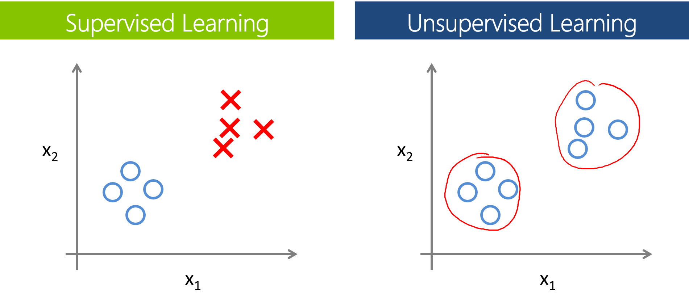

```{r setup, include=FALSE}
# note to students: you can ignore the content of this code chunk
knitr::opts_chunk$set(echo = TRUE, warning = FALSE, message = FALSE,
                      tidy = FALSE)

def.chunk.hook  <- knitr::knit_hooks$get("chunk")
knitr::knit_hooks$set(chunk = function(x, options) {
  x <- def.chunk.hook(x, options)
  ifelse(options$size != "normalsize", paste0("\\", 
                          options$size,"\n\n", x, "\n\n \\normalsize"), x)
})

hook_output <- knitr::knit_hooks$get('output')
knitr::knit_hooks$set(output = function(x, options) {
  if (!is.null(n <- options$linewidth)) {
    x = knitr:::split_lines(x)
    if (any(nchar(x) > n)) x = strwrap(x, width = n)
    x = paste(x, collapse = '\n')
  }
  hook_output(x, options)
})
```

# Supervised text classification

## Supervised vs unsupervised

```{r, out.width='100%', echo = FALSE, fig.align = 'center'}

```


## A simple model: Naive-Bayes Classifier 

- "all models are wrong but some models are useful."
- *naive* assumption: features are independent of each other

$$
P(\text{label}\mid\text{feature}) = 
\frac{P(\text{feature}\mid
\text{label}) \cdot P(\text{label})}{P(\text{feature})}
$$

## Reload our DonorsChoose data

```{r, size = 'footnotesize', linewidth = 60}
library(tidyverse)
library(quanteda)
library(caret)
load('data/dfm_donor.Rdata')
dim(dfm_donor)
```

We want to predict whether a donation request received funding:

```{r, size = 'footnotesize', linewidth = 60}
docvars(dfm_donor) %>% count(funded)
```

## Training and test sets


- in order to train a model, we need to split our data into training and test sets
- the classifier will learn from the training set. The testset is used to evaluate its performance on unseen data
- there is no optimal solution for the proportions to split train and test data (see [bias-variance tradeoff](https://en.wikipedia.org/wiki/Bias%E2%80%93variance_tradeoff)). 

## Training a model

```{r, size = 'footnotesize', linewidth = 80}
set.seed(1337) # for replication

train <- dfm_sample(dfm_donor, size = 8000) # 80% of the data
test <- dfm_donor[!docnames(dfm_donor) %in% docnames(train), ] 

# run the model
donor_nb <- textmodel_nb(x = train, y = docvars(train)$funded)
```

## Making sense of the model - important features

We create a function to find the most important terms for correctly predicting whether a donation request received funding: 

```{r, size = 'footnotesize', linewidth = 90}
imp_features <- function(nb_model, n = 10) {
  # PcGw = probability of class given the word
  features <- t(nb_model$PcGw) %>%  # transpose
    as.data.frame() %>% rownames_to_column('feature') %>% 
    gather('label', 'prob_class' , -feature) %>%  # tidy data
    group_by(label) %>% top_n(n, prob_class) %>% # max probability
    slice(1:n) %>% 
    ungroup() %>% arrange(label, desc(prob_class)) # sort
  return(features)
}
```

## Making sense of the model - important features

```{r, size = 'footnotesize', linewidth = 80}
imp_features(donor_nb, n = 5)
```

## Confusion matrix & accuracy

|               | Reference|      |
|---------------|----------|------|
| **Predicted** | *TRUE*    | *FALSE* |
| *TRUE*          | True Positives      | False Positives   |
| *FALSE*        | False Negatives       | True Negatives   |

 $$ Accuracy = \frac{TP + TN }{TP + FP + FN + TN} $$

## Other metrics for performance evaluation


- accuracy is often not a good measure of performance, especially for imbalanced classes.
- multiple alternatives are available, e.g. balanced accuracy

 
 $$ Sensitivity = \frac{TP}{TP + FN}; Specificity = \frac{TN}{TN + FP} $$
 $$ Balanced\ Accuracy =  \frac{Sensitivity + Specificity}{2}$$

## Evaluating model performance

```{r, size = 'scriptsize', linewidth = 80}
pred_labels <- predict(donor_nb, newdata = test) %>% as.factor()
true_labels <- docvars(test)$funded %>% as.factor()
stats <- confusionMatrix(pred_labels, true_labels)
stats$table # confusion matrix
stats$byClass # performance metrics
```


## Cross-validation 

- repeat the model training on several train/test splits
- assess performance across all runs
- we'll use a simple k-fold variant, where k equalts the number if splits

```{r, include = FALSE}
# note: this function is not shown in the slides
cross_val <- function(input_dfm, # dfm 
      labels,  # document variable holding labels
      train_size, 
      nr_runs = 10, # number of runs
      what = c('Accuracy', 'Balanced Accuracy',
               'Sensitivity', 'Specificity'), #
      pos_class = NULL ) { # positive class
  results <- c(1:nr_runs)
  for (run in seq_along(results) ) { 
      set.seed(run) # 
      train <- dfm_sample(input_dfm, size = train_size) 
      test <- input_dfm[!docnames(input_dfm) %in% docnames(train), ]
      nb_cv <- textmodel_nb(train, y = docvars(train)[[labels]])
      pred_cv <- predict(nb_cv, newdata = test)
      eval <- confusionMatrix(pred_cv, 
              as.factor(docvars(test)[[labels]]), positive = pos_class)
      results[run] <- eval$byClass[what]
      print(paste(what, 'run', run , ':', round(results[run], 3)))
  }
  eval_total <- mean(results)
  print(paste('Average', what,':', round(eval_total, 3)))
}
```

## Running validation over 10 splits

```{r, size = 'footnotesize', linewidth = 80}
cross_val(input_dfm = dfm_donor, labels = 'funded' , train_size = 9000, 
          nr_runs = 10, what = 'Balanced Accuracy', pos_class = '1')
```

## What to do when model performance is bad

- adjust feature space
- adjust model parameters
- try different model(s)
- in our case: think about other factors that might be related to the funding success of donation requests

## Other approaches we didn't cover

- averaging predictions of multiple models (e.g. support vector machines, random forest models)
- optimizing hyperparameters (e.g. distribution assumptions of our naive-bayes model)
- using features beyond bag-of-words (e.g. word embeddings)

## When should you use supervised classification?

- if your goal is the best predictive power, supervised models are reasonable choices
- for many social science applications, supervised models are used to infer labels for a larger dataset from a smaller trainingset, which are then used in downstream tasks
- it might be helpful to compare results with dictionary-based approaches 

##

\begin{center}
\LARGE{Questions?}
\end{center}
