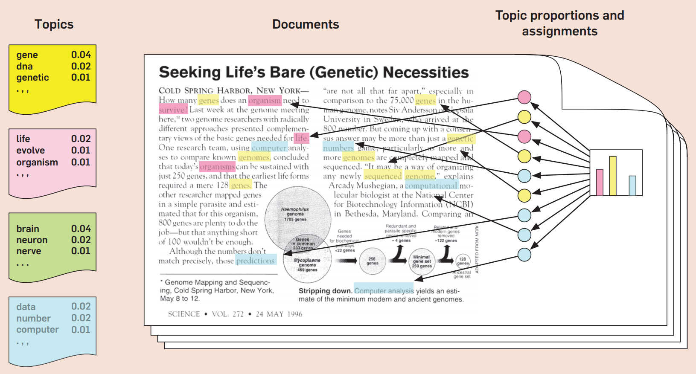
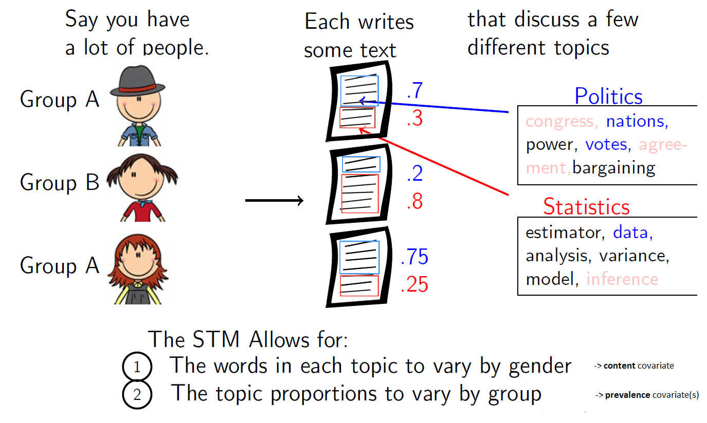
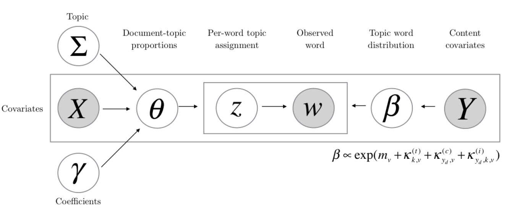
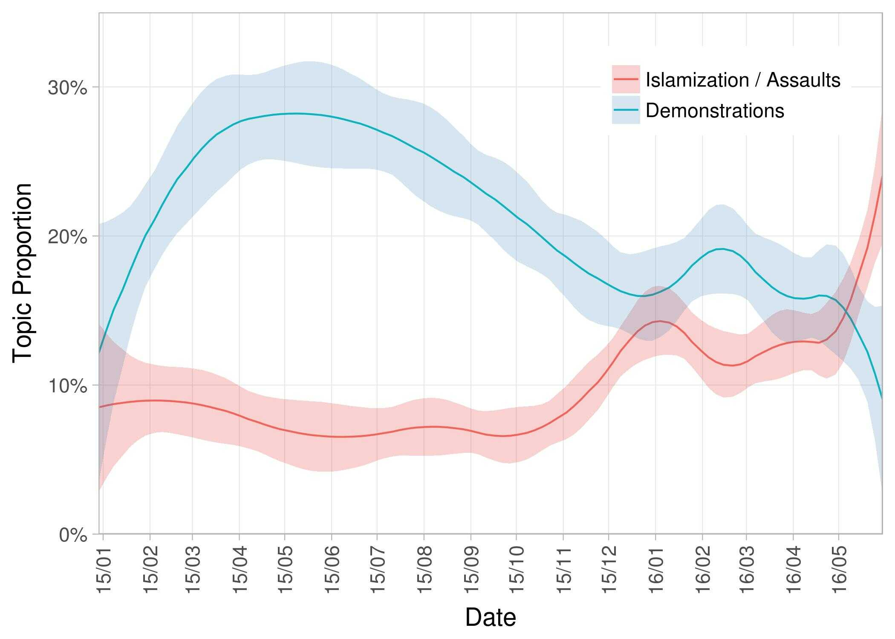

```{r setup, include=FALSE}
# note to students: you can ignore the content of this code chunk
knitr::opts_chunk$set(echo = TRUE, warning = FALSE, message = FALSE,
                      tidy = FALSE)

def.chunk.hook  <- knitr::knit_hooks$get("chunk")
knitr::knit_hooks$set(chunk = function(x, options) {
  x <- def.chunk.hook(x, options)
  ifelse(options$size != "normalsize", paste0("\\", 
                          options$size,"\n\n", x, "\n\n \\normalsize"), x)
})

hook_output <- knitr::knit_hooks$get('output')
knitr::knit_hooks$set(output = function(x, options) {
  if (!is.null(n <- options$linewidth)) {
    x = knitr:::split_lines(x)
    if (any(nchar(x) > n)) x = strwrap(x, width = n)
    x = paste(x, collapse = '\n')
  }
  hook_output(x, options)
})
```


# Introducing topic models


## Vanilla topic modeling - latent dirichlet allocation (LDA)

> "Topic models are algorithms for discovering the main themes that pervade a large and otherwise unstructured collection of documents. Topic models can organize the collection according to the discovered themes." (Blei 2012)


- LDA is a mixed membership model and the name is based upon the [dirichlet distribution](https://en.wikipedia.org/wiki/Dirichlet_distribution)
- idea: texts are generated by latent topics.
- each document is a mixture over topics. Each topic is a mixture over words
- we have to fix the number of topics ex ante


## LDA - A statistical highlighter

```{r, out.width='100%', echo = FALSE, fig.align = 'center'}

```


*Blei (2012). Probabilistic Graphical Models.*


## LDA - disadvantages

- the initialization of LDA models is not deterministic: starting parameters are initially set to random values. This affects model stability and introduces repllication problems
- good implementations of LDA topic models often require dependencies beyond R (e.g. java for [mallet](http://mallet.cs.umass.edu/))
- LDA is "blind" to context information. It only models term co-occurence without considering meta data

## Topic modeling - extensions

*correlated topic models, dynamic topic models, hierarchical LDA,
pachinko allocation, nonparametric pachinko allocation,factorial LDA,
gamma-poisson factorization, shared component topic models,
dirichlet multinomial regresson topic models, expressed agenda
model, structured topic model, nested hierarchical dirichlet process
topic model, focused topic model, inverse regression topic model,
ideal point topic model, discrete innite logistic normal topic model
multilingual topic model, markov topic model, relational topic model,
syntactic topic model, supervised latent dirichlet allocation, ...*
 
## Introducing the Structural Topic Model (STM)

- Text documents often include contextual information, e.g. time stamps or author attributes
- A huge variety of social science questions is motivated by connecting metadata with textual data
- STM provides two ways to include contextual information:

    - Topic prevelance can vary by metadata (e.g. Democrats talk more about education than Republicans)
    - Topic content can vary by metadata (e.g. Democrats are less likely to use the word life when talking about abortion than Republicans)
- you can find many publications and auxiliary packages for STM on [structuraltopicmodel.com](structuraltopicmodel.com)


## STM - what this means in pictures

```{r, out.width='100%', echo = FALSE, fig.align = 'center'}

```

*Stewart (2017). LDA and Beyond.*

## STM - graphical model


```{r, out.width='100%', echo = FALSE, fig.align = 'center'}

```

*Stewart (2017). LDA and Beyond.*

## STM - prevalence example: time


```{r, out.width='80%', echo = FALSE, fig.align = 'center'}

```

*Pegida Facebook Posts, December 2014 to May 2016.*

## STM - content example: ideology


```{r, out.width='100%', echo = FALSE, fig.align = 'center'}
knitr::include_graphics('figures/stm_poliblog_content_perspectives.png')
```


*Posts of US politicial blogs, 2008.*


## STM - R Package

-  structural topic models can be estimated and interpreted with the R package `stm`
- the [vignette](https://cran.r-project.org/web/packages/stm/vignettes/stmVignette.pdf) introduces the functionality of the package and is worth a read
- package advantages:

    - very comprehensive documentation.
    - good starting values for hyperparameters
    - extensive functionality for validating and visualising models
    
- disadvantages: base R approach (no `ggplot2` graphics, no `tidy` data structures (we will fix that with  [stminsights](https://cschwem2er.github.io/stminsights/))   

## Reload our DonorsChoose data

```{r, size = 'footnotesize', linewidth = 60}
library(tidyverse)
library(quanteda)
library(stm)
library(stminsights)
theme_set(theme_minimal())
load('data/dfm_donor.Rdata')
dim(dfm_donor)
```

## Prepare textual data for STM

- You can provide input data for the stm package in several ways:

     - via STM's own functions for text pre-processing
     - via directly passing quanteda dfm's
     - using quanteda's `convert()` function to prepare dfm's (recommended option)
     
```{r}
out <- convert(dfm_donor, to = 'stm')
names(out)
```


## STM - model fitting 

For our first model, we will choose 30 topics and include school metro type (urban vs rural), teacher gender and a flexible [spline](https://en.wikipedia.org/wiki/Spline_(mathematics)) for date as prevalence covariates:

```{r, size = 'footnotesize', linewidth = 80, eval = FALSE}
stm_30 <- stm(documents = out$documents, 
      vocab = out$vocab,
      data = out$meta,
      K = 30, 
      prevalence = ~ school_metro_type + gender + s(date_num),
      verbose = TRUE) # show progress

stm_effects30 <- estimateEffect(1:30 ~ school_metro_type + 
      gender + s(date_num),
      stmobj = stm_30, metadata = out$meta)
```

## Saving and restoring models

- depending on the number of documents and the vocabulary size, fitting STM models can require a lot of memory and computation time
- it can be useful to save model objects as R binaries and reload them as needed:

```{r, eval = FALSE }
save(out, stm_30, stm_effects30, 
     file = "data/stm_donor.RData")
```

```{r}
load("data/stm_donor.RData") # reload data
```


# Model validation and interactively exploring STM models


## Model interpretation - topic proportions

```{r fig.height=7, fig.width=10, size = 'footnotesize', linewidth = 80}
plot.STM(stm_30, type = 'summary', text.cex = 0.8)
```


## Model interpretation - probability terms

`label` plots show terms for each topic with (again) the most likely terms as a default:


```{r fig.height=4, fig.width=7, size = 'footnotesize', linewidth = 80}
plot.STM(stm_30, type = 'labels', n = 8, 
         text.cex = 0.8, width = 100, topics = 1:5)
```


## Model interpretation - frex terms

One strength of STM is that it also offers other metrics for topic terms. `frex` terms are both frequent and exclusive to a topic.


```{r fig.height=4, fig.width=7, size = 'footnotesize', linewidth = 80}
plot.STM(stm_30, type = 'labels', n = 8, text.cex = 0.8, 
         width = 100, topics = 1:5, labeltype = 'frex')
```


## Model interpretation - don't rely on terms only

- assigning labels for topics only by looking at the most likely terms is generally not a good idea
- sometimes these terms contain domain-specific stop words. Sometimes they are hard to make sense of by themselves
- recommendation: 

    - use probability (most likely) terms
    - use frex terms
    - **qualitatively examine representative documents**
    
    
## Model interpretation - representative documents

STM allows to find representative (unprocessed) documents for each topic with `findThoughts()`, which can then be plotted with `plotQuote()`: 

```{r , size = 'footnotesize', linewidth = 80}
thoughts <- findThoughts(stm_30, 
     texts = out$meta$text, # unprocessed documents
     topics = 1:3,  n = 2) # topics and number of documents

```


## Model interpretation - representative documents

```{r fig.height=7, fig.width=10, size = 'footnotesize', linewidth = 80}
plotQuote(thoughts$docs[[3]][1], # topic 3 thought 1
          width = 100) 
```

## Interactive model validation - stminsights

You can interactively validate and explore structural topic models using the R package *stminsights*. What you need:

  - one or several stm models and corresponding effect estimates
  - the `out` object used to fit the models
  - the example `stm_donor.RData` includes all required objects


```{r eval=FALSE}
run_stminsights()
```

For more details see https://cschwem2er.github.io/stminsights

# Interpreting and visualizing prevalence and content effects

- we already estimated prevalence effects. Now we'll see how to also estimate content effects and how to visualize effects

- there are several options for interpreting and visualizing effects:
  
    - using functions of the STM package
    - using stminsights function `get_effects()`
    - usting stminsights interactive mode

## Prevalence effects (stm package)


- prevalence covariates affect topic proportions 
- they can be visualized in three ways:

    - `pointestimate`: pointestimates for categorical variables
    - `difference`: differences between topic proportions for two categories of one variable
    - `continuous`: line plots for continuous variables
- you can also visualize interaction effects if you integrated them in your STM model (see `?plot.estimateEffect()`)
    
## Prevalence effects - pointestimate

```{r, size = 'footnotesize', linewidth = 80}
plot.estimateEffect(stm_effects30, topic = 3, 
            covariate = 'school_metro_type', method = 'pointestimate')
```


## Prevalence effects - continuous

```{r, size = 'footnotesize', linewidth = 80}
plot.estimateEffect(stm_effects30, covariate = "date_num", 
                    topics = c(9:10), method = "continuous")
```

## Prevalence effects with stminsights

You can use `get_effects()` to store prevalence effects in a tidy data frame:

```{r, size = 'footnotesize', linewidth = 80, fig.height=4, fig.width=7}
effects <- get_effects(estimates = stm_effects30,
                      variable = 'gender',
                      type = 'pointestimate')
```

Afterwards, effects can for instance be visualized with `ggplot2`

## Prevalence effects with stminsights

```{r, size = 'scriptsize', linewidth = 100, fig.height=3.5, fig.width=6}
effects %>% filter(topic == 3 & value %in% c('Female', 'Male')) %>%
ggplot(aes(x = value, y = proportion)) + geom_point() +
 geom_errorbar(aes(ymin = lower, ymax = upper), width = 0.1) +
 coord_flip() + labs(x = 'Gender', y = 'Topic Proportion')
```

## STM content effects

- content effects allow covariates to affect word distributions **within a topic**  (e.g. female teachers talk differently about sports in comparison to male teachers). Example model formula: ``content = ~ gender``
- this feature is powerful but comes with some disadvantages:

    - you can only use one discrete variable for content effects
    - interpreting the model is more complicated (see `labelTopics() and sageLabels()
    - we will focus on visualizing content effects with `perspective` plots

## Fitting content models

- content models can (but do not have to) be combined with prevalence models. We fit a model with 20 topics and teacher gender as content covariate
- important note: this as a new model and can show different results, even if you compare it to a model with the same number of topics

```{r, eval = FALSE, size = 'scriptsize', linewidth = 80}
stm_20_content <- stm(documents = out$documents, 
      vocab = out$vocab,
      data = out$meta,
      K = 20, 
      prevalence = ~ school_metro_type + gender + s(date_num),
      content = ~ gender,
      verbose = FALSE) # show progress
stm_effects20 <- estimateEffect(1:20 ~ school_metro_type + 
      gender + s(date_num),
      stmobj = stm_20_content, metadata = out$meta)
save(stm_20_content, stm_effects20,file =  "data/stm_donor_content.RData")
```

## Load content model

```{r}
load("data/stm_donor_content.RData") # reload data
```

## Visalizing content effects 

```{r fig.height=6, fig.width=8, size = 'footnotesize', linewidth = 80}
plot.STM(stm_20_content, topics = c(2), type = 'perspectives', 
         covarlevels = c('Female', 'Male'))
```


##

\begin{center}
\LARGE{Questions?}
\end{center}

