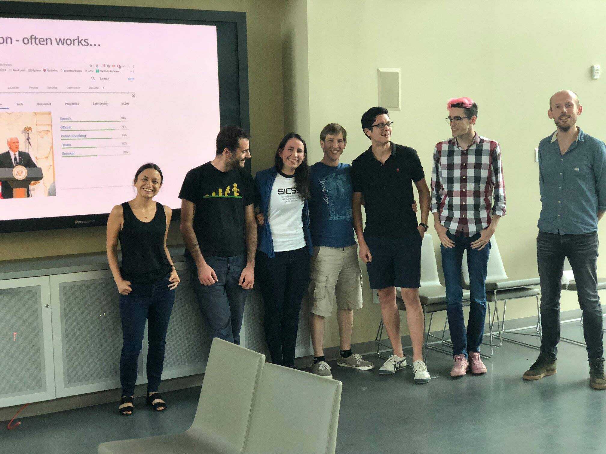
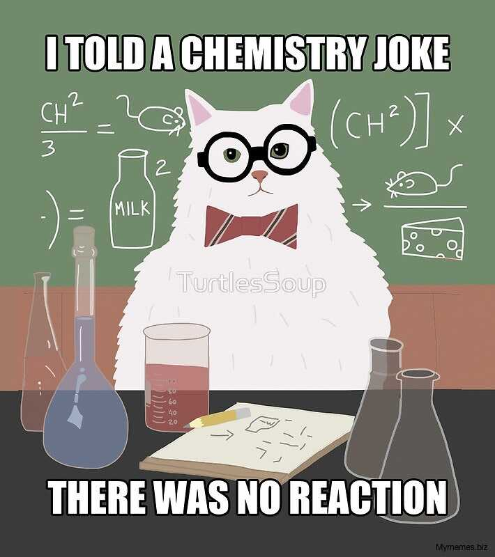
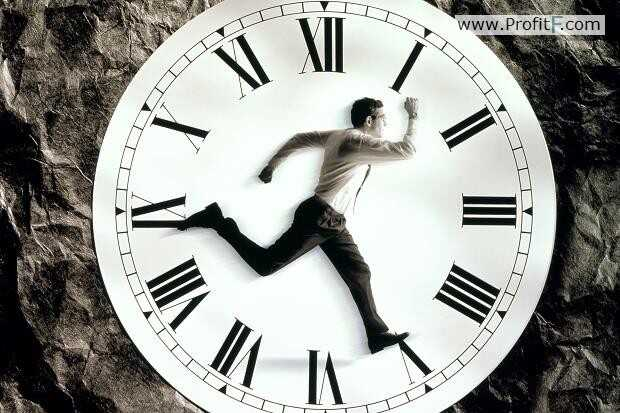
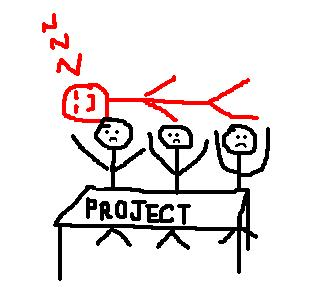

```{r setup, include=FALSE}
# note to students: you can ignore the content of this code chunk
knitr::opts_chunk$set(echo = TRUE, warning = FALSE, message = FALSE,
                      tidy = FALSE)

def.chunk.hook  <- knitr::knit_hooks$get("chunk")
knitr::knit_hooks$set(chunk = function(x, options) {
  x <- def.chunk.hook(x, options)
  ifelse(options$size != "normalsize", paste0("\\", 
                          options$size,"\n\n", x, "\n\n \\normalsize"), x)
})

hook_output <- knitr::knit_hooks$get('output')
knitr::knit_hooks$set(output = function(x, options) {
  if (!is.null(n <- options$linewidth)) {
    x = knitr:::split_lines(x)
    if (any(nchar(x) > n)) x = strwrap(x, width = n)
    x = paste(x, collapse = '\n')
  }
  hook_output(x, options)
})
```

# Strengths of group projects

## Better science

```{r, out.width='100%', echo = FALSE, fig.align = 'center'}
knitr::include_graphics('figures/uzzi_et_al.png')
```


## Efficient way to learn from each other

```{r, out.width='90%', echo = FALSE, fig.align = 'center'}

```

## Diversity of skills

```{r, out.width='80%', echo = FALSE, fig.align = 'center'}
knitr::include_graphics('figures/data_science_venn.png')
```


## A lot of fun

```{r, out.width='95%', echo = FALSE, fig.align = 'center'}

```


# Weaknesses of group projects

## Diversity of skills

```{r, out.width='80%', echo = FALSE, fig.align = 'center'}
knitr::include_graphics('figures/data_science_venn.png')
```


## Ensuring good group chemistry

```{r, out.width='80%', echo = FALSE, fig.align = 'center'}

```


## Limited time

```{r, out.width='90%', echo = FALSE, fig.align = 'center'}

```


## Different goals?

```{r, out.width='80%', echo = FALSE, fig.align = 'center'}

```


## Free-riding

```{r, out.width='80%', echo = FALSE, fig.align = 'center'}

```

## SICSS group projects

- can take on many forms (from original empirical research to creation of open-source tools)
- many groups will only find enough time to create a proposal; some may have pilot results by the end of the week.
- limited seed funding is available for pilot research, data purchasing, and/or cloud computing costs (we encourage you to explore options such as AWS educate first).

# Research speed dating

## Research speed dating

1. we crowdsource a list of research interests in a google sheet (5 min)
2. each person enters a "1" under their research interests (5 min)
3. we identify maximally similar clusters of participants
4. we identify maximally different clusters of participants

## Research speed dating

1. maximally similar clusters come up with a group project (30 min)  
2. maximally different clusters come up with a group project (30 min)  
3. we start a new google doc. Each person takes 5 minutes to write down their favorite group project idea.  
4. we have a 20-30 minute discussion of ideas in the google doc with all SICSS participants.   
5. everyone puts their name next to the group project they want to join  

## Timeline for group projects

Monday afternoon: refine group project idea  

Tuesday morning: write 1 page project description

Tuesday afternoon: organizers will begin responding to seed funding requests (if there are any) on a rolling basis

Tuesday afternoon-Thursday morning: work on group projects  

Thursday afternoon/evening: group presentations (with feedback)

## Required deliverable (for Thursday)

A document that contains a presentation of your group project that is between 10-20 minutes that explains:  

- why your group project is important 

- what are your hypotheses or research questions?  

- what data will/did you collect? 

- first results (if available)

- what are the next steps? 

Note: not all projects will work; if yours fails, please write a post-mortem that explains why

# Let's begin

## Let's crowdsource a list of our research interests

- navigate to the "Bamberg" tab of the Google Sheet: https://bit.ly/2WIrIYh

- create a new row with your name in the first column and a `1` under each of your research interests


## Reading the Google Sheet

```{r, size = 'footnotesize', linewidth = 70}
# Read in interests from google sheet
library(googlesheets)
library(tidyverse)
library(caTools)

SICSS_sheet <- gs_url("https://docs.google.com/spreadsheets/d/1RIeYYvtzEX2kkrXspP2npWBSd9_rRqtw6RywlGvCpsU/edit#gid=0") 

# Extract interests for site
interests <- gs_read(SICSS_sheet, 
                     ws = "Bamberg")
interests <- interests %>% 
  select(-c(2,3)) %>% 
  slice(2:nrow(interests)) 
```

## Identify maximally similar groups

```{r, size = 'footnotesize', linewidth = 70}
# Create distance matrix
interests <- interests %>% 
  # turn interest vectors into numeric
  mutate_at(vars(-Name), as.numeric) %>% 
  # replace nas with 0
  replace(is.na(.), 0)

interest_mat <- interests %>%
  column_to_rownames("Name") %>% 
  as.matrix()

sim_matrix <- dist(interest_mat, method = "euclidean") 
fit_interests <- hclust(sim_matrix , method = "ward.D") 
```

## Identify maximally similar groups

```{r fig.height=4, fig.width=7, size = 'footnotesize', linewidth = 70}
# Display dendogram
plot(fit_interests) 
# Draw dendogram with cut points for groups 
rect.hclust(fit_interests, k = 5,  border = "red")
```


## Compute distances for random groups

```{r, size = 'footnotesize', linewidth = 70}
# Identify all unique combinations of participants of size 4
all_combs <- combs(interests$Name, 4)
# Calculate mean distance within groups
dissimilar_groups <- as.data.frame(all_combs)
dissimilar_groups$score <- NA
for (i in 1:nrow(all_combs)) {
  temp_group <- interests[interests$Name %in% all_combs[i,],]
  temp_dist <- mean(dist(temp_group[,-1]))
  dissimilar_groups$score[i] <- temp_dist
}
```

## Identify maximally diverse groups

```{r, include = FALSE}
max_diverse <- function(df, k = NA) { # `df` specifies data frame used , 
                                      # `k` ceiling for number of groups of 4
  
  ### Just to be safe, arrange `df` by descending dissimilarity score
  df <- df %>%
    arrange(desc(score))
  
  ### `all_names` stores every participant name in the SICSS location
  all_names <- unique(c(as.character(df$V1), as.character(df$V2), 
                        as.character(df$V3), as.character(df$V4)))
  
  # if `k` is set to `NA`, set to k to maximum possible number:
  if (is.na(k)) {
    k = floor(length(all_names)/4)
  }
  
  ### `dgroups` will house each maximally dissimilar group
  dgroups <- df %>%
    slice(1L)
  
  ### `names` stores the names of participants already selected
  names <- c(as.character(dgroups$V1), as.character(dgroups$V2),
             as.character(dgroups$V3), as.character(dgroups$V4)) 
  
  ### `remaining_names` contains names of all remaining participants
  remaining_names <- all_names[!all_names %in% names]
  
  ### The remainder of the groups are selected through the following loop
  for (i in 1:(k - 1)) {
    
    ### `temp_group` eliminates rows in `df` that feature a participant
    ### who has already been placed into a group
    temp_group <- df %>%
      filter(!(V1 %in% names) &
             !(V2 %in% names) &
             !(V3 %in% names) &
             !(V4 %in% names)) %>%
      slice(1L)
    
    ### `temp_group` is added to `dgroups`
    dgroups <- dgroups %>%
      bind_rows(temp_group)
    
    ### The list of `names` already selected is updated for the next iteration
    ### of the loop
    names <- c(as.character(dgroups$V1), as.character(dgroups$V2),
               as.character(dgroups$V3), as.character(dgroups$V4)) 
    
    ### `remaining_names` is also updated
    remaining_names <- all_names[!all_names %in% names]
    
  }
  
  ### If we have less than four participants remaining, these participants
  ### are assigned to a final group
  if (length(remaining_names) < 4) {

    last_group <- as.data.frame(t(c(remaining_names,
                                    rep("", 4-length(remaining_names))))) %>%
      mutate(score = 0)
    
    ### `temp_group` is added to `dgroups`
    dgroups <- dgroups %>%
      bind_rows(last_group)
    
  }
 
  ### Remove dissimilarity scores to prepare final `output`
  output <- dgroups %>%
    select(-score)
  ### Rename column variables (why not?)
  colnames(output) <- str_replace(colnames(output), "V", "Member ")
  ### Name rows for presentation
  rownames(output) <- paste("Group", 1:nrow(output), sep = " ")
  ### Transpose `output` in order to make group assignments more readable
  flip_output <- as.data.frame(t(output))
  
  return(flip_output)
  
}

```


```{r, size = 'footnotesize', linewidth = 70}
dis_groups <- max_diverse(dissimilar_groups)
dis_groups
```

## Let's go!

- Meet in maximally similar and dissimilar groups for 30 minutes. 
- At the end of each 30 minute period, one group representative should write the name of the project and a brief description. Here's a Google Sheet for project ideas: https://docs.google.com/spreadsheets/d/17n2flcUlsg8oXDpOmOb73lc9Z89_JnYNFXB_W5pE1qk/edit?usp=sharing  
- After the end of the exercise, there will be 5 more minutes where everyone can add more project ideas to the sheet.
- Put your name next to the research project that you are most excited about joining.
- Have lunch with your group to begin discussing your project.  
- It is ok to change groups until the end of today.


## Program for week 2

- Monday 12.30 - 13.30: lunch
- Monday 13.30 - 15.00: guest talk by Martijn Schoonvelde
- Tuesday 12.30 - 13.30: lunch
- Tuesday 13.30 - 15.00: guest talk by Milena Tsvetkova
- Wednesday 12.30 - 13.30: lunch
- Wednesday 13.30 - 15.00: flash talks (message organizers on Slack)


##

\begin{center}
\LARGE{Questions?}
\end{center}
