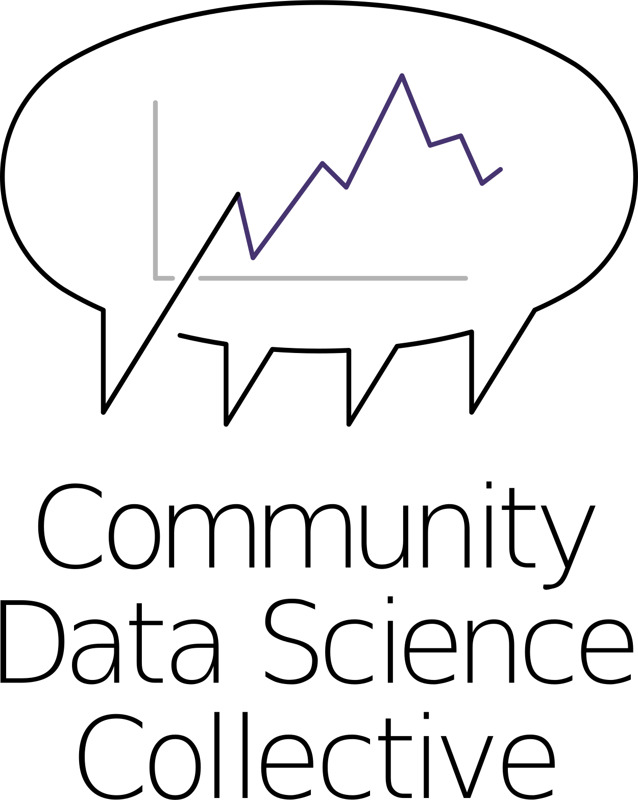

 
From Monday, June 17 to Friday, June 28, 2019, the Summer Institute in Computational Social Science is sponsoring a partner site in Chicago. The purpose of SICSS-Chicago is to bring together Chicagoland graduate students and early career researchers in both social science (broadly conceived) and data science (broadly conceived) to learn and collaborate. Content will include live-streamed lectures from the main site at Princeton University as well as local guest speakers who will present on cutting-edge computational social science research. Topics covered include text analysis, digital data collection, experimental design, non-probability sampling, agent based modeling, and ethics. 

Participants will get hands-on experience using computational methods to test social theories by conducting group projects during the second week. One or more collaborative projects that demonstrate extraordinary promise and interdisciplinarity will receive pilot funding for further development, and all participants will be given support in accessing and utilizing the many data sources freely available for research and analysis.

SICSS-Chicago will be held at Northwestern University’s campus in downtown Chicago. There is no cost to participate, and we will provide breakfast and lunch for all on-site days (see schedule for details). Applicants are invited to apply from everywhere, but we cannot provide travel and lodging in Chicago.

We invite applications from graduate students, postdoctoral researchers, and untenured faculty within 7 years of their Ph.D. SICSS-Chicago is committed to diversity and inclusion in computational social science, and we welcome applicants from groups currently underrepresented in computational social science. About twenty participants will be invited. 

Participants with less experience with social science research will be expected to complete additional readings in advance of the Institute, and participants with less experience coding will be expected to complete a set of online learning modules on the R or Python programming language. Students doing this preparatory work will be supported by a teaching assistant who will hold online office hours before the Institute. 

**[Application materials](https://compsocialscience.github.io/summer-institute/2019/chicago/apply)** should be received by **March 30th, 2019.**

We will notify applicants via e-mail in mid-April, and will ask participants to confirm their participation very soon thereafter. Inquiries can be sent to [sicss.chicago@gmail.com](mailto:sicss.chicago@gmail.com)

**SICSS-Chicago is generously supported by the Alfred P. Sloan Foundation and the Russell Sage Foundation**, 
and several generous local sponsors:

