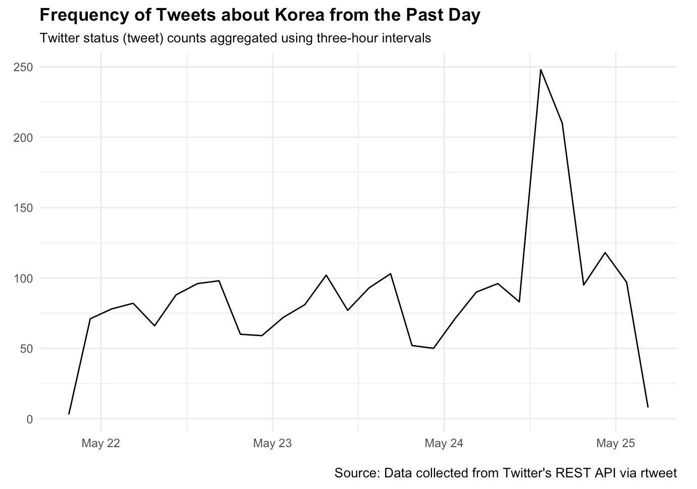
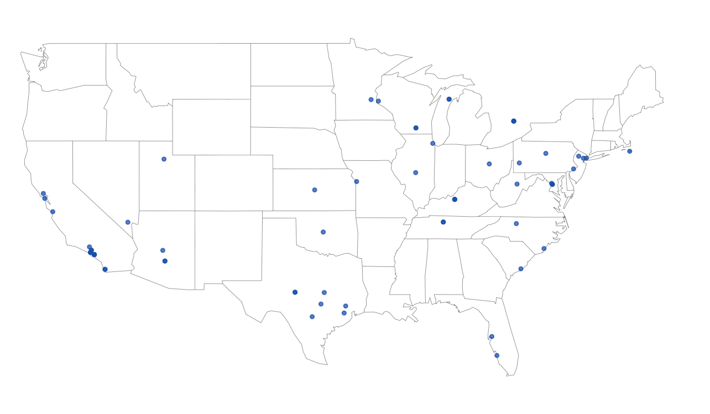
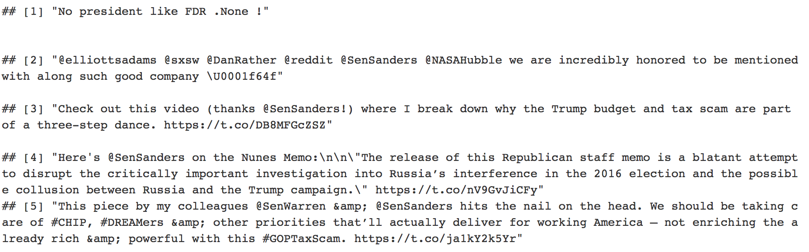

<style>
.reveal section p {
  color: black;
  font-size: .7em;
  font-family: 'Helvetica'; #this is the font/color of text in slides
}


.section .reveal .state-background {
    background: white;}
.section .reveal h1,
.section .reveal p {
    color: black;
    position: relative;
    top: 4%;}

.wrap-url pre code {
  word-wrap:break-word;
}


</style>


Application Programming Interfaces
========================================================
author: Chris Bail 
date: Duke University
autosize: true
transition: fade  
  website: https://www.chrisbail.net  
  github: https://github.com/cbail  
  Twitter: https://www.twitter.com/chris_bail


What Is an Application Programming Interface (API)?
========================================================


What Is an Application Programming Interface (API)?
========================================================


Growth of APIS
========================================================


A List of APIs
========================================================
&nbsp; 

There are now nearly 20,000 APIs and counting:

https://www.programmableweb.com/apis/directory

How Does an API Work?
========================================================
&nbsp;


Simple Example with Google Maps API
========================================================


Anatomy of an API Call
========================================================


Output of API call:
========================================================


Designing your Own API Calls
========================================================

Designing your Own API Calls
========================================================
&nbsp;


API Credentials
========================================================


Example: Facebook API
========================================================
&nbsp;

Navigate to:

https://developers.facebook.com/tools/explorer?classic=0


Rate Limiting
========================================================


An Example with Twitter's API
========================================================

Navigate to:

https://apps.twitter.com.


An Example with Twitter's API
========================================================


Select Account Type and Describe Use
========================================================


The Waiting Is the Hardest Part...
========================================================


Your Developer Console
========================================================


Callback URL
========================================================
&nbsp;

http://127.0.0.1:1410


========================================================
&nbsp;

Keys and Access Tokens
========================================================


The rtweet Package
========================================================
&nbsp;


```r
install.packages("rtweet")
```


Define Your Credentials
========================================================
&nbsp;

```r
app_name<-"YOURAPPNAMEHERE"
consumer_key<-"YOURKEYHERE"
consumer_secret<-"YOURSECRETHERE"
access_token<-"YOURACCESSTOKENHERE"
access_token_secret<-"YOURACCESSTOKENSECRETHERE"
```


Authenticate Yourself with Twitter API
========================================================
&nbsp;

```r
library(rtweet)
create_token(app=app_name, consumer_key=consumer_key, consumer_secret=consumer_secret, access_token=access_token,
access_secret=access_token_secret,
set_renv = TRUE)
```

Your First API Call
========================================================
&nbsp;

```r
korea_tweets<-search_tweets("#Korea", n=3000, include_rts = FALSE)
```


Browse the Results
========================================================
&nbsp;

```r
names(korea_tweets)
```


Browse the Results
========================================================
&nbsp;


Browse the Results
========================================================
&nbsp;

```r
head(korea_tweets$text)
```


Plot the Results
========================================================
&nbsp;

```r
ts_plot(korea_tweets, "3 hours") +
  ggplot2::theme_minimal() +
  ggplot2::theme(plot.title = ggplot2::element_text(face = "bold")) +
  ggplot2::labs(
    x = NULL, y = NULL,
    title = "Frequency of Tweets about Korea from the Past Day",
    subtitle = "Twitter status (tweet) counts aggregated using three-hour intervals",
    caption = "\nSource: Data collected from Twitter's REST API via rtweet"
  )
```

Plot the Results
========================================================
&nbsp;


Next, Let's Search by Location
========================================================
&nbsp;

```r
nk_tweets <- search_tweets("korea",
  "lang:en", geocode = lookup_coords("usa"), 
  n = 1000, type="recent", include_rts=FALSE
  )
geocoded <- lat_lng(nk_tweets)
```


Plot
========================================================
&nbsp;

```r
par(mar = c(0, 0, 0, 0))
maps::map("state", lwd = .25)
with(geocoded, points(lng, lat, pch = 20, cex = .75, col = rgb(0, .3, .7, .75)))
```


Plot
========================================================
&nbsp;



Get Tweets from Individual Account
========================================================
&nbsp;

```r
sanders_tweets <- get_timelines(c("sensanders"), n = 5)
head(sanders_tweets$text)
```

Get Tweets from Individual Account
========================================================
&nbsp;


Get General Information About a User
========================================================
&nbsp;

```r
sanders_twitter_profile <- lookup_users("sensanders")
```


Browse Fields
========================================================
&nbsp;

```r
sanders_twitter_profile$description
```


Browse Fields
========================================================
&nbsp;

```r
sanders_twitter_profile$location
```

Browse Fields
========================================================
&nbsp;

```r
sanders_twitter_profile$followers_count
```


Get Users' Favorites
========================================================
&nbsp;

```r
sanders_favorites<-get_favorites("sensanders", n=5)
sanders_favorites$text
```

Get Users' Favorites
========================================================
&nbsp;



Get Networks
========================================================
&nbsp;

```r
sanders_follows<-get_followers("sensanders")
```


Check Rate Limits
========================================================
&nbsp;

```r
rate_limits<-rate_limit()
head(rate_limits[,1:4])
```

Check Rate Limits
========================================================
&nbsp;


Get Trending Topics by Location
========================================================
&nbsp;

```r
get_trends("New York")
```

Get Trending Topics by Location
========================================================
&nbsp;


rtweet can even post tweets!
========================================================
&nbsp;

```r
post_tweet("I love APIs")
```
&nbsp;  

**Note: this is a very useful function if you are building a bot**

Wrapping API Calls within a Loop
========================================================


Wrapping API Calls within a Loop
========================================================
class: wrap-url
&nbsp;

```r
#load list of twitter handles for elected officials
elected_officials<-read.csv("https://cbail.github.io/Elected_Officials_Twitter_Handles.csv",stringsAsFactors = FALSE)
head(elected_officials)
```

```
                  name    screen_name
1   Sen Luther Strange SenatorStrange
2    Rep. Mike Johnson RepMikeJohnson
3             Ted Budd     RepTedBudd
4    Adriano Espaillat   RepEspaillat
5 Rep. Blunt Rochester  RepBRochester
6  Nanette D. Barragán    RepBarragan
```


Wrapping API Calls within a Loop
========================================================
class: wrap-url

```r
#create empty container to store tweets for each elected official
elected_official_tweets<-as.data.frame(NULL)

for(i in 1:nrow(elected_officials)){
  
  #pull tweets
  tweets<-get_timeline(elected_officials$screen_name[i], n=100)
  
  #populate dataframe
  elected_official_tweets<-rbind(elected_official_tweets, tweets)
  
  #pause for one second to further prevent rate limiting
  Sys.sleep(1)
  
  #print number/iteration for debugging/monitoring progress
  print(i)
}
```


There Are R Packages for Other APIs
========================================================
&nbsp;

**Here are a few: `RgoogleMaps`, `Rfacebook`, `rOpenSci`(this one combines many different APIs e.g. the Internet Archive),  `WDI`,`rOpenGov`,`rtimes`**

**Many more are available but not yet on CRAN (install from github or using devtools)**

There Are Also APIs That do Analysis for You!
========================================================
&nbsp;

**For example, visualization (`plotly`)**


Challenges of Working with APIs
========================================================


A List of APIs of Interest
========================================================
&nbsp;

https://www.programmableweb.com/ https://github.com/toddmotto/public-apis  

https://apilist.fun/

https://ropensci.org/packages/

https://docs.google.com/spreadsheets/d/1ZEr3okdlb0zctmX0MZKo-gZKPsq5WGn1nJOxPV7al-Q/edit?usp=sharing


