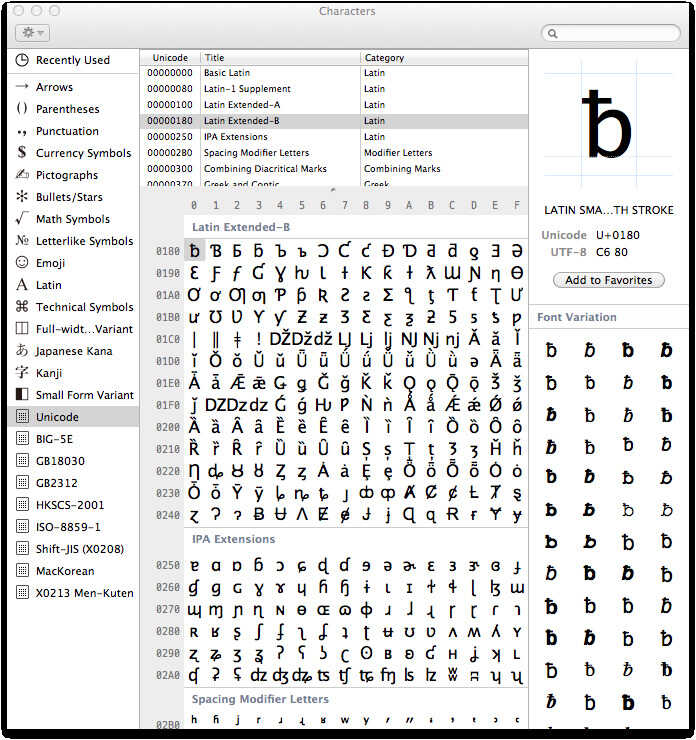

<br>
**[Text as Data Course](https://cbail.github.io/textasdata/Text_as_Data.html)**   
**Chris Bail, PhD**  
**Duke University**  
[www.chrisbail.net](http://www.chrisbail.net)  
[github.com/cbail](https://github.com/cbail)  
[twitter.com/chris_bail](https://twitter.com/chris_bail)  

This tutorial is designed to introduce you to the basics of text analysis in R. It provides a foundation for future tutorials that cover more advanced topics in automated text analysis such as topic modeling and network-based text analysis. This tutorial assumes basic knowledge about R and other skills described in previous tutorials at the link above.

# Character Encoding

One of the first things that is important to learn about quantitative text analysis is to most computer programs, texts or strings also have a numerical basis called character encoding. Character encoding is a style of writing text in computer code that helps programs such as web browsers figure out how to display text. There are presently dozens of different types of character encoding that resulted not only from advances in computing technology---and the development of different styles for different operating systems---but also for different languages (and even new languages such as emoji). The figure below illustrates a form of character encoding called "Latin Extended-B" which was developed for representing text in languages derived from Latin (which of course excludes a number of important languages)

<br>

<br>

Why should you care that text can be created using different forms of character encoding? Well, if you have scraped a large amount of data from multiple websites---or multiple social media sites--- you may find that your data exist in multiple types of character encoding, and this can create a big hassle. Before we begin working with a text-based dataset, it is useful to either a) make sure every text uses the same character encoding; or b) use a tool to force or coerce all text into a single character encoding. The `Encoding` and `inconv` functions in base R can be very useful for the latter purposes. Note, however, that the latter function may create "place holders" for characters that it cannot process. For example, if an old version of character encoding is applied to text that contains emoji, the emoji may appear as strings of seeminly incoherent symbols and punctuation marks.

Inconsistent character encoding is one of the most common pitfalls for those attempting to learn how to perform quantitative text analysis in R, but there are no easy solutions. If you try to run the code below and receive error messages such as `invalid multibyte string`, this is indicative of a character encoding issue that you will most likely need to resolve using one of the imperfect steps above. 

# GREP

Another important tool for working with text is GREP, which stands for "Globally search a regular expression and print." In laymans terms, GREP is a tool that helps you search for the presence of a string of characters that matches a pattern.

To demonstrate why you need to learn some GREP, let's return to an issue we encountered in a previous tutorial on screen-scraping. In that tutorial, we scraped a Wikipedia page and discovered that there were strange characters such as `\t` and `\n` interspersed throughout the text we scraped. At the time, I mentioned that these are html tags, or chunks of code that tell your web browser how to display something (in this case a "tab" space and a new line).

Let's create a character string that includes such characters as follows (the meaning of the text isn't important- this was scraped from the Duke University web page "Events" section):

```{r}
duke_web_scrape<- "Class of 2018: Senior Stories of Discovery, Learning and Serving\n\n\t\t\t\t\t\t\t" 
```

Once again, GREP-style commands search for a certain pattern. For example, let's write some code that determines whether the word "Class" is part of our string using the `grepl` function in base R:

```{r}
grepl("Class", duke_web_scrape)
```

The text within quotes is the pattern we are trying to find, and the second argument is the string we want to search within. The output tells us that there was one occurrence of "Class."

Now let's use the `gsub` command to remove all `\t`s from the string

```{r}
gsub("\t", "", duke_web_scrape)
```

The first argument in the `gsub` function names the pattern we are looking for, the second (blank) argument tells us what we want to replace that pattern with, and the third argument is the strong we want to transform.

We can also pass two arguments at once using the `|` separator as follows:

```{r}
gsub("\t|\n", "", duke_web_scrape)
```

GREP-style commands also include a wildcard which can be used to, for example, find all words in a string that start with a certain letter, such as "P":

```{r}
some_text<-c("This","Professor","is","not","so","great")
some_text[grep("^[P]", some_text)]
```

[Here](http://www.rstudio.com/wp-content/uploads/2016/09/RegExCheatsheet.pdf) is a useful cheatsheet that includes more examples of how to use GREP to find patterns in text.

Grep commands are fairly straight forward, and much more powerful and useful for subsetting rows or columns within larger datasets. There is one more concept which is important for you to grasp about GREP, however, which is that certain characters such as `"` confuse the techniques. For example

```{r, eval=FALSE}
text_chunk<-c("[This Professor is not so Great]")
gsub("\","", text_chunk)
```

We receive an error message when we run the code above because the `\` character has a literal meaning to R because it is part of something called a regular expression. To remove this character, and other characters like it, we need to "escape" the character using single quotation marks wraped around a double `\\` as follows:
```{r}
text_chunk<-c("[This Professor is not so Great]")
gsub('\\[|\\]',"", text_chunk)
```


# Tokenization

Another important concept that is necessary to master to perform quantitative text analysis is Tokenization. Tokenization refers to the way you are definining the unit of analysis. This might include words, sequences of words, or entire sentences. The figure below provides an example of one way to Tokenize a simple sentence.

<br>

<br>

This figure illustrates the most common way of tokenizing a text---by individual word. Many techniques in quantitative text analysis also analyze what are known as "n-grams" however. Ngrams are simply sequences of words with length "n." For example, the sentence above could be written in ngram form as "the quick brown","quick brown fox", "brown fox jumps" and so on. N-grams can be useful when word-order is important, as I will discuss in additional detail below. For now, let me give you a simple example: "I hate the president" and "I'd hate to be the president."

# Creating a Corpus

Another unique feature of quantitative text analysis is that it typically requires new data formats that allow algorithms to quickly compare one document to a lot of other documents in order to identify patterns in word usage that can be used to identify latent themes, or address the overall popularity of a word or words in a single document vs. a group of documents. One of the most common data formats in the field of Natural Language Processing is a corpus. 

In R, the `tm` package is often used to create a corpus object. This package can be used to read in data in many different formats-- including text within data frames, .txt files, or .doc files. Let's begin with an example of how to read in text from within a data frame. We begin by loading an .Rdata file that contains 3,196 recent tweets by President Trump that are hosted on my Github page:

```{r}
load(url("https://cbail.github.io/Trump_Tweets.Rdata"))
head(trumptweets$text)
```

In order to create a corpus of these tweets, we need to use the `Corpus` function within the `tm` package. First let's install that package

```{r, eval=FALSE}
install.packages("tm")
```

Now let's load the `tm` package in order to use its `Corpus` function:

```{r, warning=FALSE, message=FALSE}
library(tm)
trump_corpus <- Corpus(VectorSource(as.vector(trumptweets$text))) 
trump_corpus
```

As this output shows, we've created a corpus with 3,196 documents, where each document is one of Trump's tweets. You may also notice that the `Corpus` object can also store metadata such as information about the names of the author of each document of or the date each document was produced (though we are not storing any such meta data here.

# Tidy-Text

An important alternative to Corpus object has emerged in recent years in the form of `tidytext`. Instead of saving a group of documents and associated meta data, text that is in `tidytext` format contains one word per row, and each row also includes additional information about the name of the document where the word appears, and the order in which the words appear.

Let's install the tidytext package to illustrate:

```{r, eval=FALSE}
install.packages("tidytext")
```

Now let's load our database of Trump tweets into `tidytext` format--- since the `tidytext` package is part of the `tidyverse`, which is a family of packages that work well together in R that includes other popular packages such as `dplyr` and `ggplot2` we will use the "piping" style of coding (`%>%`) associated with such packages:

```{r, warning=FALSE, message=FALSE}

library(tidytext)
library(dplyr)
tidy_trump_tweets<- trumptweets %>%
    select(created_at,text) %>%
    unnest_tokens("word", text)
```

A major advantage of `tidytext` format is that once the text has been tidy-ed, regular R functions can be used to analyze it instead of the specialized functions necessary to analyze a Corpus object. For example, to count the most popular words in Trump's tweets, we can do the following:

```{r}
tidy_trump_tweets %>%
  count(word) %>%
    arrange(desc(n))
```

Not very informative or interesting that the most frequent word used by trump is "the" is it? This brings us to our next subject: text pre-processing.

# Text Pre-Processing

Before we begin running quantitative analyses of text, we first need to decide precisely which type of text should be included in our analyses. For example, as the code above showed, very common words such as "the" are often not very informative. That is, we typically do not care if one author uses the word "the" more often than another in most forms of quantitative text analysis, but we might care a lot about how many times a politician uses the word "economy" on Twitter.

**Stopwords**

Common words such as "the","and","bot","for","is" etc. are often described as "stop words," meaning that they should not be included in a quantitative text analysis. Removing stop words is fairly easy regardless of whether you are working with a Corpus object or a tidytext object assuming you are working with a widely used language such as English. Let's begin with the former, using the `tm_map` function as follows:

```{r}
trump_corpus <- tm_map(trump_corpus, removeWords, stopwords("english"))
```

In `tidytext` we can remove stopwords as follows:

```{r, warning=FALSE, message=FALSE}
 data("stop_words")
    tidy_trump_tweets<-tidy_trump_tweets %>%
      anti_join(stop_words)
```

And now we can repeat the count of top words above:

```{r}
tidy_trump_tweets %>%
  count(word) %>%
    arrange(desc(n))
```

Looks better, but we still have a number of terms in there that might not be very useful such as "https" or "t.co", which is an abbreviation used in links shared on twitter. Likewise "rt" is an abbreviation for "retweet," and does not thus carry much meaning.

If we wanted to remove these words, we could create a custom list of stop words in the form of a character vector, and use the same `anti_join` function above to remove all words within this custom list. 

**Punctuation**  

Another common step in pre-processing text is to remove all punctuation marks. This is generally considered important, since to an algorithm the punctuation mark "," will assume a unique numeric identity just like the term "economy." It is often therefore advisable to remove punctuation marks in an automated text analysis, but there are also a number of cases where this can be problematic. Consider the phrase, "Let's eat, Grandpa" vs. "Lets eat Grandpa."

To remove punctuation marks within a `Corpus` object, we use this code:

```{r}
trump_corpus <- tm_map(trump_corpus, content_transformer(removePunctuation))
```

An advantage of `tidytext` is that it removes punctuation automatically.

**Removing Numbers**  

In many texts, numbers can carry significant meaning. Consider, for example, a text about the 4th of July. On the other hand, many numbers add little to the meaning of a text, and so it has become commonplace in the field of natural language processing to remove them from an analysis.

One can remove numbers from a `Corpus` object as follows:

```{r}
trump_corpus <- tm_map(trump_corpus, content_transformer(removeNumbers))
```

This is also very easy in `tidytext` using basic `grep` commands (note the `"\\b\\d+\\b"` text here tells R to remove all numeric digits and the '-' sign means grep excludes them rather than includes them):

```{r}

tidy_trump_tweets<-tidy_trump_tweets[-grep("\\b\\d+\\b", tidy_trump_tweets$word),]

```

**Word Case**  

There are also several less obvious issues in text-preprocessing. For example, do we want "Economy" to be counted as a different word than "economy"? Probably. What about "God", and "god"? That one is much less straightforward. Nevertheless, it has become commonplace to force all text into lower case in quantitative text analysis. Here's how to do it with a `Corpus` object:

```{r, eval=FALSE}
trump_corpus <- tm_map(trump_corpus,  content_transformer(tolower)) 
```

Once again `tidytext` automatically makes all words lower case.

**Removing whitespaces**  

Often, a single white space or group of whitespaces can also be considered to be a "word" within a corpus. To prevent this, do the following with a `Corpus` object:

```{r}
trump_corpus <- tm_map(trump_corpus, content_transformer(stripWhitespace))
```

In `tidytext` we can use the `gsub` function again as follows (s+ describes a blank space)

```{r}
tidy_trump_tweets$word <- gsub("\\s+","",tidy_trump_tweets$word)
```

**Stemming**  

A final common step in text-pre processing is stemming. Stemming a word refers to replacing it with its most basic conjugate form. For example the stem of the word "typing" is "type." Stemming is common practice because we don't want the words "type" and "typing" to convey different meanings to algorithms that we will soon use to extract latent themes from unstructured texts.

Here is the procedure for stemming words within a `Corpus` object:

```{r, eval=FALSE}
trump_corpus  <- tm_map(trump_corpus, content_transformer(stemDocument), language = "english")
```

And here is some code to stem `tidytext` data-- we are also going to employ the `SnowballC` package (which you may need to install). This package includes the `wordStem` function we will use to stem the tidytext object:

```{r, eval=FALSE}
library(SnowballC)
  tidy_trump_tweets<-tidy_trump_tweets %>%
      mutate_at("word", funs(wordStem((.), language="en")))
```

# The Document-Term Matrix

A final core concept in quantitative text analysis is a Document-Term Matrix. This is a matrix where each word is a row and each colum is a document. The number within each cell describes the number of times the word appears in the document. Many of the most popular forms of text analysis, such as topic models, require a document term matrix.

To create a document-term matrix from a `Corpus` object, use the following code:

```{r, eval=FALSE}
trump_DTM <- DocumentTermMatrix(trump_corpus, control = list(wordLengths = c(2, Inf)))
```

The end of the code above specifies that we only want to include words that are at least two characters long.

We can view the first five rows of the DTM and two of its columns as follows:

```{r, eval=FALSE}
inspect(trump_DTM[1:5,3:8])
```


To create a DTM in `tidytext` we can use the following code:

```{r}

tidy_trump_DTM<-
  tidy_trump_tweets %>%
  count(created_at, word) %>%
  cast_dtm(created_at, word, n)
```

**Now YOU try it!!!**

Now that we have mastered some basic concepts in text analysis, try a) creating a corpus or tidytext dataset; b) counting the five top words that appear in that dataset after removing stop words; and c) create a Document-Term Matrix.
