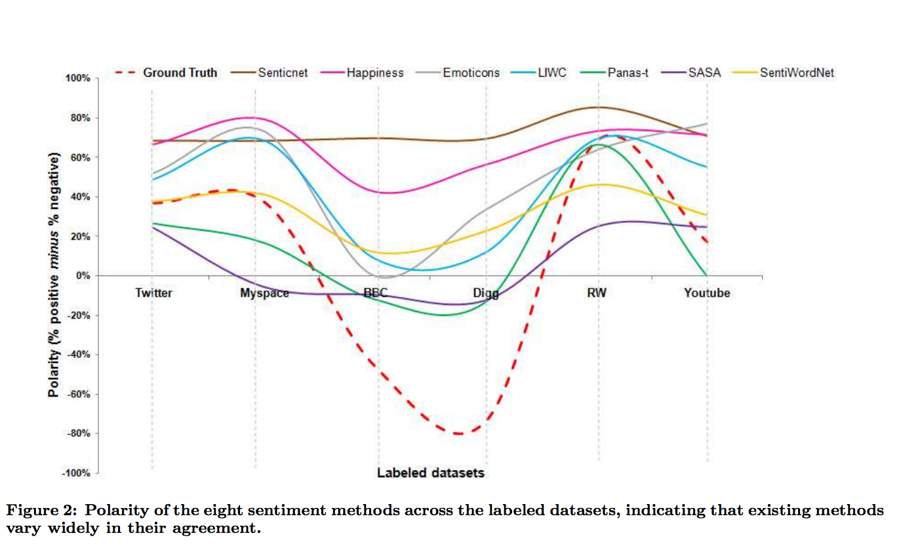

<br>
**[Text as Data Course](https://cbail.github.io/textasdata/Text_as_Data.html)**   
**Chris Bail, PhD**  
**Duke University**  
[www.chrisbail.net](http://www.chrisbail.net)  
[github.com/cbail](https://github.com/cbail)  
[twitter.com/chris_bail](https://twitter.com/chris_bail)  

# Introduction

Among the most basic forms of quantitative text analysis are word-counting techniques and dictionary-based methods. This tutorial will cover both of these topics, as well as sentiment analysis, which is a form of dictionary-based text analysis. This tutorial assumes basic knowledge about R and other skills described in previous tutorials at the link above.

# Word Counting

In the early days of quantitative text analysis, word-frequency counting in texts was a common mode of analysis. In this section, we'll learn a few basic techniques for counting word frequencies and visualizing them. We're going to work within the `tidytext` framework, so if you need a refresher on that, see my previous tutorial entitled "Basic Text Analysis in R."

Let's begin by loading the Trump tweets we extracted in a previous tutorial and transform them into `tidytext` format:

```{r, message=FALSE, warning=FALSE}
load(url("https://cbail.github.io/Trump_Tweets.Rdata"))
library(tidytext)
library(dplyr)
tidy_trump_tweets<- trumptweets %>%
    select(created_at,text) %>%
    unnest_tokens("word", text)
```

Next, let's count the top words after removing stop words (frequent words such as "the", and "and") as well as other unmeaningful words (e.g. https):

```{r, message=FALSE, warning=FALSE}

data("stop_words")

trump_tweet_top_words<-
   tidy_trump_tweets %>%
      anti_join(stop_words) %>%
        count(word) %>%
        arrange(desc(n))
    

trump_tweet_top_words<-
  trump_tweet_top_words[-grep("https|t.co|amp|rt",
                              trump_tweet_top_words$word),]
```

Now let's make a graph of the top 20 words

```{r, message=FALSE, warnings=FALSE}
#select only top words
top_20<-trump_tweet_top_words[1:20,]

#create factor variable to sort by frequency
trump_tweet_top_words$word <- factor(trump_tweet_top_words$word, levels = trump_tweet_top_words$word[order(trump_tweet_top_words$n,decreasing=TRUE)])


library(ggplot2)
ggplot(top_20, aes(x=word, y=n, fill=word))+
  geom_bar(stat="identity")+
  theme_minimal()+
  theme(axis.text.x = element_text(angle = 90, hjust = 1))+
  ylab("Number of Times Word Appears in Trump's Tweets")+
  xlab("")+
  guides(fill=FALSE)

```

# tf-idf

Though we have already removed very common "stop words" from our analysis, it is common practice in quantitative text analysis to identify unusual words that might set one document apart from the others (this will become particularly important when we get to more advanced forms of pattern recognition in text later on). The metric most commonly used to identify these unusual words is "Term Frequency Inverse Document Frequency" (tf-idf). We can calculate the tf-idf for the Trump tweets databased in `tidytext` as follows:

```{r, message=FALSE, warning=FALSE}

tidy_trump_tfidf<- trumptweets %>%
    select(created_at,text) %>%
      unnest_tokens("word", text) %>%
        anti_join(stop_words) %>%
           count(word, created_at) %>%
              bind_tf_idf(word, created_at, n)
```

Now let's see what the most unusual words are:

```{r}
top_tfidf<-tidy_trump_tfidf %>%
  arrange(desc(tf_idf))

top_tfidf$word[1]

```

The tfidf increases the more a term appears in a document but it is negatively weighted by the overall frequency of terms across all documents in the dataset or Corpus. In simpler terms, the tf-idf helps us capture which words are not only important within a given document but also distinctive vis-a-vis the broader corpus or tidytext dataset.

# Dictionary-Based Quantitative Text Analysis

Though word frequency counts and tf-idf can be an informative way to examine text-based data, another very popular techniques involves counting the number of words that appear in each document that have been assigned a particular meaning or value to the researcher. There are numerous examples that we shall discuss below--- some of which are more sophisticated than others.

**Creating your own dictionary**

To begin, let's make our own dictionary of terms we want to examine from the Trump tweet dataset. Suppose we are doing a study of economic issues, and want to subset those tweets that contain words associated with the economy. To do this, we could first create a list or "dictionary" or terms that are associated with the economy.

```{r}
economic_dictionary<-c("economy","unemployment","trade","tariffs")
```

Having created a very simple/primitive dictionary, we can now subset the parts of our tidytext dataframe that contain these words. 

```{r}
economic_tweets<-trumptweets %>% 
filter(text, paste0(economic_dictionary, "\\b", collapse = "|"))
```

# Sentiment Analysis

The example above was somewhat arbitrary and mostly designed to introduce you to the concept of dictionary-base text analysis. The list of economic terms that I came up with was very ad hoc---and though the tweets identified above each mention the economy, there are probably many more tweets in our dataset that reference economic issues that do not include the words I identified.

Dictionary-based approaches are often most useful when a high-quality dictionary is available that is of interest to the researcher or analyst. One popular type of dictionary is a sentiment dictionary which can be used to assess the valence of a given text by searching for words that describe affect or opinion. Some of these dictionaries are created by examining comparing text-based evaluations of products in online forums to ratings systems. Others are created via systematic observation of people writing who have been primed to write about different emotions.

Let's begin by examining some of the sentiment dictionaries that are built into `tidytext.` These include the `afinn` which includes a list of sentiment-laden words that appeared in [Twitter discussions of climate change](http://www2.imm.dtu.dk/pubdb/views/edoc_download.php/6006/pdf/imm6006.pdf); `bing` which includes sentiemnt words identified on online forums; and `nrc` which is a dictionary that was created by having workers on Amazon mechanical Turk code the emotional valence of a [long list of terms](https://arxiv.org/pdf/1308.6297.pdf). These algorithims often produce similar results, even though they are trained on different datasets (meaning they identify sentiment laden words using different corpora). Each of these dictionaries only describe sentiment-laden words in the English language. They also have different scales. We can browse the content of each dictionary as follows:

```{r}
head(get_sentiments("afinn"))
```

Let's apply the `bing` sentiment dictionary to our database of tweets by Trump:

```{r, message=FALSE, warning=FALSE}

trump_tweet_sentiment <- tidy_trump_tweets %>%
  inner_join(get_sentiments("bing")) %>%
    count(created_at, sentiment) 

head(trump_tweet_sentiment)
```

Now let's make a visual that compares the frequency of positive and negative tweets by day. To do this, we'll need to work a bit with the `created_at` variable---more specifically, we will need to transform it into a "date" object that we can use to pull out the day during which each tweet was made:

```{r}
tidy_trump_tweets$date<-as.Date(tidy_trump_tweets$created_at, 
                                          format="%Y-%m-%d %x")
```

The `format` argument here tells R how to read in the date character string, since dates can appear in a number of different formats, time zones, etc. For more information about how to format data with other dates, see `?as.Date()`

Now let's aggregate negative sentiment by day

```{r}
trump_sentiment_plot <-
  tidy_trump_tweets %>%
    inner_join(get_sentiments("bing")) %>% 
      filter(sentiment=="negative") %>%
          count(date, sentiment)

        
library(ggplot2)

ggplot(trump_sentiment_plot, aes(x=date, y=n))+
  geom_line(color="red")+
    theme_minimal()+
      ylab("Frequency of Negative Words in Trump's Tweets")+
        xlab("Date")
    
  
```

There appears to be an upward trend. Is it possible that this increase is being shaped by Trump's approval rating? Let's take a look, downloading data from the survey polling group 538 for the same time period as our Twitter data above:

```{r}
trump_approval<-read.csv("https://projects.fivethirtyeight.com/trump-approval-data/approval_topline.csv")

trump_approval$date<-as.Date(trump_approval$modeldate, format="%m/%d/%Y")

approval_plot<-
  trump_approval %>%
    filter(subgroup=="Adults") %>%
      filter(date>min(trump_sentiment_plot$date)) %>% 
          group_by(date) %>%
              summarise(approval=mean(approve_estimate))

#plot
ggplot(approval_plot, aes(x=date, y=approval))+
  geom_line(group=1)+
    theme_minimal()+
      ylab("% of American Adults who Approve of Trump")+
        xlab("Date")
```

Quite obviously we have some scaling issues we would need to address if we wanted to make a proper comparison, but for now, let's move on.

There are many other types of sentiment analysis, which we do not have time to cover here. An important thing for you to know, however, is that different sentiment analysis tools work better for some corpuses than others. Here is a figure from a recent paper that applies a vareity of different sentiment dictionaries to different corpora:



Source: http://homepages.dcc.ufmg.br/~fabricio/download/cosn127-goncalves.pdf


**Now you Try it**

Let's try to build together several of the skills you've learned in the course thus far: 1) Pick another politician or celebrity of interest, such as Hilary Clinton; 2) Grab her 3,000 most recent tweets; 3) See if her approval rating tracks the sentiment of her tweets, or---better yet--- create your own custom dictionary to track a variable or variables of interest over time.


**Linguistic Inquiry Word Count (LIWC)**

Before I wrap up, I just want to highlight another class of dictionary-based approaches: those that attempt to classify not only sentiment but a range of different types of psychometric properties and substantive properties of a text. A popular example is Linguistic Inquiry Word Count, which was developed by the social psychologist James Penebaker. As the figure below shows, LIWC is a large dictionary that classifies words into dozens of categories:


Unlike some of the other approaches above, LIWC was built in a very systematic fashion--- through both observation of natural language use in a variety of settings as well as empirical observation of people who were primed to write about different subjetions. For these reasons, it has become one of the more popular dictionary-based approaches in the past decade. At the same time, it---like all dictionary approaches---is ultimately limited insofar as it assumes that each word has an intrinisic meaning. As we will soon see, a more useful assumption is often that words assume different meanings based upon their apperance alongside other words.

# When Should I use a Dictionary-Based Approach?

The quality of dictionary-based methods depends heavily upon the match between the learning-corpus and the one you want to code. Creating your own is often a good solution, but it is very time intensive. On the other hand, as we will see in future tutorials, dictionary-based approaches often perform better than more sophisticated techniques such as topic modeling, depending upon the task at hand.


