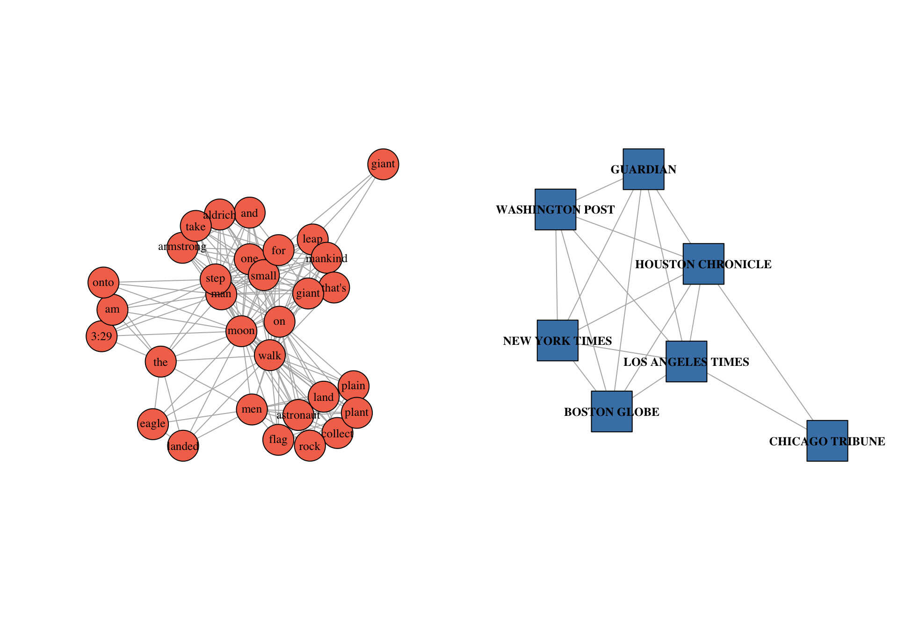
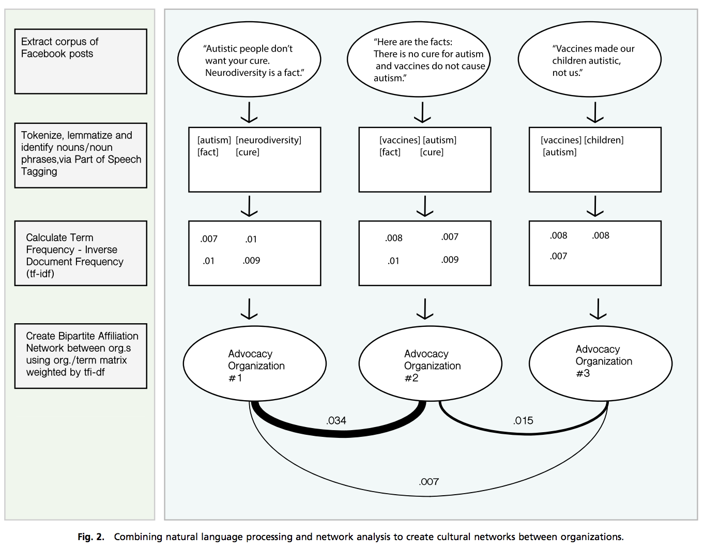
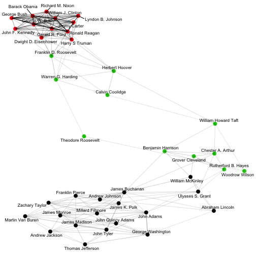
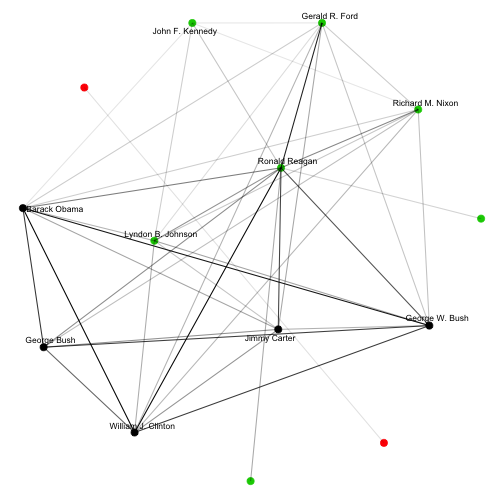

<style>
.reveal section p {
  color: black;
  font-size: .7em;
  font-family: 'Helvetica'; #this is the font/color of text in slides
}


.section .reveal .state-background {
    background: white;}
.section .reveal h1,
.section .reveal p {
    color: black;
    position: relative;
    top: 4%;}


</style>


Text Networks
========================================================
author: Chris Bail 
date: Duke University
autosize: true
transition: fade  
  website: https://www.chrisbail.net  
  github: https://github.com/cbail  
  Twitter: https://www.twitter.com/chris_bail

What is a Network?
========================================================

What is a Network?
========================================================


Two-mode networks
========================================================

Two-mode networks
========================================================


Two-mode networks
========================================================


Two-mode networks
========================================================


From Words to Networks
========================================================


From Words to Networks
========================================================



State of the Union Addresses
========================================================


State of the Union Addresses
========================================================


Textnets
========================================================


Textnets
========================================================

The `textnets` package provides the following functions:

1) preparing texts for network analysis  
2) creating text networks  
3) visualizing text networks  
4) detecting themes or "topics" within text networks  

Textnets
========================================================


```r
library(devtools)
install_github("cbail/textnets")
```


Example: State of the Union Addresses
========================================================


```r
library(textnets)
data(sotu)
```

Part of Speech Tagging Takes Time...
========================================================


```r
sotu_first_speeches <- sotu %>% group_by(president) %>% slice(1L)
```

PrepText
========================================================


```r
prepped_sotu <- PrepText(sotu_first_speeches, groupvar = "president", textvar = "sotu_text", node_type = "groups", tokenizer = "words", pos = "nouns", remove_stop_words = TRUE, compound_nouns = TRUE)
```


Creating Textnets
========================================================


```r
sotu_text_network <- CreateTextnet(prepped_sotu)
```


Visualize
========================================================


```r
VisTextNet(sotu_text_network, label_degree_cut = 0)
```




Interactive Visualization
========================================================


```r
library(htmlwidgets)
vis <- VisTextNetD3(sotu_text_network, 
                      height=300,
                      width=400,
                      bound=FALSE,
                      zoom=FALSE,
                      charge=-30)
saveWidget(vis, "sotu_textnet.html")
```


Choosing Alpha
========================================================


```r
VisTextNet(sotu_text_network, alpha=.1, label_degree_cut = 2)
```




Interactive Visualization
========================================================

<embed width="1000" height="800" src="https://cbail.github.io/sotu_textnet.html">


Analyzing Text Networks
========================================================


```r
sotu_communities <- TextCommunities(sotu_text_network)
head(sotu_communities)
```

```
              group modularity_class
1   Abraham Lincoln                3
2    Andrew Jackson                3
3    Andrew Johnson                3
4      Barack Obama                2
5 Benjamin Harrison                3
6   Calvin Coolidge                1
```

Analyzing Text Networks
========================================================


```r
top_words_modularity_classes <- InterpretText(sotu_text_network, prepped_sotu)
head(top_words_modularity_classes, 10)
```

```
# A tibble: 10 x 2
# Groups:   modularity_class [2]
   modularity_class lemma        
   <chr>            <chr>        
 1 2                recovery plan
 2 1                consolidation
 3 1                child labor  
 4 1                exploitation 
 5 1                readjustment 
 6 1                recovery     
 7 1                recovery act 
 8 1                restoration  
 9 1                structure    
10 2                drug         
```

Centrality Measures
========================================================


```r
text_centrality <- TextCentrality(sotu_text_network)
```


Next Steps with TextNets
========================================================


Next Steps with TextNets
========================================================


