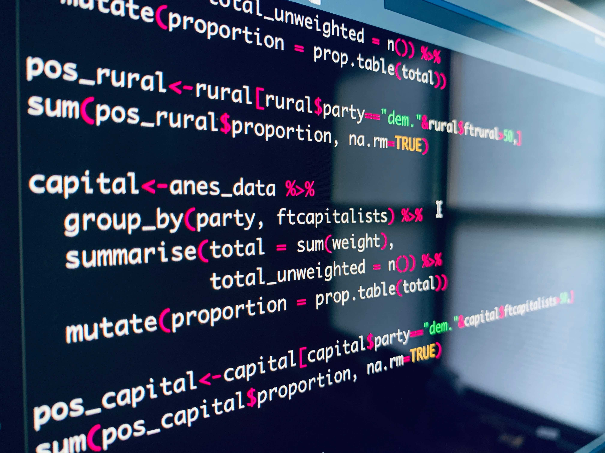
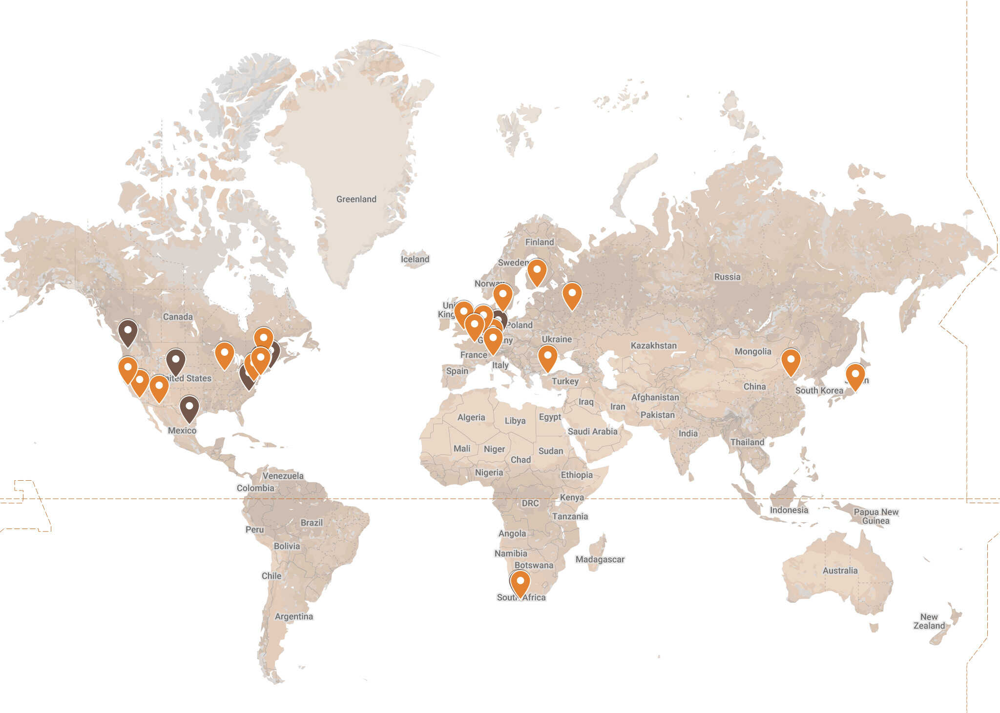
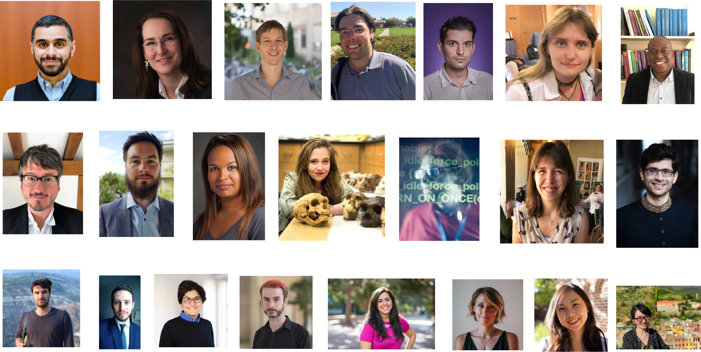
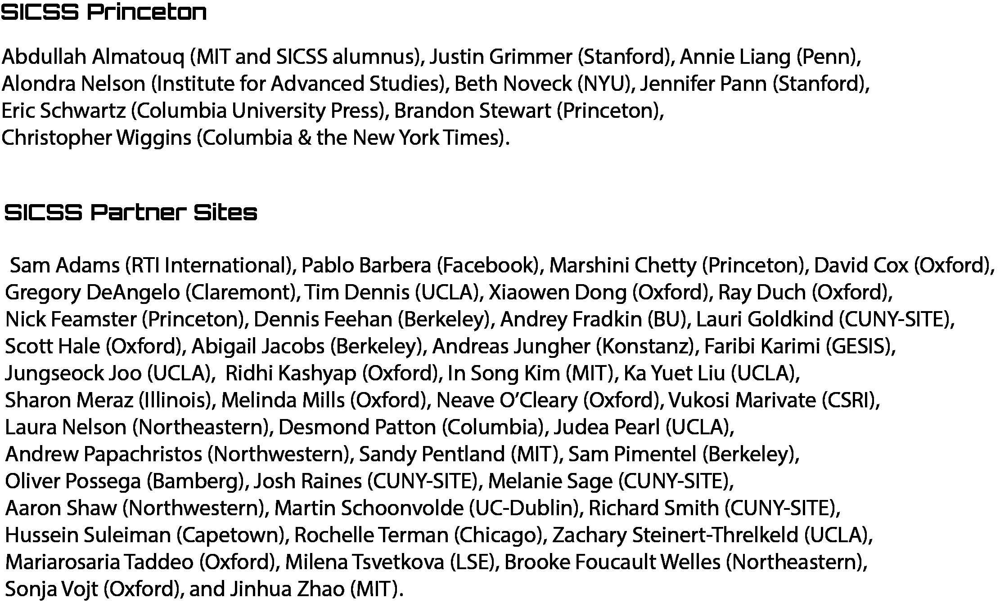
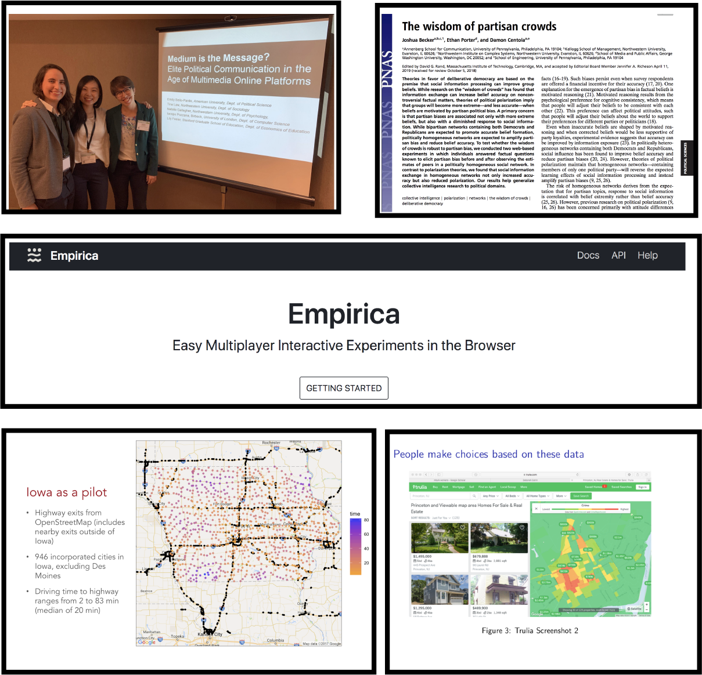

Why SICSS?
========================================================
author: Chris Bail 
date: Duke University
autosize: true
transition: fade  
  website: https://www.chrisbail.net  
  github: https://github.com/cbail  
  Twitter: https://www.twitter.com/chris_bail

========================================================

# **CHALLENGES**

1. Big Problems in the World
========================================================

1. Big Problems in the World
========================================================

2. Our Field is Growing
========================================================

2. Our Field is Growing
========================================================

https://www.chrisbail.net/post/mapping-computational-social-science

3. Our Field is Interdisciplinary
========================================================

3. Our Field is Interdisciplinary
========================================================

https://www.chrisbail.net/post/mapping-computational-social-science

4. Training Opporunities are Rare
========================================================

4. Training Opporunities are Rare
========================================================

========================================================

# **SOLUTIONS**

========================================================

Goal #1: Provide State-of-the-Art Training
========================================================

Goal #1: Provide State-of-the-Art Training
========================================================

Goal #2: Challenge Disciplinary Divides
========================================================

Goal #2: Challenge Disciplinary Divides
========================================================

Goal #2: Challenge Disciplinary Divides
========================================================

Goal #2: Challenge Disciplinary Divides
========================================================

Goal #3: Reach a Broad Audience
========================================================

Goal #3: Reach a Broad Audience
========================================================

<embed width="800" height="600" src="https://cbail.github.io/sicss_around_globe.html">

Goal #3: Reach a Broad Audience
========================================================

Goal #3: Reach a Broad Audience
========================================================

And many more people are following along online!

Goal #4: Open-Source
========================================================

Goal #4: Open-Source
========================================================

<embed width="800" height="600" src="https://compsocialscience.github.io/summer-institute/2019/#schedule">

Goal #5: Teach the Teachers
========================================================

Goal #5: Teach the Teachers
========================================================

Goal #6: Create a Diverse Community
========================================================

Goal #6: Create a Diverse Community
========================================================

========================================================

# **HOW SICSS WORKS**

Schedule
========================================================

Schedule
========================================================

Lecture Schedule
========================================================
&nbsp; 

Day | Topic
------------- | -------------
Monday | **Intro/Ethics** (Matt & Chris)
Tuesday | **Collecting Digital Trace Data** (Chris)
Wednesday | **Automated Text Analysis** (Chris)
Thursday | **Surveys in the Digital Age** (Matt)
Friday | **Mass Collaboration** (Matt)
Saturday | **Field Experiments** (Matt)

Accessing Materials
========================================================
Go to this site: https://compsocialscience.github.io/summer-institute/2019/#schedule

<embed width="800" height="600" src="https://compsocialscience.github.io/summer-institute/2019/#schedule">

Visiting Speakers
========================================================

Link to Schedule Across all SICSS Sites: https://bit.ly/2I1SXE5 

All Talks will be archived on our [YouTube Channel] (https://www.youtube.com/watch?v=9flaMjO-r24&feature=youtu.be)

Group Projects
========================================================

Build a Web-Based Group Project!
========================================================
&nbsp;

Add your name to a list of people hoping to create
a web-based group project here: 

http://bit.ly/2rF78IV

========================================================

# **YOUR RESPONSIBILITIES**

Open-ness
========================================================

Patience
========================================================

Togetherness
========================================================

Generosity
========================================================

Anonymous Feedback Form
========================================================
&nbsp;

https://forms.gle/uwB17RpvFU5RkJgHA
 
