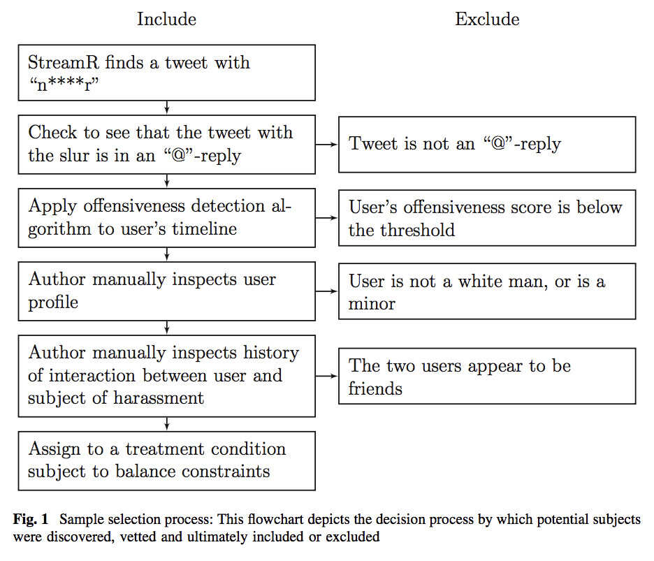

<style>
.reveal section p {
  color: black;
  font-size: .7em;
  font-family: 'Helvetica'; #this is the font/color of text in slides
}


.section .reveal .state-background {
    background: white;}
.section .reveal h1,
.section .reveal p {
    color: black;
    position: relative;
    top: 4%;}


</style>


Building Apps & Bots for Social Science Research
========================================================
author: Chris Bail 
date: Duke University
autosize: true
transition: fade  
  website: https://www.chrisbail.net  
  github: https://github.com/cbail  
  Twitter: https://www.twitter.com/chris_bail

========================================================

# **Part I: APPS**

Salganik’s List of the Weaknesses of Digital Trace Data:
========================================================
&nbsp;

Incomplete    
Inaccessible    
Non-Representative   
Drifting    
Algorithmic Confounding   
Dirty   
Sensitive   


But What Are the Alternatives?
========================================================
&nbsp;

But What Are the Alternatives?
========================================================
&nbsp;

-Survey response rates continue to drop  

But What Are the Alternatives?
========================================================
&nbsp;

-Survey response rates continue to drop  

-Many of the most important questions require longitudinal/relational/qualitative data  

But What Are the Alternatives?
========================================================
&nbsp;

-Survey response rates continue to drop 

-Many of the most important questions require longitudinal/relational/qualitative data  

-Digital trace data have a number of major advantages that conventional sources do not (big, always on, non-reactive)  


Can We Have Our Cake and Eat It Too?
========================================================


Apps Can Address Many Limitations
========================================================
&nbsp;

**Incomplete**  
**Inaccessible**  
**Non-Representative**  
Drifting  
Algorithmic Confounding  
**Dirty**  
**Sensitive**  


Example: The Viralgorithm
========================================================


Social Media Survey Apps (SMSAs)
========================================================
&nbsp;


Social Media Survey Apps (SMSAs)
========================================================
&nbsp;

A web or mobile-based tool built by a researcher in order to:  


Social Media Survey Apps (SMSAs)
========================================================
&nbsp;

A web or mobile-based tool built by a researcher in order to:  

a) collect public and/or private data produced by social media users from an API; 

Social Media Survey Apps (SMSAs)
========================================================
&nbsp;

A web or mobile-based tool built by a researcher in order to:  

a) collect public and/or private data produced by social media users from an API; 

b) collect supplemental information from such users (e.g. demographics) using more conventional survey methods;  

Social Media Survey Apps (SMSAs)
========================================================
&nbsp;

A web or mobile-based tool built by a researcher in order to:  

a) collect public and/or private data produced by social media users from an API; 

b) collect supplemental information from such users (e.g. demographics) using more conventional survey methods;  

c) offer something back to the user as an incentive to share their data (e.g. analysis or financial incentives)  

Social Media Survey Apps (SMSAs)
========================================================
&nbsp;

A web or mobile-based tool built by a researcher in order to:  

a) collect public and/or private data produced by social media users from an API; 

b) collect supplemental information from such users (e.g. demographics) using more conventional survey methods;  

c) offer something back to the user as an incentive to share their data (e.g. analysis or financial incentives)  

For additional information, see:

[Bail, Christopher A. 2015. "Taming Big Data: Using App Technology to Study Organizational Behavior on Social Media." Sociological Methods and Research: 1-29](https://drive.google.com/file/d/0Byvk0A8Ic21YMC1SNHIzWU5jSXc/view) 


Workflow of a Social Media Survey App
========================================================


Workflow of the Viralgorithm
========================================================


Response Rate
========================================================
&nbsp;

1. Approximately 40% of all organizations contacted installed the app (across two fields)

Minimal Evidence of Selection
========================================================


Examples
========================================================
&nbsp; 

[Bail, Christopher A. 2016. "Combining Network Analysis and Natural Language Processing to Examine how Advocacy Organizations Stimulate Conversation on Social Media." Proceedings of the National Academy of Sciences, 113:42 11823-11828](http://www.pnas.org/content/pnas/113/42/11823.full.pdf?with-ds=yes)

[Bail, Christopher A. 2016. "Emotional Feedback and the Viral Spread of Social Media Messages about Autism
Spectrum Disorders." American Journal of Public Health 106(7): 1173-1180](https://ajph.aphapublications.org/doi/pdf/10.2105/AJPH.2016.303181)

[Bail, Christopher A., Taylor W. Brown, and Marcus Mann. 2017. “Channeling Hearts and Minds: Cognitive-
Emotional Currents and Public Deliberation on Social Media.” American Sociological Review, 82(6) 1188-1213](https://drive.google.com/file/d/179SpJoLuyOyOgOFEenlziOPmfkVLjnFH/view)


Challenges of Building Apps for Social Science Research
========================================================
&nbsp;

1. Significant coding skills required (html, css, cloud-computing, reactive programming)  

2. Competitive environment for attention (apps are no longer "new")

3. Concerns about data sharing/privacy  

4. Compelling incentives are hard to identify- and particularly challenging for studies of sensitive topics. But financial incentives may be an important option going forward. 


OK, but How Do I Build an App?
========================================================


Shiny
========================================================

Shiny is a (relatively) new tool that enables people to build, compile, and host interactive apps natively within RStudio


A Simple Shiny App
========================================================

<embed width="1000" height="600" src="https://shiny.rstudio.com/gallery/google-charts.html">


Three Components of A Shiny App
========================================================
&nbsp;

Global.R  
server.R  
ui.R  

Global.R
========================================================
&nbsp;

The "memory" of the app. Stores things you want to call from other parts of the app (usually data but could also be functions and other types of objects)

server.R
========================================================
&nbsp;

The "brains" of the app- runs the analysis you want to show the user, but can also store data generated by the user, or expose different users to different types of information (good for experimentation)

ui.R
========================================================
&nbsp;

The "face" of the app. Determines what user will see (e.g. what types of visualizations, check boxes or word boxes, fonts, etc.) Can load fancy images, logos, etc. to improve the overall appeal of the app. 

Anatomy of a Shiny App
========================================================
&nbsp;


Shiny Templates 
========================================================
&nbsp;

There are now many Shiny apps out there. Check out the templates (with code) [here](https://www.showmeshiny.com/).


Linking to Cloud Servers
========================================================
&nbsp;

-Check out the `googledrive` package for loading and storing data.  

-High-volume app hosting is available via RStudio.


Google's Flutter SDK
========================================================
&nbsp;


========================================================

# **Part 2: BOTS**


Why Bots?
========================================================


Anti-Racism Bots
========================================================
&nbsp;

[Munger, Kevin. 2017. "Tweetment Effects on the Tweeted: Experimentally Reducing Racist Harassment." Political Behavior. 398:629-649.](https://internet.psych.wisc.edu/wp-content/uploads/532-Master/532-UnitPages/Unit-06/Munger_PB_2017.pdf)


Anti-Racism Bots
========================================================


Using Bots to Study Social Media & Polarization
========================================================


Using Bots to Study Social Media & Polarization
========================================================
&nbsp;

[Bail, Christopher, Lisa Argyle, Taylor Brown, John Bumpuss, Haohan Chen, M.B. Fallin Hunzaker, Jaemin Lee, Marcus Mann, Friedolin Merhout, and Alexander Volfovsky. 2018. "Exposure to Opposing Viewscan Increase Political Polarization: Evidence from a Large-Scale Field Experiment on Social Media." Proceedings of the National Academy of Sciences. 155(37): 9216-9221](https://www.pnas.org/content/115/37/9216)

Using Bots to Study Social Media & Polarization
========================================================


Using Bots to Study Social Media & Polarization
========================================================


How Do I Build a Bot?
========================================================

A Very Simple Bot
========================================================

```r
for (i in 1:24){
  #Search for 50 recent tweets about computational social science
  css_tweets<-search_tweets("Computational Social Science", n=50, include_rts = FALSE)
  #Randomly pick one of them, which appears in the `text` variable with the `css_tweets` dataframe
  lucky_tweet<-sample(css_tweets$text, 1)
  post_tweet(lucky_tweet)
  Sys.sleep(3600)
  #3600 seconds is 60 minutes
}
```

Making a Bot Interactive
========================================================
&nbsp;




Hosting a Bot
========================================================

Hosting a Bot
========================================================
&nbsp;


Check out my tutorial on running RStudio in the cloud [here](https://cbail.github.io/Running_R_in_the%20Cloud.html).


Storing Data
========================================================
&nbsp;


Ethical Issues in App & Bot-Based Research
========================================================


Ethical Issues in App & Bot-Based Research
========================================================


