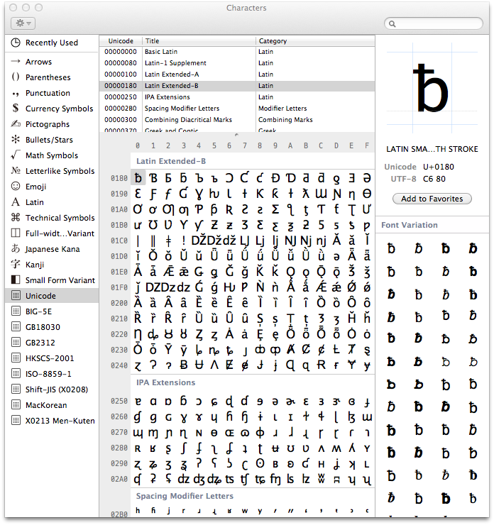
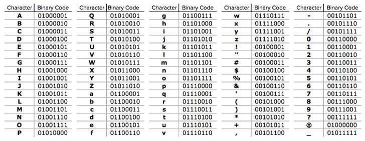
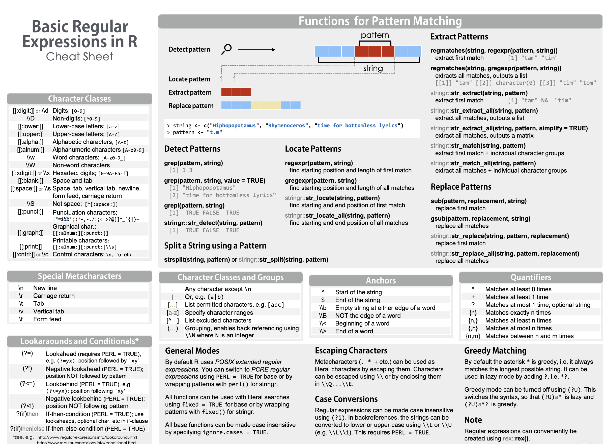
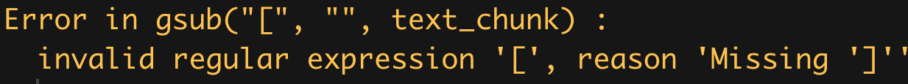

<style>

.reveal section p {
  color: black;
  font-size: .7em;
  font-weight: normal;
  font-family: 'Helvetica'; #this is the font/color of text in slides
}


.section .reveal .state-background {
    background: white;}
.section .reveal h1,
.section .reveal p {
    color: black;
    position: relative;
    font-family: 'Helvetica';
    font-weight: normal;
    top: 4%;}
   
 
 /* section titles */
.reveal h1 { 
  color: black;
  position: relative;
  font-weight: normal;
  font-family: 'Helvetica'; 
  top: 4%
}    

 
/* slide titles */
.reveal h3 { 
  color: black;
  font-weight: normal;
  font-family: 'Helvetica'; 
}    

.small-code pre code {
  font-size: 1.2em;
}

</style>


Basics of Text Analysis
========================================================
author: Chris Bail 
date: Duke University
autosize: true
transition: fade  
  website: https://www.chrisbail.net  
  Twitter: https://www.twitter.com/chris_bail  
  github: https://github.com/cbail  

========================================================

# **WRANGLING TEXT**

Character Encoding
========================================================

Character Encoding
========================================================
&nbsp;


UTF-8
========================================================
&nbsp;


Character Encoding Over Time
========================================================
&nbsp;


GREP
========================================================


GREP
========================================================

Globally search a regular expression and print

Regular Expression
========================================================

A pattern that describes a set of strings


It's GREP-tastic!
========================================================
&nbsp;


```r
duke_web_scrape<- "Duke Experts: A Trusted Source for Policymakers\n\n\t\t\t\t\t\t\t" 
```

grepl
========================================================
&nbsp;

```r
grepl("Experts", duke_web_scrape)
```

```
[1] TRUE
```


gsub
========================================================
&nbsp;

```r
gsub("\t", "", duke_web_scrape)
```

```
[1] "Duke Experts: A Trusted Source for Policymakers\n\n"
```

gsub (2 patterns)
========================================================
&nbsp;

```r
gsub("\t|\n", "", duke_web_scrape)
```

```
[1] "Duke Experts: A Trusted Source for Policymakers"
```

More GREP
========================================================
class: small-code
&nbsp;

```r
some_text<-c("Friends","don't","let","friends","make","wordclouds")

some_text[grep("^[F]", some_text)]
```

```
[1] "Friends"
```

Regex Cheat Sheet
========================================================



Link [here](http://www.rstudio.com/wp-content/uploads/2016/09/RegExCheatsheet.pdf)


Escaping Text
========================================================
&nbsp;

```r
text_chunk<-c("[This Professor is not so Great]")
gsub("[","", text_chunk)
```
&nbsp;  


Escaping Text
========================================================
&nbsp;

```r
text_chunk<-c("[This Professor is not so Great]")
gsub('\\[|\\]',"", text_chunk)
```

```
[1] "This Professor is not so Great"
```

========================================================

# **UNITS OF ANALYSIS**

Tokenization
========================================================

Tokenization
========================================================


```r
<sentence>
  
<word>Friends</word

<word>don't</word>

<word>let</word>

<word>friends</word>

<word>make</word>

<word>word</word>

<word>clouds</word>

</sentence>
```

N-grams
========================================================


N-grams
========================================================


========================================================

# **CREATING TEXT DATABASES**

What is a Corpus?
========================================================


Creating a Corpus
========================================================
class: small-code
&nbsp;  

```r
load(url("https://cbail.github.io/Trump_Tweets.Rdata"))

trumptweets$text[1]
```

```
[1] "Just met with UN Secretary-General António Guterres who is working hard to “Make the United Nations Great Again.” When the UN does more to solve conflicts around the world, it means the U.S. has less to do and we save money. @NikkiHaley is doing a fantastic job! https://t.co/pqUv6cyH2z"
```

Creating a Corpus
========================================================
class: small-code
&nbsp;

```r
install.packages("tm")
```

Creating a Corpus
========================================================
class: small-code
&nbsp;

```r
library(tm)
trump_corpus <- Corpus(VectorSource(as.vector(trumptweets$text))) 
trump_corpus
```

```
<<SimpleCorpus>>
Metadata:  corpus specific: 1, document level (indexed): 0
Content:  documents: 3196
```

TidyText
========================================================


TidyText
========================================================
class: small-code

```r
library(tidytext)
library(dplyr)
tidy_trump_tweets<- trumptweets %>%
    select(created_at,text) %>%
    unnest_tokens("word", text)
head(tidy_trump_tweets)
```

```
# A tibble: 6 x 2
  created_at          word     
  <dttm>              <chr>    
1 2018-05-18 20:41:21 just     
2 2018-05-18 20:41:21 met      
3 2018-05-18 20:41:21 with     
4 2018-05-18 20:41:21 un       
5 2018-05-18 20:41:21 secretary
6 2018-05-18 20:41:21 general  
```

TidyText is... tidy
========================================================
class: small-code


```r
tidy_trump_tweets %>%
  count(word) %>%
    arrange(desc(n))
```

```
# A tibble: 8,690 x 2
   word      n
   <chr> <int>
 1 the    3671
 2 to     2216
 3 and    1959
 4 of     1606
 5 https  1281
 6 t.co   1258
 7 a      1248
 8 in     1213
 9 is     1045
10 for     886
# … with 8,680 more rows
```

Corpus vs. TidyText
========================================================


========================================================

# **TEXT PRE-PROCESSING**

Stopwords
========================================================


Stopwords
========================================================
class: small-code
In `tm`:


```r
trump_corpus <- tm_map(trump_corpus, removeWords, stopwords("english"))
```

Stopwords
========================================================
class: small-code

In `tidytext`:


```r
 data("stop_words")
    tidy_trump_tweets<-tidy_trump_tweets %>%
      anti_join(stop_words)
```

Inspect Top Words Again
========================================================
class: small-code


```r
tidy_trump_tweets %>%
  count(word) %>%
    arrange(desc(n))
```

```
# A tibble: 8,121 x 2
   word          n
   <chr>     <int>
 1 https      1281
 2 t.co       1258
 3 amp         562
 4 rt          351
 5 people      302
 6 news        271
 7 president   235
 8 fake        234
 9 trump       218
10 country     213
# … with 8,111 more rows
```

Remove Punctuation
========================================================


Remove Punctuation
========================================================
class: small-code

In `tm`:


```r
trump_corpus <- tm_map(trump_corpus, content_transformer(removePunctuation))
```

(punctuation marks are removed automatically in `tidytext`)

Remove Numbers
========================================================
class: small-code

In `tm`:


```r
trump_corpus <- tm_map(trump_corpus, content_transformer(removeNumbers))
```

In `tidytext`:


```r
tidy_trump_tweets<-tidy_trump_tweets[-grep("\\b\\d+\\b", tidy_trump_tweets$word),]
```


Word Case
========================================================


Word Case
========================================================
class: small-code

In `tm`:


```r
trump_corpus <- tm_map(trump_corpus,  content_transformer(tolower)) 
```

Once again, `tidytext` does this for you.


Removing Whitespaces
========================================================


Removing Whitespaces
========================================================
class: small-code

In `tm`:


```r
trump_corpus <- tm_map(trump_corpus, content_transformer(stripWhitespace))
```

In `tidytext`:


```r
tidy_trump_tweets$word <- gsub("\\s+","",tidy_trump_tweets$word)
```

Stemming
========================================================

Stemming
========================================================
class: small-code

In `tm`:


```r
trump_corpus  <- tm_map(trump_corpus, content_transformer(stemDocument), language = "english")
```

In `tidytext`:

```r
library(SnowballC)
  tidy_trump_tweets<-tidy_trump_tweets %>%
      mutate_at("word", funs(wordStem((.), language="en")))
```

========================================================

# **THE DOCUMENT-TERM MATRIX**

The DTM
========================================================
class: small-code

In `tm`:


```r
trump_DTM <- 
  DocumentTermMatrix(trump_corpus, control = list(wordLengths=c(2, Inf)))

inspect(trump_DTM[1:5,3:8])
```

```
<<DocumentTermMatrix (documents: 5, terms: 6)>>
Non-/sparse entries: 6/24
Sparsity           : 80%
Maximal term length: 8
Weighting          : term frequency (tf)
Sample             :
    Terms
Docs around conflict fantast great guterr hard
   1      1        1       1     1      1    1
   2      0        0       0     0      0    0
   3      0        0       0     0      0    0
   4      0        0       0     0      0    0
   5      0        0       0     0      0    0
```

The DTM
========================================================
class: small-code

In `tidytext`:


```r
tidy_trump_DTM<-
  tidy_trump_tweets %>%
  count(created_at, word) %>%
  cast_dtm(created_at, word, n)
```


Other great resources
========================================================
&nbsp;  

Julia Silge's https://www.tidytextmining.com/  

Ken Benoit's https://quanteda.io/

Jurafsky and Martin's textbook: https://web.stanford.edu/~jurafsky/slp3/


