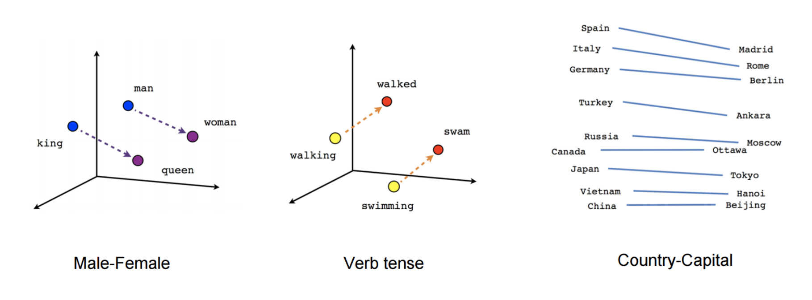

<style>
.reveal section p {
  color: black;
  font-size: .7em;
  font-family: 'Helvetica'; #this is the font/color of text in slides
}


.section .reveal .state-background {
    background: white;}
.section .reveal h1,
.section .reveal p {
    color: black;
    position: relative;
    top: 4%;}

.wrap-url pre code {
  word-wrap:break-word;
}

</style>


Introduction to Word2Vec
========================================================
author: Chris Bail 
date: Duke University
autosize: true
transition: fade  
  website: https://www.chrisbail.net  
  github: https://github.com/cbail  
  Twitter: https://www.twitter.com/chris_bail

========================================================

# **What is word2vec?**

What is word2vec?
========================================================




What is word2vec?
========================================================
class: wrap-url

Interactive example linked [here](https://anvaka.github.io/pm/#/galaxy/word2vec-wiki?cx=-17&cy=-237&cz=-613&lx=-0.0575&ly=-0.9661&lz=-0.2401&lw=-0.0756&ml=300&s=1.75&l=1&v=d50_clean_small)


The Context Window
========================================================
class: wrap-url


The Context Window
========================================================


Two tools with word2vec
========================================================
&nbsp;
 
Continuous Bag of words predicts focus word based on context words. Skip-gram model predicts context words based on focus word


word2vec in Tidytext
========================================================
class: wrap-url
&nbsp;
Let's load our tweets from elected officials and follow along with some code from Julia Silge:


```r
library(tidytext)
library(dplyr)
load(url("https://cbail.github.io/Elected_Official_Tweets.Rdata"))
# We want to use original tweets, not retweets:
elected_no_retweets <- elected_official_tweets %>%
  filter(is_retweet == F) %>%
  select(c("text"))
#create tweet id
elected_no_retweets$postID<-row.names(elected_no_retweets)
```

Calculate Unigram Probabilities
========================================================
&nbsp;


```r
unigram_probs <- elected_no_retweets %>%
    unnest_tokens(word, text) %>%
    count(word, sort = TRUE) %>%
    mutate(p = n / sum(n))
```

word2vec in Tidytext
========================================================
&nbsp;


```r
unigram_probs
```

```
# A tibble: 23,761 x 3
   word      n       p
   <chr> <int>   <dbl>
 1 the   11864 0.0434 
 2 to    10546 0.0386 
 3 t.co   6498 0.0238 
 4 https  6422 0.0235 
 5 and    5968 0.0218 
 6 of     5315 0.0194 
 7 in     4443 0.0163 
 8 a      4242 0.0155 
 9 for    3580 0.0131 
10 on     2466 0.00902
# … with 23,751 more rows
```


Skipgram probabilities
========================================================


```
Error in library(widyr) : there is no package called 'widyr'
```
