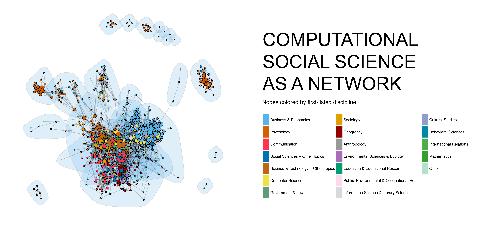

<style>
.reveal section p {
  color: black;
  font-size: .7em;
  font-family: 'Helvetica'; #this is the font/color of text in slides
}


.section .reveal .state-background {
    background: white;}
.section .reveal h1,
.section .reveal p {
    color: black;
    position: relative;
    top: 4%;}


</style>


Group Projects
========================================================
author: Chris Bail/Matt Salganik, 
date: SICSS
autosize: true
transition: none

========================================================

# **STRENGTHS OF GROUP PROJECTS**


1. Better Science
========================================================

1. Better Science
========================================================


1. Better Science
========================================================


2. This may be especially true for CSS
========================================================


2. This may be especially true for CSS
========================================================



3. Group Projects may be the Most Efficient Way for us to Learn from Each Other
========================================================


========================================================

# **CHALLENGES OF GROUP PROJECTS**


Challenges
========================================================
&nbsp; 

1. Tremendous diversity of skills  
2. Ensuring good group chemistry 
3. Limited time 
4. Different goals?
5. Free-riding


SICSS Group Projects
========================================================
&nbsp; 

1. Can take on many forms (from original empirical reseaarch to creation of open-source tools)
2. In one week, many groups will only find enough time to create a proposal, though some may have pilot results by the end of the week.
3. Limited seed funding may be available at your site for pilot research and/or data purchasing, cloud computing costs.
4. Additional funding may be available at your site after the end of the week.

========================================================

# **RESEARCH SPEED DATING**


Research Speed-dating
========================================================
&nbsp;  

1. We crowdsource a list of research interests in a google doc (5 min)
2. Each person writes a "1" next to their research interests (5 min)
3. We identify maximally similar clusters of participants
4. We identify maximally different clusters of participants

Research Speed-dating
========================================================
&nbsp;  

1. Maximally similar clusters come up with a group project (30 min)  
2. Maximally different clusters come up with a group project (30 min)  
3. We start a new google doc. Each person takes 5 minutes to write down their favorite group project idea  
4. Everyone puts there name next to the group project they want to join  


Research Speed-dating
========================================================
&nbsp;  

1. Have lunch today with your group in order to begin discussing your project.  
2. It is ok to change groups until the end of today.


Timeline for this week
========================================================
&nbsp;

Monday afternoon: refine group project idea  

Tuesday morning: write brief (<1 page) proposal 

Tuesday afternoon: the organizer of your site will begin responding to seed funding requests on a rolling basis (if funds are available)

Tuesday afternoon-Thursday night: work on group projects  

Friday (all day): group presentations (with feedback)


REQUIRED Deliverable
========================================================
&nbsp;

A document that contains a presentation of your group project that is between 10-20 minutes that explains:  

1) Why your group project is important 

2) What are your hypotheses?  

3) What will you collect? 

4) What are the next steps? 

Note: not all projects will work; if yours fails, please write a post-mortem that explains why.


========================================================

# **LET'S BEGIN**


Let's crowdsource a list of our research interests
========================================================
&nbsp;

Place the name of a research interest in the first column of this
document, and write a "1" across all research interests you have:

https://bit.ly/2WIrIYh


Read the Googlesheet
========================================================
&nbsp;


```r
#read in interests from google sheet
library(googlesheets)
our_interests<-gs_url("https://docs.google.com/spreadsheets/d/1RIeYYvtzEX2kkrXspP2npWBSd9_rRqtw6RywlGvCpsU/edit#gid=0")	
#organizer, enter your site's sheet name below
results<-gs_read(our_interests, ws="Sample")
```

Identify Maximally similar
========================================================
&nbsp;


```r
#create distance matrix
rownames(results) <- results$Name
dmatrix <- dist(results, method = "euclidean") 
fit <- hclust(dmatrix, method="ward.D") 
# display dendogram
plot(fit) 
groups <- cutree(fit, k=5) # cut tree into 5 clusters
# draw dendogram with cut points for groups 
rect.hclust(fit, k=5, border="red")
```


Simulate Random Groups
========================================================
&nbsp;


```r
final<-as.data.frame(NULL)
data$names<-NULL
library(dplyr)
library(vegan)
for (i in 1:1000){
test<-sample_n(results, 4)
names<-paste(test$Name, collapse=",")
diversity_score<-diversity(unlist(test[,c(2:ncol(test))]))
data<-cbind(names, diversity_score)
final<-rbind(final, data)
print(i)
}
```

Identify maximally diverse groups
========================================================
&nbsp;


```r
final$diversity_score<-as.character(final$diversity_score)
final$diversity_score<-as.numeric(final$diversity_score)
final<-final[order(final$diversity_score, decreasing=TRUE),]
head(final, 10)
```


Go!
========================================================
&nbsp;

Meet in maximally similar and dissimilar groups for 30 minutes. Site organizer will create googlesheet where project ideas will be listed. At the end of each 30 minutes period, one group representative should write the name of the project and a brief (less than three sentence description). After the end of the exercise, put your name next to the research project that you are most excited about joining. 


