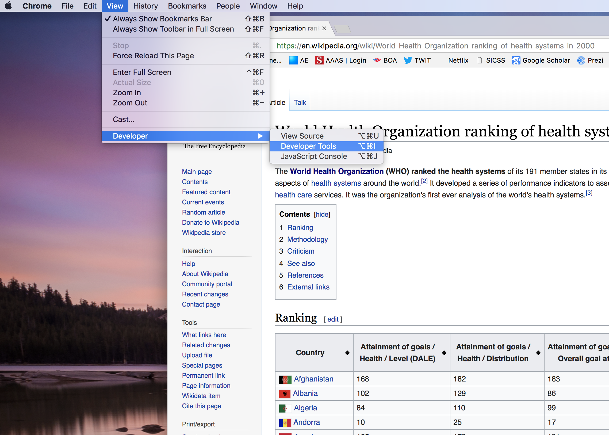

<br>
**Chris Bail, PhD**  
**Duke University**  
[www.chrisbail.net](http://www.chrisbail.net)  
[github.com/cbail](https://github.com/cbail)  
[twitter.com/chris_bail](https://twitter.com/chris_bail)  
**[Check out my Text as Data Course](https://cbail.github.io/textasdata/Text_as_Data.html)**   


## **What is Screen-Scraping?**

Screenscraping refers to the process of automatically extracting data from web pages, and often a long list of websites that cannot be mined by hand. As the figure below illustrates, a typical screenscraping program a) loads the name of a web-page to be scraped from a list of webpages; b) downloads the website in a format such as HTML or XML; c) finds some piece of information desired by the author of the code; and d) places that information in a convenient format such as a "data frame" (which is R speak for a dataset). Screenscraping can also be used to download other types of content as well, however, such as audio-visual content. This tutorial assumes basic knowledge about R and other skills described in previous tutorials at the link above.

<br>


<br><br>


## **Is Screen-Scraping Legal?**

In the early years of the internet, screen-scraping was a very common practice because there were not yet widespread legal norms surrounding the protection of data on the internet. This has changed drastically in recent decades as the value of data on websites has become obvious, and bots or automated computer programs can easily wreak havoc by collecting data from websites and repurposing it for nefarious purposes. The very first thing you should consider before screen-scraping a website is whether you are allowed to do so. The easiest way to do this is to visit the "Terms of Service" (sometimes abbreviated as "Terms") which often appears at the bottom of a web page. These days, most websites have a "robots.txt" policy that specifies  rules about automated data collection on the site, and an increasing number of sites do not allow such practices (especially larger websites such as Facebook, the New York Times, or Instagram). You should consult professional legal advice to determine whether you have permission to scrape a website.


## **Reading a Web-Page Into R**

If you've identified a web page you'd like to scrape, the first step in writing a screen-scraping program is to download the source code into R. To do this we are going to install the `rvest` package, authored by Hadley Wickham, which provides a number of very useful functions for screen-scraping. (Note: You may also need to install the `selectr` package.)

```{r, messages=FALSE, eval=FALSE}
install.packages("rvest")
install.packages("selectr")
```


We are going to begin by scraping [this very simple web page from Wikipedia](https://en.wikipedia.org/wiki/World_Health_Organization_ranking_of_health_systems_in_2000). I describe the page as "simple" because it does not have a lot of interactive features which require sophisticated types of web programming such as javascript, which---as we will see in a later example--- can be particularly difficult to work with.

This is what the webpage linked above looks like to us when we visit it via a browser such as Explorer or chrome:

<br><br>

<br><br>

But this is not what the web page actually looks like to our browser. To view the "source code" of the web page, we can use Chrome's dropdown menu called "developer" and then click "View Source." We then see the page in its most elemental form, called an HTML file, which is a long file that contains both the text of the web page as well as a long list of instructions about how the text, images, and other components of the webpage should be rendered by the browser:

<br><br>


<br><br>

To download the source code into R, we can use the `read_html` function from the `rvest` package that we just installed above (Note: you may also have to load/install the `selectr` package):

```{r, messages=FALSE, echo=FALSE, message=FALSE, waning=FALSE}
library(rvest)
library(selectr)
```

```{r}

wikipedia_page<-read_html("https://en.wikipedia.org/w/index.php?title=World_Health_Organization_ranking_of_health_systems_in_2000&oldid=876464764")
```


To verify that our code worked, we can "browse" the `wikipedia_page` object that we just created:

```{r}
wikipedia_page
```

As this output shows, we have successfully loaded the web page into our R Studio session. But this was the easy part.

## **Parsing HTML**

Perhaps the most challenging part of screen-scraping is extracting the piece of information you want out of the html file. This is challenging because this information is almost always hidden deep within the source code, which can be very difficult to navigate. Fortunately, as the figure below shows, web page source code such as HTML or XML has a "tree like" structure that allows you to gradually hone in on the part of the web page where the information you want lives.

<br><br>

<br><br>

In order to find out where the data we want is located within this tree-like structure, we can use a handy tool within Chrome called "Developer Tools":

<br><br>

<br><br>

This tool provides you with an interactive interface where you can view the webpage alongside the source code. When you right click on the part of the web page you are interested in and choose "inspect", the Developer Tool highlights the part of the source code where the information you want is located. In the figure below, I have highlighted the table that describes health metrics for different countries that are described on the Wikipedia page linked above.

<br><br>

<br><br>

When I inspected the part of the web page I am trying to scrape by right-clicking, the part of the HTML below became highlighted:

<br><br>

<br><br>

Sometimes, finding the exact part of the code where the data you want lives requires some trial and error. In this case, I discovered that I had to select an earlier line in the code to identify the entire table I want to scrape instead of just one line.

The next step is to identify a string of numbers and letters called the "Xpath" for this part of the source code. The Xpath describes the precise part of the HTML where the data I want lives. I identify the X path by right clicking on the highlighted section of the pane of the Developer Tools that displays the html code:

<br><br>

<br><br>

Now that I have the xpath, I can use this information to narrow my search within the HTML file for the Table that I want to extract using the `html_nodes` function which passess the xpath as an argument as pictured in the code below:

```{r}
section_of_wikipedia<-html_node(wikipedia_page, xpath='//*[@id="mw-content-text"]/div/table')
head(section_of_wikipedia)
```

As the output above shows, I am now getting closer, but I am still not quite where I want to be. The top of the output tells me that the data are in table format (rather than simple text format), so I am going to use the `html_table` function to extract the table embedded within the html code:


```{r}
health_rankings<-html_table(section_of_wikipedia)
head(health_rankings[,(1:2)])
```

As the output above shows, I now finally have the data I wanted in the form of a data frame or dataset called "health_rankings." This was quite a bit of work, however, and recall that this was a very simple type of webpage. Also, it is worth noting that groups of Wikipedia pages have a very similar format which makes them very amenable to screen-scraping. If, on the other hand, I was scraping a list of sites from multiple domains-- each of which have their own complicated structure--- I could spend days or weeks writing code to scrape them. In this scenario, many people may find that it is easier to collect the data by hand, or hire workers on Amazon Mechanical Turk to extract the information you might want from a list of web pages.

One final note: often the web page that you wish to scrape will contain XML instead of HTML (or in addition to HTML). In this case, the `rvest` package has a series of functions to parse XML such as `xml` and `xml_node`.

**Now YOU Try It!!!**

In order to practice your new skill, pick another web page and scrape some information from it. Hint: if you choose text to scrape, you may find `rvest`'s `html_text` function quite useful. Also, if you are unable to extract the piece of information that you want, it may not be possible, and you might need to use one of the other techniques for screen-scraping described below. 

## **Parsing With the CSS Selector**

It is often the case---particularly with more complex web pages--- that the procedures described above will not work. In this case it is useful to know about an alternative to the Xpath code described above: the "CSS Selector," which is another snippet of code that helps you find the nugget of HTML you want to extract from a web page.

Let's look at an example of scraping a list of "events" from [Duke University's main webpage](https://www.duke.edu/). If you visit this page, you will see that the example is considerably more complex than the aforementioned Wikipedia example. There are not only more types of information presented on the page but multiple ways of accessing it. In our hypothetical example, the information we want changes on a daily basis (the list of major events that will occur at Duke on that day). 

In order to identify the CSS Selector, we are going to employ a popular Chrome plug-in called the [Selector Gadget](http://selectorgadget.com/). This is an interactive tool---not unlike the Chrome Developer Tool described above--- that allows one to interact with a web page in order to reveal the CSS Selector. After installing the tool, a small icon will appear in your Chrome toolbar that is a hand holding a microscope. When you click on this tool, a new pane will appear at the bottom of your browser window that will eventually reveal the CSS Selector-- it can also be used to identify the Xpath, incidentally. This pane is pictured at the bottom of the figure below:

<br><br>


To reveal the CSS selector for the part of the page you want, click on that part of the page. The part of the page should appear highlighted in Green. However, you will most likely also see other parts of the page, highlighted in yellow, that you do not want:

<br><br>


Click on one of the yellow parts until only the green part you originally highlighted remains. As you click, you may note that the CSS Selector that is selected at the bottom of the page changes. This can take some trial and error, and the Selector Gadget is imperfect. It works best when you try to click different parts highlighted in yellow, and try out the resultant CSS selectors it identifies in an iterative fashion using the code below.

Once we have identified the CSS selector we think is attached to the piece of information we want, we can pass it as an argument in `rvest`'s `html_nodes` function as follows:

```{r}
duke_page<-read_html("https://www.duke.edu")
duke_events<-html_nodes(duke_page, css="li:nth-child(1) .epsilon")
html_text(duke_events)

```

As the output above shows, we have now collected information about the events we wanted. Note, however, that it includes some messy characters with backslashes, ts, and ns. These are called "html tags", and we will learn how to clean them up in an upcoming tutorial on basic text processing in R.


## **Scraping With Selenium**

Sometimes, our interest in scraping web pages involves more interaction with a web browser. For instance, suppose we wanted to visit the main web pages of a series of universities and run a search for "data science." This would require inputting data into a search bar on a series of sites, and then scraping the resultant data. In order to accomplish such tasks, it is ocassionally useful to automate your entire web browser. This means that we will write code that will tell our computer to a) open a web browser; b) load a web page; c) interact with the web page by clicking on the search bar and entering text; and c) downloading the resultant data.

`RSelenium` is a powerful package for automating tasks on your computer, and---with a bit of elbow grease---it can be used to automate your browser and scrape information as well. To write code for Rselenium, you need to input keyboard strokes such as "Tab,"Ctrl," or "Enter" and intersperse them with the text you want to input (in the example above, we might pass the text "data science").

Unfortunately, installing RSelenium can be a bit involved since it requires more sophisticated interfacing between your RStudio session and your Operating System than the typical R package. The instructions that follow will help you install R Selenium on Mac OSX.13.4. First, you will need to install another piece of software called the Java SE Development Kit. Choose the most appropriate version for your machine at [this link](http://www.oracle.com/technetwork/java/javase/downloads/jdk8-downloads-2133151.html). Then, you will need to download [Docker](https://www.docker.com/products/docker-desktop) and install it on your machine. When asked for login in credentials, you will need to provide the user name you setup to download Docker, not your email address. Once you have done that, we will make Docker available to RSelenium using the following command:

```{r, eval=FALSE}
#now we install selenium from Docker
system('docker run -d -p 4445:4444 selenium/standalone-chrome')
```

Next, you will need to install `RSelenium`, which is finally again hosted on CRAN. (For a couple of months earlier this year that was not the case, but you were able to use a workaround to install it from Github using the `devtools` package.) After downloading and loading the package, we start the Selenium server and open Chrome with commands below (If you don't have Chrome installed, you can start Firefox instead using the following command `rD <- rsDriver(browser = "firefox")`.

Note: When you run the `rsDriver` function to set up an RSelenium session, RSelenium will pick the latest available version of chromedriver by default. Oftentimes this latest version reflects a developer release of Chrome that may not yet be available even as a beta, resulting in an incompatibility that will stop RSelenium from working. To fix this, use `binman::list_versions("chromedriver")` to identify which version of chromedriver matches your installed version of Chrome (in Chrome, select "About Google Chrome" to identify your installed version). Once identified, specify this version as the value of the `chromever` argument in `rsDriver`. [Thanks to this Stack Overflow page for the fix!](https://stackoverflow.com/questions/55201226/session-not-created-this-version-of-chromedriver-only-supports-chrome-version-7/56173984#5617398)

```{r, eval=FALSE}
install.packages("RSelenium")
library(RSelenium)

# Check available versions of chromedriver
binman::list_versions("chromedriver")

# start a Selenium server
rD <- rsDriver(browser = c("chrome"), chromever = "75.0.3770.8")

# open the browser
remDr <- rD$client


```

Now, we can launch the Duke web page above as follows:

```{r, eval=FALSE}
remDr$navigate("https://www.duke.edu")
```

Next, we need to use the Selector Gadget or some other method to identify the part of the web page where the "search" bar is. After some trial and error, I discovered the CSS selector was `fieldset input`:

```{r, eval=FALSE}
search_box <- remDr$findElement(using = 'css selector', 'fieldset input')
```

You will now see that the search bar is highlighted in your browser. The only thing remaining is to ask RSelenium to type in "data science" into the query box and then hit the return button using the `sendKeysToElement` function. The code for the "Enter" or "Return" key stroke is the second argument we pass to the aforementioned function (`\uE007`)

```{r, eval=FALSE}
search_box$sendKeysToElement(list("data science", "\uE007"))
```

This code should result in a search for "data science" within the Duke web page.


## **Screen-Scraping Within a Loop**

Regardless of which approach to screenscraping you use, you will often want to scrape not just one page, but many pages. In this case, you can simply embed any of the techniques above within a `for` loop that reads a list of web pages you wish to scrape. Once again, be aware that websites often have different structures, so the way you extract information on one site may be very different from another. This is one of the main reasons that screen scraping can be difficult--- and also another reason why screenscraping has fallen out of fashion in addition to the legal issues highlighted above. If you do proceed to scrape a large list of web pages, you may want to build in some "error handling" into your code, so that it does not break every time your code does not function---note that some errors may also be created by violating a website's terms of service.

## **So... When Should I Use Screen-Scraping?**

By now it is hopefully clear that screenscraping can often be more trouble than its worth--- particularly in the age of Application Programming Interfaces, which I will discuss in another tutorial. Still, there are some cases where screenscraping remains useful. One ideal use case is where you are scraping different pages within one web site again and again. An example might include a local government website that posts information on events. Such a website may have the same "root" URL, but different suffixes that describe different days, months, etc. Assuming the structure of the pages are identical, one can then write a loop which switches out the end of the URL for different dates (using whatever naming convention is used by the site).

Another common reason to scrape a web page is if it is prohibitively difficult to copy and paste the information you seek from a website. Examples are extremely long pieces of text, or those that are embedded within complex tables (though again, parsing the HTML to identify the precise text you require could take a very long time as well). In such cases, it may be useful to consider Amazon Mechanical Turk workers as an alternative approach to collecting your data.


