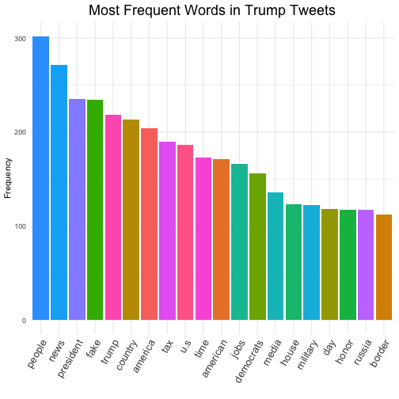
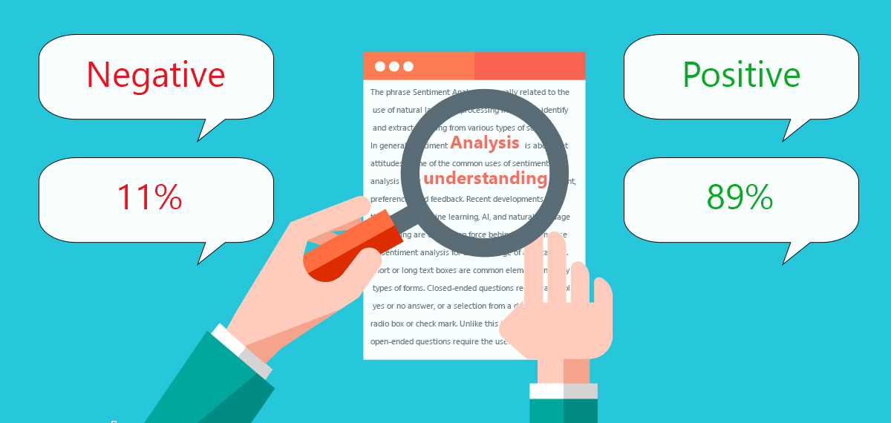
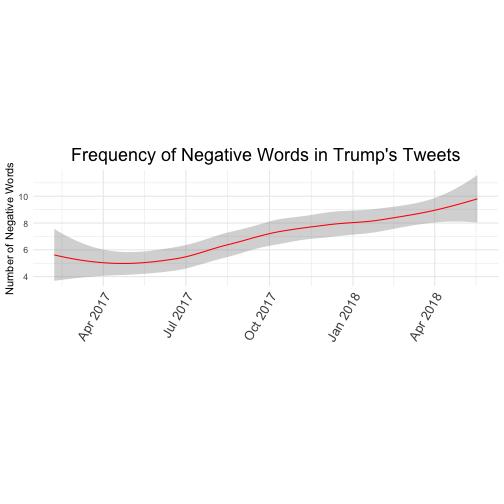
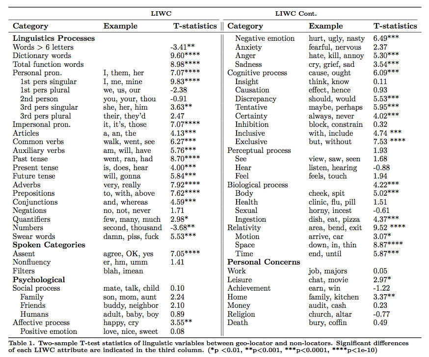
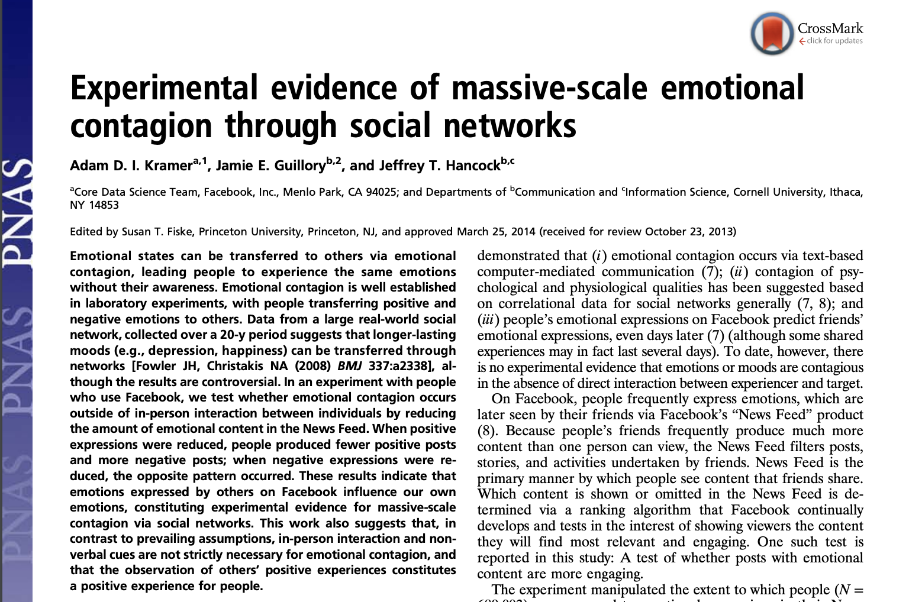
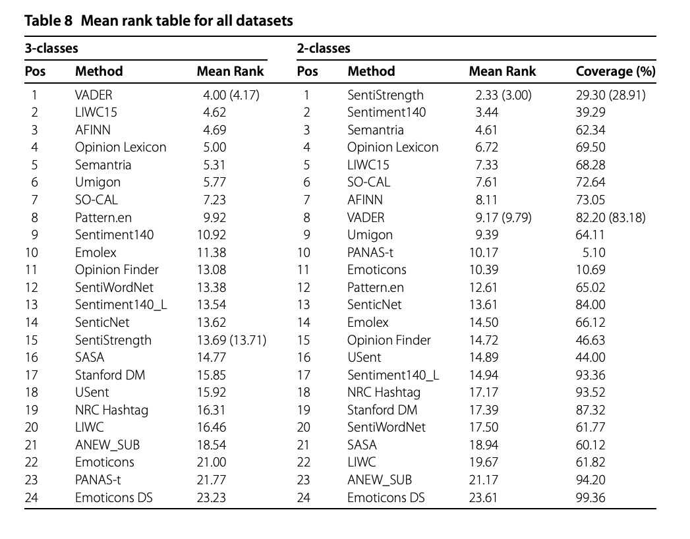

<style>

.reveal section p {
  color: black;
  font-size: .7em;
  font-weight: normal;
  font-family: 'Helvetica'; #this is the font/color of text in slides
}


.section .reveal .state-background {
    background: white;}
.section .reveal h1,
.section .reveal p {
    color: black;
    position: relative;
    font-family: 'Helvetica';
    font-weight: normal;
    top: 4%;}
   
 
 /* section titles */
.reveal h1 { 
  color: black;
  position: relative;
  font-weight: normal;
  font-family: 'Helvetica'; 
  top: 4%
}    

 
/* slide titles */
.reveal h3 { 
  color: black;
  font-weight: normal;
  font-family: 'Helvetica'; 
}    

.small-code pre code {
  font-size: 1.2em;
}

</style>


Dictionary-Based Text Analysis
========================================================
author: Chris Bail 
date: Duke University
autosize: true
transition: fade  
  website: https://www.chrisbail.net  
  Twitter: https://www.twitter.com/chris_bail  
  github: https://github.com/cbail  

Word Counting
========================================================


Word Counting w/Trump Tweets
========================================================
class: small-code

&nbsp;


```r
library(tidytext)
library(dplyr)

load(url("https://cbail.github.io/Trump_Tweets.Rdata"))

tidy_trump_tweets<- trumptweets %>%
    select(created_at,text) %>%
      unnest_tokens("word", text)
```

Without Stop words
========================================================
class: small-code


```r
data("stop_words")

top_words<-
   tidy_trump_tweets %>%
      anti_join(stop_words) %>%
        filter(!(word=="https"|
                 word=="rt"|
                 word=="t.co"|
                 word=="amp")) %>%
            count(word) %>%
              arrange(desc(n))
```

Plot
========================================================
class: small-code


```r
library(ggplot2)
top_words %>%
  slice(1:20) %>%
    ggplot(aes(x=reorder(word, -n), y=n, fill=word))+
      geom_bar(stat="identity")+
        theme_minimal()+
        theme(axis.text.x = 
            element_text(angle = 60, hjust = 1, size=13))+
        theme(plot.title = 
            element_text(hjust = 0.5, size=18))+
          ylab("Frequency")+
          xlab("")+
          ggtitle("Most Frequent Words in Trump Tweets")+
          guides(fill=FALSE)
```

Plot
========================================================
class: small-code

&nbsp;


Term Frequency Inverse Document Frequency
========================================================


Term Frequency Inverse Document Frequency
========================================================


tf-idf
========================================================
class: small-code


```r
tidy_trump_tfidf<- trumptweets %>%
    select(created_at,text) %>%
      unnest_tokens("word", text) %>%
        anti_join(stop_words) %>%
             count(word, created_at) %>%
                bind_tf_idf(word, created_at, n)
```


tf-idf
========================================================
class: small-code


```r
top_tfidf<-tidy_trump_tfidf %>%
  arrange(desc(tf_idf)) 

top_tfidf$word[1]
```

```
[1] "standforouranthem"
```


tf-idf
========================================================


Creating your own dictionary
========================================================


Creating your own dictionary
========================================================
class: small-code
&nbsp;  

```r
economic_dictionary<-c("economy","unemployment","trade","tariffs")
```


Applying the dictionary
========================================================
class: small-code
&nbsp;  

```r
library(stringr)

economic_tweets <-
  trumptweets %>%
    filter(str_detect(text, economic_dictionary))

head(economic_tweets$text, 2)
```

```
[1] "Great talk with my friend President Mauricio Macri of Argentina this week. He is doing such a good job for Argentina. I support his vision for transforming his country’s economy and unleashing its potential!"                                                         
[2] "The Washington Post and CNN have typically written false stories about our trade negotiations with China. Nothing has happened with ZTE except as it pertains to the larger trade deal. Our country has been losing hundreds of billions of dollars a year with China..."
```

Sentiment Analysis
========================================================


Sentiment Analysis
========================================================




Sentiment Analysis
========================================================


Sentiment Analysis
========================================================
class: small-code
&nbsp;  

```r
head(get_sentiments("bing"))
```

```
# A tibble: 6 x 2
  word       sentiment
  <chr>      <chr>    
1 2-faces    negative 
2 abnormal   negative 
3 abolish    negative 
4 abominable negative 
5 abominably negative 
6 abominate  negative 
```


Sentiment Analysis
========================================================
class: small-code
&nbsp;  

```r
trump_tweet_sentiment <- 
  tidy_trump_tweets %>%
    inner_join(get_sentiments("bing")) %>%
      count(created_at, sentiment) 

head(trump_tweet_sentiment)
```

```
# A tibble: 6 x 3
  created_at          sentiment     n
  <dttm>              <chr>     <int>
1 2017-02-05 22:49:42 positive      2
2 2017-02-06 03:36:54 positive      4
3 2017-02-06 12:01:53 negative      3
4 2017-02-06 12:01:53 positive      1
5 2017-02-06 12:07:55 negative      2
6 2017-02-06 16:32:24 negative      3
```


Create Date Object 
========================================================
class: small-code
&nbsp;  

```r
tidy_trump_tweets$date<-as.Date(
                          tidy_trump_tweets$created_at, 
                          format="%Y-%m-%d %x")
```

Aggregate Negative Sentiment Daily
========================================================
class: small-code
&nbsp;  

```r
trump_sentiment_plot <-
  tidy_trump_tweets %>%
    inner_join(get_sentiments("bing")) %>% 
      filter(sentiment=="negative") %>%
          count(date, sentiment)
```


Plot
========================================================
class: small-code
&nbsp;  

```r
library(ggplot2)

ggplot(trump_sentiment_plot, aes(x=date, y=n))+
  geom_line(color="red", size=.5)+
    theme_minimal()+
    theme(axis.text.x = 
            element_text(angle = 60, hjust = 1, size=13))+
    theme(plot.title = 
            element_text(hjust = 0.5, size=18))+
      ylab("Number of Negative Words")+
      xlab("")+
      ggtitle("Negative Sentiment in Trump Tweets")+
      theme(aspect.ratio=1/4)
```

Plot
========================================================


Plot
========================================================



Linguistic Inquiry Word Count
========================================================


Linguistic Inquiry Word Count 
========================================================


LIWC is Popular, but Imperfect
========================================================


For other applications of LIWC see Golder and Macy [(2011)](https://science.sciencemag.org/content/333/6051/1878) or Bail et al. [(2017)](https://drive.google.com/file/d/179SpJoLuyOyOgOFEenlziOPmfkVLjnFH/view)


So many Sentiments...
========================================================


From Goncalves et al. [(2013)](https://dl.acm.org/doi/abs/10.1145/2512938.2512951)


So many Sentiments...
========================================================


From Ribiero et al. [(2016)](https://link.springer.com/content/pdf/10.1140/epjds/s13688-016-0085-1.pdf)


So many Sentiments...
========================================================


From Goncalves et al. [(2013)](https://dl.acm.org/doi/abs/10.1145/2512938.2512951)


When Should You Use Dictionary-Based Analysis?
========================================================


