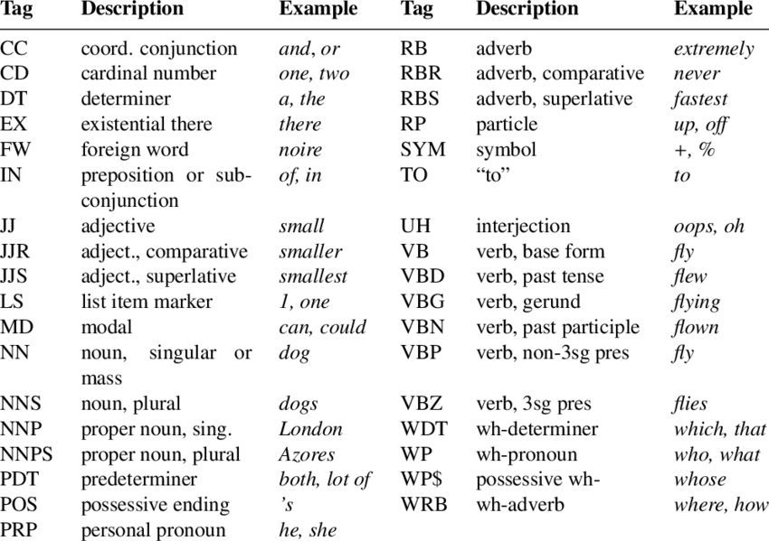

<style>
.reveal section p {
  color: black;
  font-size: .7em;
  font-family: 'Helvetica'; #this is the font/color of text in slides
}


.section .reveal .state-background {
    background: white;}
.section .reveal h1,
.section .reveal p {
    color: black;
    position: relative;
    top: 4%;}

.wrap-url pre code {
  word-wrap:break-word;
}

</style>


Part of Speech Tagging, Sentence Parsing, and Named-Entity Recognition
========================================================
author: Chris Bail 
date: Duke University
autosize: true
transition: fade  
  website: https://www.chrisbail.net  
  github: https://github.com/cbail  
  Twitter: https://www.twitter.com/chris_bail


Outline For Today
========================================================
&nbsp;

1) Part of Speech Tagging;  
2) Sentence Parsing;  
3) Named-Entity Recognition

========================================================

## **Part of Speech Tagging**


What is Part of Speech (POS) Tagging?
========================================================

Examples from the Penn Tree Bank
========================================================
&nbsp;



What is the the Penn Tree Bank?
========================================================
&nbsp;

Hand-coded POS annotations for:

1) 1 Million words of 1989 Wall Street Journal Material  
2) Fully-tagged version of the Brown Corpus (~ 1 mill works published in U.S. since 1961)  
3) Other samples


How does POS-Tagging work?
========================================================


Backend Options for POS Tagging
========================================================
&nbsp;

Stanford CoreNLP   
NLTK Module (in Python)  
UDPipe (new)


POS Tagging in CleanNLP
========================================================
&nbsp;

CleanNLP is a relatively new package in R that handles a variety of NLP tasks including POS tagging. It supports a variety of different backends for this purpose, including CoreNLP, Spacy, and udpipe. We are going to use udpipe because it does not require Java or Python to be installed.  

Here's how we initialize cleanNLP with udpipe:


```
Error in library(cleanNLP) : there is no package called 'cleanNLP'
```
