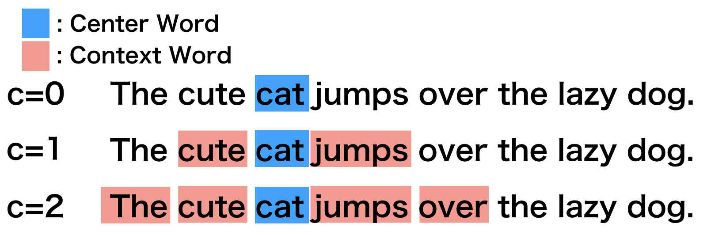
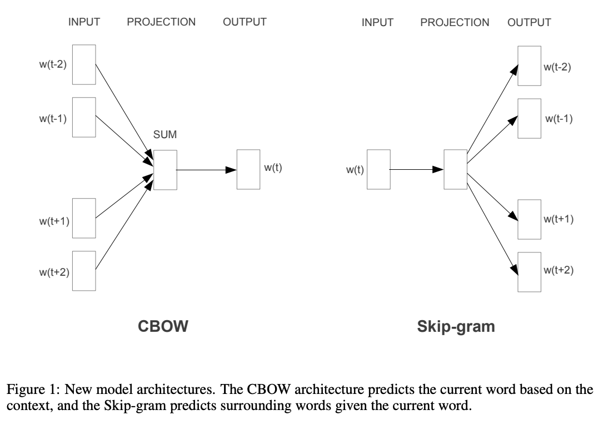

<br>
**[Text as Data Course](https://cbail.github.io/textasdata/Text_as_Data.html)**   
**Chris Bail, PhD**  
**Duke University**  
[www.chrisbail.net](http://www.chrisbail.net)  
[github.com/cbail](https://github.com/cbail)  
[twitter.com/chris_bail](https://twitter.com/chris_bail)  

This page builds upon previous tutorials designed to introduce you to extracting and analyzing text-based data from the internet. This tutorial introduces you to a technique for automated text analysis known as "word embeddings." This tutorial assumes basic knowledge about R and other skills described in previous tutorials at the link above.

## What are Word Embeddings?

In their most basic form, word embeddings are a technique for identifying similarities between words in a corpus by using some type of model to predict the co-occurence of words within a small chunk of text. Word embeddings gained fame in the world of automated text analysis when it was demonstrated that they could be used to identify analogies. Figure 1 illustrates the output of a word embedding model where individual words are plotted in three dimensional space generated by the model. By examining the adjacency of words in this space, word embedding models can complete analogies such as "Man is to woman as king is to queen." If you'd like to explore what the output of a large word embedding model looks like in more detail, check out this [fantastic visualization](https://anvaka.github.io/pm/#/galaxy/word2vec-wiki?cx=-17&cy=-237&cz=-613&lx=-0.0575&ly=-0.9661&lz=-0.2401&lw=-0.0756&ml=300&s=1.75&l=1&v=d50_clean_small.) of most words in the English language that was produced using a word embedding model called GloVE. 


## The Context Window

Word embeddings are created by identifying the words that occur within something called a "Context Window." The Figure below illustrates context windows of varied length for a single sentence. The context window is defined by a string of words before and after a focal or "center" word that will be used to train a word embedding model. Each center word and context words can be represented as a vector of numbers that describe the presence or absence of unique words within a dataset, which is perhaps why word embedding models are often described as "word vector" models, or "word2vec" models.

<br>
{width=500px}
<br>
<br>
<br>

## Two Types of Embedding Models  

Word embeddings are usually performed in one of two ways: "Continuous Bag of Words" (CBOW) or a "Skip-Gram Model." The figure below illustrates the differences between the two models. The CBOW model reads in the context window words and tries to predict the most likely center word. The Skip-Gram Model predicts the context words given the center word. The examples above were created using the Skip-Gram model, which is perhaps most useful for people who want to identify patterns within texts to represent them in multimensional space, whereas the CBOW model is more useful in practical applications such as predictive web search.

<br>
{width=500px}

## Word Embedding Models in Tidytext

Many of the word embedding models currently in use are created using neural networks. Yet a neural network is just one of many possible techniques for identifying patterns of the co-occurence of words within a context window. Before I explain how to create a word-embedding model with a neural network, let's create a simple model in TidyText that draws heavily upon Julia Silge's [wonderful tutorial](https://juliasilge.com/blog/tidy-word-vectors/) on this subject. We will develop an embedding model using a corpus of Tweets by elected officials in the United States from 2018 that is hosted on my github page. The code below reads in that data:

```{r}
load(url("https://cbail.github.io/Elected_Official_Tweets.Rdata"))
```

Next, we are going to drop all tweets that are retweets, because the these will become identical word vectors in our model that will produce poor results. We are also going to create a unique identifier for each tweet to faciliate the tokenization process later on.

```{r, message=FALSE}
library(tidytext)
library(dplyr)
# We want to use original tweets, not retweets:
elected_no_retweets <- elected_official_tweets %>%
  filter(is_retweet == F) %>%
  select(c("text"))
#create tweet id
elected_no_retweets$postID<-row.names(elected_no_retweets)
```

Now we can calculate the Skipgram probabilities-- or how often we find each word next to every other word within the context window. In this example we've set our context window to have a length of eight words. The code is a bit involved because we have to normalize the skipgram probabilities according to the unigram probabilities (or the overall frequency of each word in the corpus)

```{r, message=FALSE}
library(widyr)
#create context window with length 8
tidy_skipgrams <- elected_no_retweets %>%
    unnest_tokens(ngram, text, token = "ngrams", n = 8) %>%
    mutate(ngramID = row_number()) %>% 
    tidyr::unite(skipgramID, postID, ngramID) %>%
    unnest_tokens(word, ngram)

#calculate unigram probabilities (used to normalize skipgram probabilities later)
unigram_probs <- elected_no_retweets %>%
    unnest_tokens(word, text) %>%
    count(word, sort = TRUE) %>%
    mutate(p = n / sum(n))

#calculate probabilities
skipgram_probs <- tidy_skipgrams %>%
    pairwise_count(word, skipgramID, diag = TRUE, sort = TRUE) %>%
    mutate(p = n / sum(n))

#normalize probabilities
normalized_prob <- skipgram_probs %>%
    filter(n > 20) %>%
    rename(word1 = item1, word2 = item2) %>%
    left_join(unigram_probs %>%
                  select(word1 = word, p1 = p),
              by = "word1") %>%
    left_join(unigram_probs %>%
                  select(word2 = word, p2 = p),
              by = "word2") %>%
    mutate(p_together = p / p1 / p2)

```

Let's look at a few lines of the output to get a better sense of what we are doing:

```{r}
normalized_prob[2005:2010,]
```

The variable p_together here describes the probability the word2 occurs within the context window of word1.

A more instructive and useful type of output can be created by filtering this dataframe for an individual word- let's try "Trump":

```{r}
normalized_prob %>% 
    filter(word1 == "trump") %>%
    arrange(-p_together)
```

These are the words that are most likely to occur within a context window of eight words around Trump, and they generally make sense, which is encouraging. Take a minute to try another politician or political term if you like.

Eventually, we want to be able to plot all of the words in our model in multidimensional space. To do this, we need to make a matrix and reduce the dimensionality of that matrix--later we will use a neural net to do this, but for now we are going to use a simple singular value decomposition from the `irlba` package. This will take a little bit of time since it is a large matrix. We are asking for 246 dimensions in the code below.

```{r}
pmi_matrix <- normalized_prob %>%
    mutate(pmi = log10(p_together)) %>%
    cast_sparse(word1, word2, pmi)

library(irlba)
#remove missing data
pmi_matrix@x[is.na(pmi_matrix@x)] <- 0
#run SVD
pmi_svd <- irlba(pmi_matrix, 256, maxit = 500)
#next we output the word vectors:
word_vectors <- pmi_svd$u
rownames(word_vectors) <- rownames(pmi_matrix)
```

Here's a handy function written by Julia Silge to identify synonyms using the word vectors we created above:

```{r}
library(broom)

search_synonyms <- function(word_vectors, selected_vector) {

    similarities <- word_vectors %*% selected_vector %>%
        tidy() %>%
        as_tibble() %>%
        rename(token = .rownames,
               similarity = unrowname.x.)

    similarities %>%
        arrange(-similarity)    
}
```

Let's see what the top synonyms are for the term "president"

```{r}
pres_synonym <- search_synonyms(word_vectors,word_vectors["president",])
pres_synonym
```

Finally, let's plot 200 words from our model in 2 dimensional space. In order to do this, we are going to rerun the SVD in two dimensions for easier plotting and interpretation.

```{r}
pmi_svd <- irlba(pmi_matrix, 2, maxit = 500)

#next we output the word vectors:
word_vectors <- pmi_svd$u
rownames(word_vectors) <- rownames(pmi_matrix)

#grab 100 words
forplot<-as.data.frame(word_vectors[200:300,])
forplot$word<-rownames(forplot)

#now plot
library(ggplot2)
ggplot(forplot, aes(x=V1, y=V2, label=word))+
  geom_text(aes(label=word),hjust=0, vjust=0, color="blue")+
  theme_minimal()+
  xlab("First Dimension Created by SVD")+
  ylab("Second Dimension Created by SVD")
```

Here we see some reasonable output. In the top-right hand corner of the plot we see a series of terms associated with the nomination of Supreme Court Judge Brett Kavanaugh, for example.


## Word2Vec Models with Keras/Neural Networks

Hopefully by now you have a sense of what word embeddings are, and how to create simple embeddings using tidytext and a simple form of dimensionality reduction. The most popular way to create word embeddings at present is to use neural networks. I do not have time to go into a lengthy explanation of how neural networks work here. Instead, I will only provide a very high-level overview. Neural networks a tool for classifying data and making predictions that are modeled upon an idea of how information is processed in the human brain. Essentially, a neural net takes in a series of inputs-- in this case, words-- and outputs something else (in this case, a set of predictions about the likelihood that each word will occur within the context window of another word). Neural nets make such predictions by processing patterns within "hidden layers" between inputs and outputs that identify patterns of relationships at increasingly high levels of aggergation, and using some fairly complex mathematics to assign weights to different "neurons" within each hidden layer using a process known as backpropagation. For a far more detailed explanation of neural nets, check out this [great book](http://neuralnetworksanddeeplearning.com/). To get a more intuitive sense of how neural nets work, check out this neat [interactive tutorial](https://playground.tensorflow.org/#activation=tanh&batchSize=10&dataset=circle&regDataset=reg-plane&learningRate=0.03&regularizationRate=0&noise=0&networkShape=4,2&seed=0.70505&showTestData=false&discretize=false&percTrainData=50&x=true&y=true&xTimesY=false&xSquared=false&ySquared=false&cosX=false&sinX=false&cosY=false&sinY=false&collectStats=false&problem=classification&initZero=false&hideText=false).

Using Neural Networks in R requires interfacing with broader software tools created by Google and others via an API. The most popular platform for building neural networks is called TensorFlow, and the most popular API for accessing TensorFlow at the moment is called Keras (pronounced "KEE-RAS"). Fortunately, wonderful folks at RStudio and Google have created a `keras` package that we will now install:

```{r, eval=FALSE}
install.packages("keras")
library("keras")
```

The `keras` package will install all of the necessary software on your machine. 

```{r, eval=FALSE}
install_keras()
```

If you are on a mac, you should already have a version of Python installed on your machine. Unfortunately, depending upon which version of Python you have installed, you may receive an error and may need to run the following code below from your terminal. Note: copying and pasting both lines of code at the same time will give you an error. You need to run them one by one, as the first line will prompt you to enter your computer user's password (which is required to execute the second line).

```{}
sudo /usr/bin/easy_install pip

sudo /usr/local/bin/pip install --upgrade virtualenv
```

We are also going to need a number of other packages to run the code below-- several of which are a bit buggy:

```{r, eval=FALSE, message=FALSE}
library(reticulate)
library(purrr)
library(text2vec) 
library(dplyr)
library(Rtsne)
library(ggplot2)
library(plotly)
library(stringr)
```

From here on out, we are going to draw heavily upon [this tutorial](https://blogs.rstudio.com/tensorflow/posts/2017-12-22-word-embeddings-with-keras/) from RStudio. First, let's read in our elected official data again, drop retweets, and this time let's also remove urls, which probably aren't going to be very informative in our model. 

```{r, eval=FALSE}
load(url("https://cbail.github.io/Elected_Official_Tweets.Rdata"))

# We want to use original tweets, not retweets:
elected_no_retweets <- elected_official_tweets %>%
  filter(is_retweet == F) %>%
  select(c("screen_name", "text"))

# Many tweets contain URLs, which we don't want considered in the model:
elected_no_retweets$text <- str_replace_all(string = elected_no_retweets$text,
           pattern = "https.+",
           replacement = "")
```

Next, we need to tokenize our text:

```{r, eval=FALSE}
tokenizer <- text_tokenizer(num_words = 20000)
tokenizer %>% fit_text_tokenizer(elected_no_retweets$text)
```

Next, we'll create another function to create skipgrams:

```{r, eval=FALSE}
skipgrams_generator <- function(text, tokenizer, window_size, negative_samples) {
  gen <- texts_to_sequences_generator(tokenizer, sample(text))
  function() {
    skip <- generator_next(gen) %>%
      skipgrams(
        vocabulary_size = tokenizer$num_words, 
        window_size = window_size, 
        negative_samples = 1
      )
    x <- transpose(skip$couples) %>% map(. %>% unlist %>% as.matrix(ncol = 1))
    y <- skip$labels %>% as.matrix(ncol = 1)
    list(x, y)
  }
}
```

Then, we define our model as follows:

```{r, eval=FALSE}
# Number of Dimensions in the embedding vector.
embedding_size <- 128  
# Size of context window
skip_window <- 5       
# Number of negative examples to sample for each word.
num_sampled <- 1       
input_target <- layer_input(shape = 1)
input_context <- layer_input(shape = 1)
```

Now we need to define the matrix we will use for the embeddings:

```{r, eval=FALSE}
embedding <- layer_embedding(
  input_dim = tokenizer$num_words + 1, 
  output_dim = embedding_size, 
  input_length = 1, 
  name = "embedding"
)

target_vector <- input_target %>% 
  embedding() %>% 
  layer_flatten()

context_vector <- input_context %>%
  embedding() %>%
  layer_flatten()

dot_product <- layer_dot(list(target_vector, context_vector), axes = 1)
output <- layer_dense(dot_product, units = 1, activation = "sigmoid")

model <- keras_model(list(input_target, input_context), output)
model %>% compile(loss = "binary_crossentropy", optimizer = "adam")
summary(model)

```

Finall, we are ready to train our model. Note that the quality of the embedding will increase with the number of "epochs" defined in the code below (though this will also slow things down considerably). We use a very small number in this case which will not produce great results but will give you a sense of how to set things up:

```{r, eval=FALSE}
model %>%
  fit_generator(
    skipgrams_generator(elected_no_retweets$text, tokenizer, skip_window, negative_samples), 
    steps_per_epoch = 100, epochs = 2
  )
```

Now we can extract the embeddings as follows:

```{r, eval=FALSE}
embedding_matrix <- get_weights(model)[[1]]

words <- data_frame(
  word = names(tokenizer$word_index), 
  id = as.integer(unlist(tokenizer$word_index))
)

words <- words %>%
  filter(id <= tokenizer$num_words) %>%
  arrange(id)

row.names(embedding_matrix) <- c("UNK", words$word)
```

Now we can find similar words using this function:

```{r, eval=FALSE}
find_similar_words <- function(word, embedding_matrix, n = 5) {
  similarities <- embedding_matrix[word, , drop = FALSE] %>%
    sim2(embedding_matrix, y = ., method = "cosine")

  similarities[,1] %>% sort(decreasing = TRUE) %>% head(n)
}

find_similar_words("republican", embedding_matrix)
find_similar_words("democrat", embedding_matrix)
find_similar_words("partisan", embedding_matrix)
```

And finally, we can visualize the results in two dimensions as follows:

```{r, eval=FALSE}
tsne <- Rtsne(embedding_matrix[2:500,], perplexity = 50, pca = FALSE)

tsne_plot <- tsne$Y %>%
  as.data.frame() %>%
  mutate(word = row.names(embedding_matrix)[2:500]) %>%
  ggplot(aes(x = V1, y = V2, label = word)) + 
  geom_text(size = 3)

```

Which will produce this image:


## ...So what are Word Embeddings Useful for?

Unfortunately, many of us are still trying to work this out. They have obvious applications for industry (especially in the area of search and information retrieval), but it is less clear how they can be used for empirical studies. [Here](https://www.pnas.org/content/115/16/E3635) is an example of a nice descriptive analysis of how word embeddings help identify shifts in gender and ethnic stereotypes over time and there are a number of exciting young scholars who are incorporating embeddings into their research as well such as [Carly Knight](http://as.nyu.edu/content/nyu-as/as/faculty/carly-knight.html).


