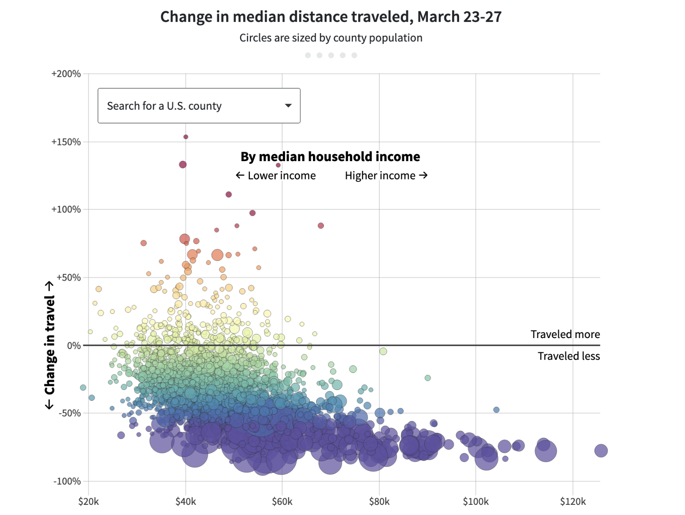
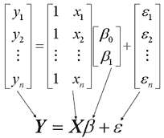

What is Computational Social Science?
========================================================
author: Chris Bail 
date: Duke University
autosize: true
transition: fade  
  website: https://www.chrisbail.net  
  github: https://github.com/cbail  
  Twitter: https://www.twitter.com/chris_bail

========================================================

========================================================

<embed width="1000" height="600" src="https://www.arcgis.com/apps/dashboards/bda7594740fd40299423467b48e9ecf6">  

========================================================

<embed width="1000" height="600" src="https://searchingcovid19.com/">  

========================================================

What is Computational Social Science?
========================================================

What is Computational Social Science?
========================================================

<embed width="1000" height="600" src="https://cbail.github.io/Mapping%20Computational%20Social%20Science.html"> 

https://tinyurl.com/mryt58m6

Prediction vs. Explanation
========================================================
&nbsp;  

Def.
========================================================
&nbsp;  

Computational social science is an interdisciplinary field that advances theories of human behavior by applying computational techniques to large datasets from social media sites, the Internet, or other digitized archives such as administrative records.

