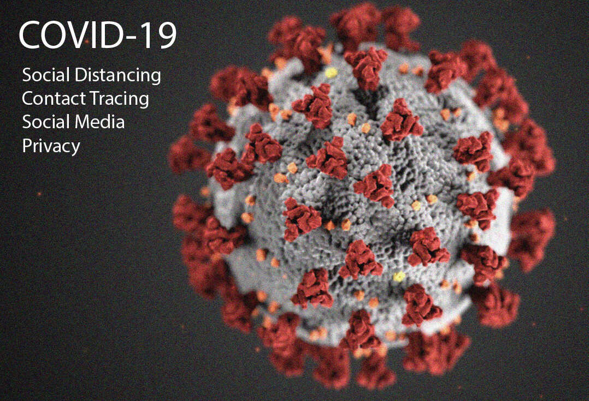
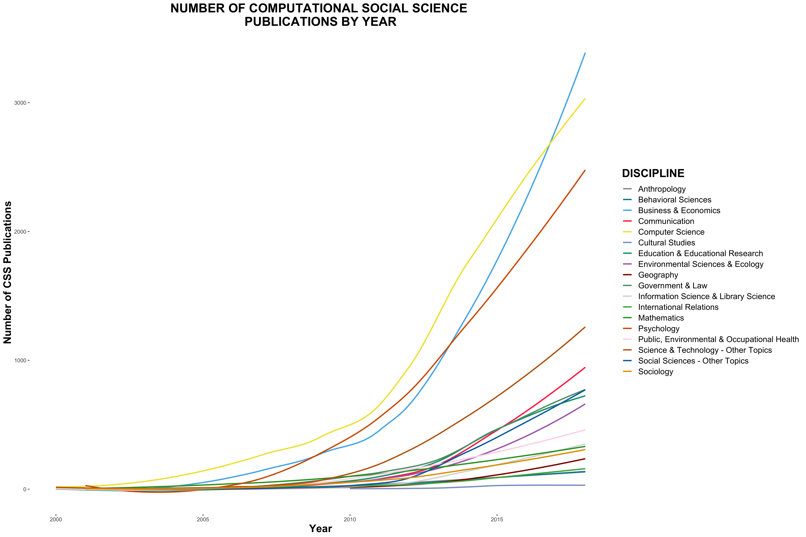
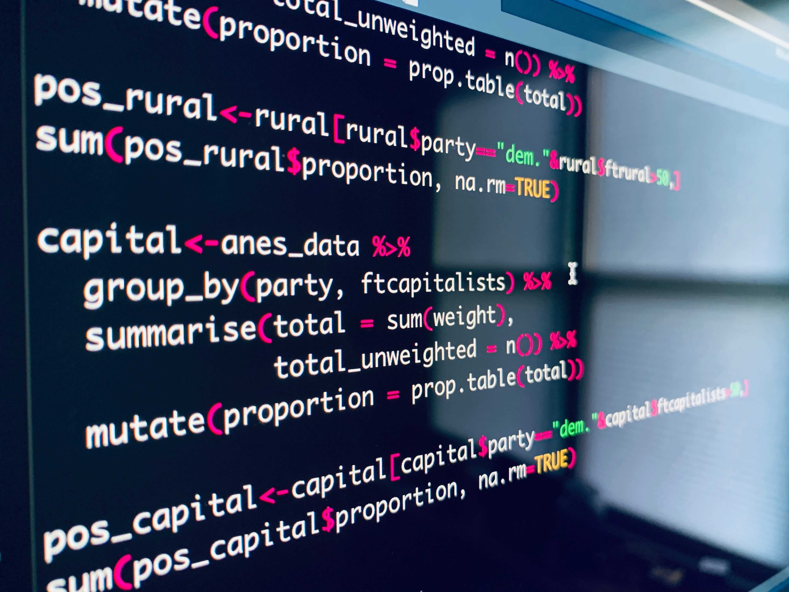
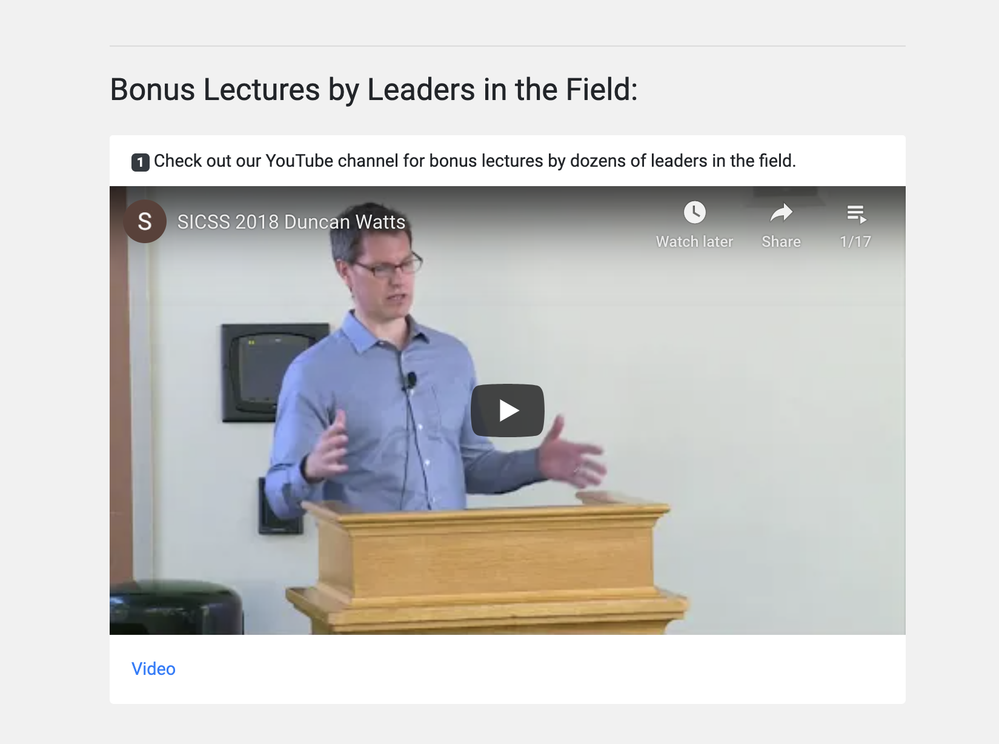
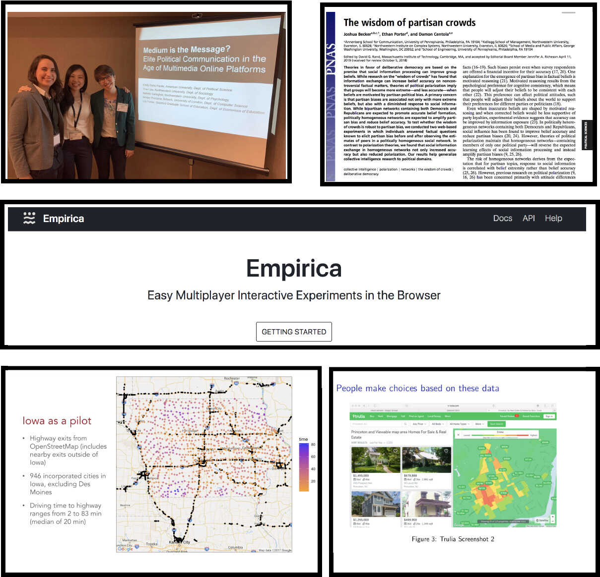

Why SICSS?
========================================================
author: Chris Bail 
date: Duke University
autosize: true
transition: fade  
  Website: https://www.chrisbail.net  
  Twitter: https://www.twitter.com/chris_bail  
  Github: https://github.com/cbail  

========================================================

# **CHALLENGES**

1. Big Problems in the World
========================================================

1. Big Problems in the World
========================================================

2. Our Field is Growing
========================================================

2. Our Field is Growing
========================================================

Source: Web of Science, for more details see [this link](https://www.chrisbail.net/post/mapping-computational-social-science)

3. We Must Grow Together
========================================================

3. We Must Grow Together
========================================================

Source: Web of Science, for more details see [this link](https://www.chrisbail.net/post/mapping-computational-social-science)

4. Training Opporunities are Rare
========================================================

4. Training Opporunities are Rare
========================================================

========================================================

# **SOLUTIONS**

========================================================

Goal #1: State-of-the-Art Training
========================================================

Goal #1: State-of-the-Art Training
========================================================

Goal #2: Foster Interdisciplinarity
========================================================

Goal #2: Foster Interdisciplinarity
========================================================

Goal #2: Foster Interdisciplinarity
========================================================

Goal #2: Foster Interdisciplinarity
========================================================

Goal #2: Foster Interdisciplinarity
========================================================

Disciplinary Background of SICSS participants, 2017-2021

Goal #3: Reach a Broad Audience
========================================================

Goal #3: Reach a Broad Audience
========================================================

<iframe src="https://www.google.com/maps/d/embed?mid=1209PanKId92WptsFB62RO_BvpFcOg7kp&ehbc=2E312F" width="4040" height="680"></iframe>
https://tinyurl.com/mryt58m6

Goal #3: Reach a Broad Audience
========================================================

Check it out: http://varycss.org/

Goal #4: Open-Source
========================================================

Goal #4: Open-Source
========================================================

<iframe src="https://sicss.io/" width="4040" height="680"></iframe>
https://tinyurl.com/mryt58m6

Goal #4: Open-Source
========================================================

Link to our Github [here](https://github.com/compsocialscience/summer-institute)

Goal #5: Teach the Teachers
========================================================

Goal #5: Teach the Teachers
========================================================

Goal #6: Cultivate Diversity
========================================================

Goal #6: Cultivate Diversity
========================================================

You can view the entire list of people who have ever participated in SICSS [here](https://compsocialscience.github.io/summer-institute/people)

Goal #6: Cultivate Diversity
========================================================

========================================================

# **HOW SICSS WORKS**

Schedule
========================================================

Schedule
========================================================

Accessing Materials
========================================================

<iframe src="https://sicss.io/overview" width="4040" height="680"></iframe>

Link to site [here](https://sicss.io/overview)

Visiting Speakers
========================================================

These will be posted on our [website](https://compsocialscience.github.io/summer-institute/curriculum#bonus_lectures) and our [YouTube Channel] (https://www.youtube.com/watch?v=9flaMjO-r24&feature=youtu.be)

Group Projects
========================================================

========================================================

# **EXPECTATIONS**

Openness
========================================================

Patience
========================================================

Togetherness
========================================================

Generosity
========================================================

 
========================================================

# **LET'S GET STARTED!**

