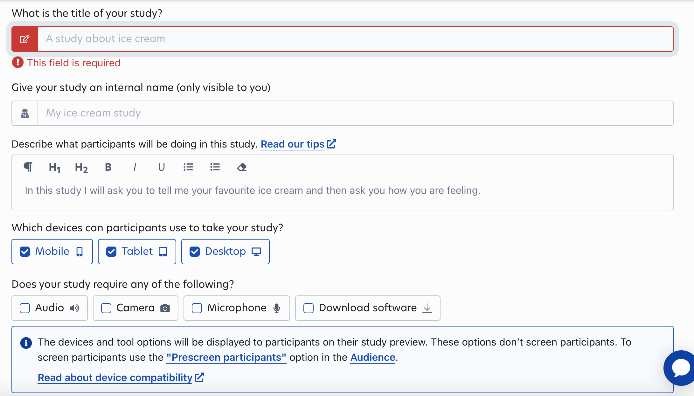

How accurate are estimates from non-probability-based online surveys? Can results from online surveys administered to non-probability-based samples generalize to the broader population? In this activity, we will conduct a survey with Prolific panelists and try a variety of estimation techniques. Then, we will compare our estimates to those that come from high-quality probability-based samples used by the Eurobarometer surveys. 

In the process, we will gain experience with writing survey questionnaires and working with survey software such as Google Forms, collecting survey responses on recruitment platforms such as Prolific, preprocessing/data wrangling in R, analyzing data, implementing various weighting methods, and thinking about broader issues related to survey errors and data quality. Please read this entire document before beginning.

At the beginning of the exercise, we will split you up in groups. Think about how you can divide the work. For example, while some build the questionnaire, others can prepare the Prolific study.

Background readings if you need to refresh the theoretical concepts:

* Slides of today's second session `02_non-probability-sampling.pdf`.
* [Chapter 3 of "Bit by Bit"](https://www.bitbybitbook.com/en/1st-ed/asking-questions/) by Matthew Salganik.
* Paper that motivated this activity: ["Online, Opt-in Surveys: Fast and Cheap, but are they Accurate?"](https://5harad.com/papers/dirtysurveys.pdf) by Goel et al. In this paper, the researchers conduct an opt-in, non-probability survey of people on MTurk. They compared the raw sample estimates and those made after various weighting adjustments to estimates that come from surveys using probability-based sampling methods.

# Creating and running the survey

## Familiarize yourself with the Eurobarometer 

We will use the UK data from the recent Standard Eurobarometer 99 (Spring 2023). 

* You can see a high-level overview of some of the questions asked and aggregate responses in the UK in `group-exercise/data-eurobarometer/eb99_uk_overview.pdf`. You won't need this PDF for anything, it's just to get a feeling for this survey.
* The full set of questions asked and responses given is in `group-exercise/data-eurobarometer/eb99_annex.pdf`.
* I have summarized some substantive variables in `group-exercise/data-eurobarometer/eb99_2023_means.csv`.

## Building the questionnaire in Google Forms

Check out `group-exercise/google-forms-template.pdf`, which contains all the questions which I summarized in `group-exercise/data-eurobarometer/eb99_2023_means.csv`. Some things which should be the same as in the template:

* You should include at least three **demographic questions** (needed for post-stratification): Age, sex and area of residence (Section 4 in `group-exercise/google-forms-template.pdf`). It is always advisable to take the wording from big surveys. In this case, I took the question texts from the [Britsh Election Study](https://www.britishelectionstudy.com/wp-content/uploads/2019/06/Bes_wave15Documentation_V2.pdf).  The population estimates you will need later are in `census/census-2021-cleaned.csv`, which have been taken from the UK [Office of National Statistics](https://www.ons.gov.uk/peoplepopulationandcommunity/populationandmigration/populationestimates/datasets/populationestimatesforukenglandandwalesscotlandandnorthernireland). 
* You should use at least *some* of the **substantive variables** in the `group-exercise/data-eurobarometer/eb99_2023_means.csv`, otherwise there will be nothing to compare to. 
* You must include a question asking for **repondents' Prolific ID** in case we want to validate that a respondent actually completed the survey.
* **Important**: At the end of the questionnaire, provide the **Prolific completion code** to participants (see Section "Deploying the survey on Prolific" for details).
    
Some things are at your discretion:

* You can add other questions you are interested in. However, do not make the survey too long. Note that each group has a fixed budget, so there is a tradeoff between questionnaire length and number of participants. For example, you could decide to shorten the questionnaire by a minute and get more participants (and therefore likely better estimates.)
* In general, think of ways to ensure the quality of the data collected. For example, use attention screeners, offer the "don't know" options judiciously, think about when to require a response, etc. 
    * Attention check: As survey researchers, we want to make sure people actually pay attention. There are ways to check this (Section 2 question 5). The template has an example. If you want to include an attention check, come up with something of your own. Prolific has [guidelines](https://researcher-help.prolific.co/hc/en-gb/articles/360009223553-Prolific-s-Attention-and-Comprehension-Check-Policy) regarding good attention checks.
    * Don't know: The template offers DK option for all substantive questions to make the data as comparable as possible to the Eurobarometer data.
* How to structure the questionnaire into sections: It is generally a good idea to not have too many questions on one page. The template is divided in sections, but feel free to modify them. 
* Mobile-friendliness: Think about how to make the questionnaire work on mobile. Do you want to use matrix questions like in the template? How do they look on mobile? Do you prefer to recruit desktop-only users? (What would that mean for your sample composition?)
* Consent: What do you do with people who do not consent? One option is to send them to the end of the questionnaire directly.

**Important**: Preview the survey, ideally on both mobile and desktop, before publishing it!

## Deploying the survey on Prolific

*Note: Unfortunately, we could not create an institutional Prolific account. I will publish the studies, but need some information from you.*

```{r figurename, echo=FALSE, fig.align = "center", out.width = '75%'}

```

The screenshot above shows some of the interface to publish a study on Prolific. So that I can publish the study, each group should put the following information in [this Google Sheet](https://docs.google.com/spreadsheets/d/1DB0kOiSVq1pIWg3dREPWU8uRj_yGjQRsUgRuI99ITzQ/edit?usp=sharing).

* *What is the title of your study?* This is what Prolific panelists will see when they decide whether to do your study (short).
* *Describe what participants will be doing in this study.* Panelists will also see this, so make your study sound interesting (1-2 sentences).
* *Which devices can participants use to take your study?* You can chose any combination of mobile/desktop/tablet. Think about what I said about question formats.
* *What is the URL of your study?*
* *How long will your study take to complete?* Please test the time of your study before you publish it. In the current template format, the study takes should take 3-4 minutes. Keep in mind the tradeoff length/number of participants.

Somethings I will give you to put into the Google Form:

* *Prolific completion code*

# Analyzing the data

Once we have published your surveys, it may take some time for the reponses to come in. Hopefully, the target number will be met after the lunch break. Since time may be short, you can chose to focus on one of two following to activities.

## Option 1: Start with your own data

Here, the focus is on data preprocessing and wrangling. 

After the data has been collected, download the data as a .csv file. To pre-process the data, you can follow the template `1_preprocessing-template.Rmd`. To make it more challening, look at the cleaned data `group-exercise/data-simulated/survey-simulated-clean.csv` and try to get there without the template.

Once you have pre-processed the data, you can use it to follow the steps described in Option 2.
      
## Option 2: Start with the simulated data set

Here, the focus is on estimation and weighting techniques. 

The simulated data set `group-exercise/data-simulated/survey-simulated-clean.csv` has fake responses to the set of Eurobarometer questions. You can use these data to do the estimations. Specifically, try the following. The template `group-exercise/2a_analysis-template.Rmd` will lead you through the steps:

* Replicate Fig. 1 from [Goel et al.](https://5harad.com/papers/dirtysurveys.pdf)
* Next, try different adjustment methods, and for each method you use, replicate Fig. 2 from [Goel et al.](https://5harad.com/papers/dirtysurveys.pdf)
* When doing the adjustment methods, you should start with the simplest thing first. Do not jump to the most fancy technique right away. You may use post-stratification packages, but only after you have coded up at least one technique by hand (if you have coded one of these techniques as part of your earlier research that counts).
* Start with cell-based post-stratification using a small number of cells. Hint: think about what may happen if you have empty cells.

# Further reading

* Dutwin and Buskirk. ["Apples to Oranges or Gala versus Golden Delicious?: Comparing Data Quality of Nonprobability Internet Samples to Low Response Rate Probability Samples"](https://academic.oup.com/poq/article/81/S1/213/3749202/Apples-to-Oranges-or-Gala-versus-Golden-Delicious) 
* Baker et al. ["Summary Report of the AAPOR Task Force on Non-probability Sampling"](https://academic.oup.com/jssam/article/1/2/90/941418/Summary-Report-of-the-AAPOR-Task-Force-on-Non)
* Kalton and Flores-Cervantes ["Weighting methods"](https://www.scb.se/contentassets/ca21efb41fee47d293bbee5bf7be7fb3/weighting-methods.pdf)
* Berinsky, Margolis, and Sances ["Separating the Shirkers from the Workers? Making Sure Respondents Pay Attention on Self‐Administered Surveys"](https://doi.org/10.1111/ajps.12081)

\newpage


