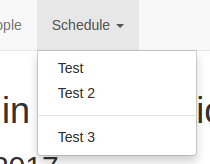

## Navigation Links

You can added custom navigation links to the navbar by editing the appropriate `navigation.yml` file. This file should be a list of links each with a name and url. A simple example would be:

```yaml
- name: People
  url: "#people"
- name: Schedule
  url: "#schedule"
```

If you'd like to have a drop-down menu, you'll need to specify children links. You can do so as follows:

```yaml
- name: Schedule
  url: "#schedule"
  children:
    - name: Test
      url: "#test"
    - name: Test 2
      url: "#test2"
    - separator: true
    - name: Test 3
      url: "#test3"
```

The resulting drop-down would look like this:


