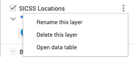
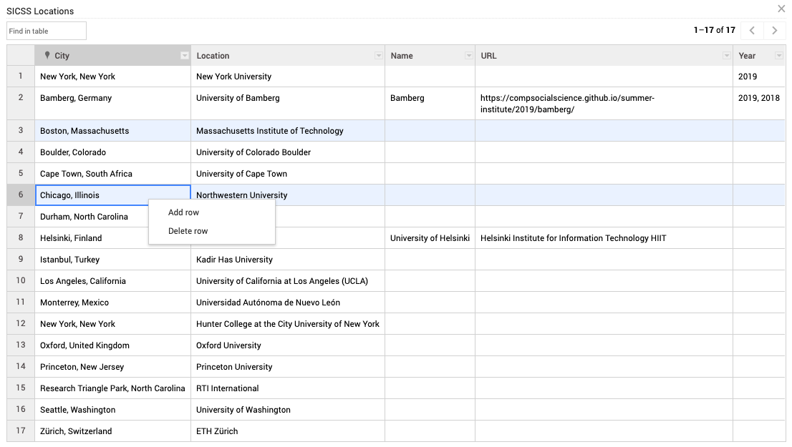
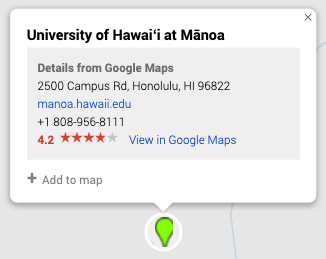

# Overview

This site was originally created for Summer Institute in Computational Social
Science. It is powered by [GitHub Pages](https://pages.github.com/),
[Jekyll](https://jekyllrb.com/), and [Bootstrap](http://getbootstrap.com/).

# Table of Contents

* [Layouts](#layouts)
  * [Default](#default)
  * [Home](#home)
* [Navigation Links](#navigation-links)
* [Sidebar](#sidebar)
  * [Hiding the sidebar](#hiding-the-sidebar)
  * [Customizing the sidebar](#customizing-the-sidebar)
* [Post-Mortems](#post-mortems)
* [Adding Additional Pages](#adding-additional-pages)
* [Homepage](#homepage)
* [Adding a partner location](#adding-a-partner-location)
* [Videos](#videos)
* [Admin Documentation](#admin-documentation)

# Layouts

## Default

The [`default`](_layouts/default.html) layout is a very basic layout with a header, navbar, footer, and area where Markdown content converted to HTML will be placed.

## Home

The [`home`](_layouts/home.html) layout is intended to be used for as the homepage. It in includes the global navigation, announcement banner, hero, and promotional content that is located at the root of the [`_data`](_data) directory. For most of these sections, the content can be controlled by the data populated within these [YAML files](#top-level-directory-specific-yaml-files). Should you want to change the content within the announcement banner, you can update the content in the [`announcements.md`](_includes/anncouncements.md) file at the root of the `_includes` directory.

# Navigation Links

The global navigation links to the various, high level information related to the various programs, both historical and current. They are the following:

* Home: links to homepage
* Locations: lists all historical and upcoming locations
* Curriculum: lists the general curriculum
* People: lists all people to participate, organized by location and year

Each global page has a custom sidebar based upon the data it is responsible for. For `Locations` and `People` these are dynamically generated with each new location (more on this later). In the case of `curriculum` this is controlled by the [`curriculum.yml`](_data/curriculum.yml) file in the root of the `_data` directory.

Curriculum example:
```yaml
- day: Day 1
  id: day_1
  topic: Introduction and Ethics
  events:
    - name: "Introduction to computational social science"
      video: "https://www.youtube.com/embed/EF7X9wwl0q4"
      sublinks:
        - link: "https://youtu.be/EF7X9wwl0q4"
          text: "Video"
        - link: "https://github.com/compsocialscience/summer-institute/blob/master/2019/materials/day1-intro-ethics/02-intro-computational-social-science.pdf"
          text: "Slides"
```

Keep in mind that this `YAML` file controls both the generation of the sidebar and the video listing as well.

# Sidebar

By default, the sidebar links will be automatically generated for pages with
a `layout` of: `people`, `locations`, or `host`. Additionally, if a page has
set `partner_site`, then it will also have a sidebar automatically generated.

## Hiding the sidebar

You can hide the sidebar by adding the following to a page's front matter:
```yaml
sidebar: hide
```

## Customizing the sidebar

You can also completely customize the sidebar updating the page's front
matter to list the links for the sidebar:

```yaml
sidebar:
  - name: "Link to anchor in current page"
    url: "#anchor"
  - name: "Link to another page"
    url: "/summer-institute/curriculum"
  - name: "Link to another site"
    url: "https://www.allourideas.org/"
```
# Post-Mortems

To add a post-mortem, three files are needed:

1. The `sidebar.yml` for the locations even for a particular year, with the following entries (eg. Tokyo 2021):

```
- name: "Post Mortem"
  url: "post-mortem"
  link: '#tokyo'
```

2. The location will also need a `post_mortem.yml` file, with the following entry:

```
- title: Post-Mortem
```

3. The parent year (in this scenario `2021`) will also need a `post-mortem.md` file in it's root, as a sibling to the `index.md` file. This `post-mortem.md` file will contain all of the markdown for that year's post mortems.

In addition, be sure when you are writing the markdown for each event's post mortem, that you include a title tag, with the corresponding anchor id, associated to the `link` value you created in the `sidebar.yml`. In this case `link: '#tokyo'` would anchor to the corresponding title tag in the post mortem's markdown:

`<h2 class="display-4" id="tokyo">Tokyo</h2>`

# Location specific pages

Each location should have it's own unique directory within the file structure. This means, that each location will have a specific directory filled with `YAML` data in `_data/{year}`, as well as a directory of Markdown files in the appropriate year at the root of the project. For simplicity, when creating a new location, we recommend copying the settings from an existing location as a starting point.

## Customizing how the location appears on the locations page

By adding "apply_button: hidden" in `location.yml`, that location's Apply button will be hidden on the location list page, the global apply screen, and the sidebar for that location.

The order of the locations is determined first by the location's order key in their `location.yml` file  (e.g., order: 99) and secondly by the location's title. In other words, the "title" is the the tie break.

# Adding Additional Location Detail Pages

You're free to add additional pages by created a new Markdown file in the directory that would map to the URL that you desire. For example, `/duke/2017/models.md` would be available at the URL `duke/2017/models`.

The Markdown variation that is used by GitHub Pages is [kramdown](https://kramdown.gettalong.org/quickref.html).

You'll always want to include the proper front-matter in the Markdown file to give the page a [layout](#layouts) and a title. Again, we suggest referring to the structure of the other markdown files within the locations directory, to ensure that the correct front-matter is present.

You will also want to update the `sidebar.yml` file within the appropriate location, and add a link to point to your newly created page.

Sidebar example: (eg. [`_data/2020/duke/sidebar.yml`](_data/2020/sidebar.yml))
```yaml
- name: People
  url: "people"
- name: Travel
  url: "travel"
- name: Schedule & Materials
  url: "schedule"
```

and to add a link to the newly created `models.md`:

Sidebar example updated: (eg. [`_data/2020/duke/sidebar.yml`](_data/2020/sidebar.yml))
```yaml
- name: Models
  url: "models"
- name: People
  url: "people"
- name: Travel
  url: "travel"
- name: Schedule & Materials
  url: "schedule"
```

# Adding a partner location

As mentioned early, the global `Locations` page and sidebar is powered by each individual location directory within the file structure. This means, that when a new location is added, the global locations page with update with a new card, the sidebar will update with the appropriate link, and a new `location_detail` page will be generated.

Partner locations must have their own directory with one or more pages. For example, a partner location for 2020 at Northwestern University can have a URL like [https://compsocialscience.github.io/summer-institute/2020/northwestern/](https://compsocialscience.github.io/summer-institute/2018/northwestern/) complete with their own data and sub-pages.

Example steps for creating a new partner location for 2018 at Northwestern University:
1. Create a new file at `2018/northwestern/index.md`.
2. Front matter data in the newly created file should at least include:
   ```yaml
    ---
    layout: location_detail
    partner_site: northwestern
    main: true
    image: /assets/images/location.jpg
    ---
   ```
   The `partner_site` field above tells the site where to look for the data files for this page. In this example, it'd use the data files in `_data/2018/northwestern`. The `main` field identifies that this is the `index.md` file, and should look for the appropriate layout (with images and correct format)
3. Create the data files as desired. For example data, feel free to checkout the `.yml` files in `_data/2019`. When creating the `sidebar.yml` file, you'll need to be sure that the corresponding markdown files exist, or the link with throw a `404: page not found` error.

4. Additional markdown pages may be created inside the `2020/northwestern/` directory. They should use the following front matter data:
    ```yaml
      ---
      layout: location_detail
      partner_site: northwestern
      ---
    ```
    Keep in mind, that this will create a type of `default` location_detail page, that will only read and render the markdown. These pages will therefore be static and not data driven.

    In order to keep things uniform, we also suggest using the same title styling for the title of this new page:

    `<h1 class="display-4">My Page Title</h1>`

    So after creation, this new page's markdown file should look similar to the following:

    ```yaml
      ---
      layout: location_detail
      partner_site: northwestern
      ---

      `<h1 class="display-4">My Page Title</h1>`

      # Markdown here
    ```


5. If the home page for the partner location needs a "People" section, add a `people.md` file to the `2020/northwestern` directory. Ensure that the front-matter also matches the other locations with the `people: true` flag to generate the appropriate layout. This will pull the appropriate data from the `people.yml` files created in the `_data` directory.

6. If the home page for the partner location needs a "Schedule & Materials" section, add a `schedule.md` to the `2020/northwestern` Ensure that the front-matter also matches the other locations with the `schedule: true` flag to generate the appropriate layout. Keep in mind that this page is also data driven. Update the `YAML` files appropriately

7. If the location is currently accepting applications, add a `apply.md` to the `2020/northwestern` directory, and also create a `apply.yml` file in the `_data/2020/northwestern` directory with the following data:

  ```yaml
    title: Northwestern University 
  ```

  once both of these files are created appropriately, it will trigger a new listing on the global `Apply` page, and also create an `Apply` button on the location's listing on the `Locations` page.

8. Additional images for the partner site may be added to the `images/` directory within that location directory.

# Videos

Video files are located in the `_videos` folder. The title for each video is going to be the direct link for that video. For example, `welcome-to-boot-camp.md` will auto-generate this link `https://sicss.io/overview/welcome-to-boot-camp` for that specific video. To add a video file, just drop in a `video-file-name-here.md` file in this folder.

Order-wise, since the current videos have no `date_published` dates, manual orders for each video is set with `has_order`. Bootcamp videos are displayed first, in their respective `has_order` values, followed by non-bootcamp videos. If `has_order` is not set, it will take precedence over other videos (order-wise).

For YouTube links and previews, they are set like this (`welcome-to-boot-camp` example):

```
preview: https://i.ytimg.com/vi/QB5ypzhIMA8/hqdefault.jpg
video_url: https://www.youtube.com/watch?v=QB5ypzhIMA8
embed_url: https://www.youtube.com/embed/QB5ypzhIMA8
```

Once you find the YouTube link of a video, you can paste that into `video_url`. The unique video ID is at the end, for the example above, it is `QB5ypzhIMA8`. Simply replace that unique video ID for both `preview` and `embed_url` to easily embed the YouTube video and image preview.

When adding a title to the video file, if the title contains a colon (:) (Or any other special characters), ensure that the title is encapsulated within quotation marks. If not, the video will not properly show up. For example, this title would cause errors:

`title: Tutorial 1: Comparing Word Embedding Models`

To fix this, let's add quotations marks:

`title: "Tutorial 1: Comparing Word Embedding Models"`

## Google Map

The map is an embed of google maps api. You can add new users to the map as editors, so long as they also have a google account. Be sure to groom this list of editors, and not to have more editors than are necessary.

You can see all the current locations by updating the `SICSS Locations` layer by clicking it's elipsis, then clicking `Open Data Table`. You can remove existing rows by right clicking the row, and clicking `Delete Row`

Step One:


Step Two:


To add new locations, you can search for the location in the search bar (just like you would in google maps). The api will then drop a pin on the location you searched for, where it can then be added by clicking on it. For instance, if you wanted to add the University of Hawaii to you map, the detail card would look like:



You can also change the theme of the map, by selecting one of google's themes under the `Base map` dropdown in the google map console. Keep in mind that when selecting a new theme, it will take a few minutes to register before it is reflected on the production website.

## Requesting access

In order to grant access, we'll need the GitHub usernames of the contributors and the directory name that will be used for the partner site (e.g., `/helsinki` or `/chicago`).

## Submitting changes

In order to make changes to your partner site and have them reflected on the main site, you'll need to get your changes into the `master` branch. You can do this on your own, once you've been granted access (see above).

1. Create a new git branch.
2. Make changes to only the directories you're allowed access to (e.g., `2018/chicago` and `_data/2018/chicago`).
3. Commit your changes to git.
4. Push your changes _to this repository_.
5. Create a pull request to merge your branch into the `master` branch.
6. If all the tests pass, you will be able to merge your changes into `master` via the button the pull request. If the tests fail, inspect the errors from the tests and make corrections by pushing fixes to your branch.
7. Within a few minutes of merging into master, your changes should be deployed to the live site. You may need to clear your browser cache.

# Admin Documentation

Admins of this repository may add and remove collaborators from the [collaboration settings screen](https://github.com/compsocialscience/summer-institute/settings/collaboration). Simply invite people via their GitHub user name giving them "Write" permission.
