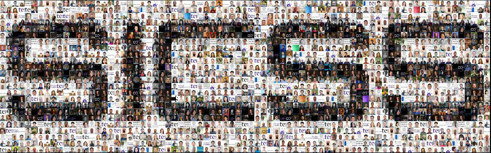

## Our Mission

Recent years have witnessed an explosion of data from social media sites, such as Facebook and Twitter, and the digitization of massive governmental administrative records. The digital age has also created novel opportunities for online field experiments, new types of public opinion surveys, and mass collaboration. This influx of new data sources occurs alongside the emergence of innovative forms of data analysis—often inspired by ideas from machine learning. Together, these opportunities hold enormous potential to help understand and address some of the world’s most pressing problems—from COVID-19 to economic recession and social unrest. They also raise important new questions about privacy and ethics. Yet there is a major barrier to realizing this potential: the vast majority of people do not yet have access to training in the methods necessary to collect, analyze, and interpret these data. The small group of people who do have such skills often have little training in social science research. Training the next generation of researchers at the intersection of social science and data science is therefore paramount to advance urgently needed research about human behavior in the digital era.

## What we do

The [Summer Institutes in Computational Social Science (SICSS)](http://sicss.io), an initiative housed at the [Social Science Research Council](https://www.ssrc.org), were created to provide free training to the next generation of researchers at the intersection of social science and data science— and to incubate cutting-edge research across disciplinary boundaries. Participants at each institute a) hear lectures by leading scholars in the field on a range of subjects from automated text analysis to experiments on social media platforms; b) participate in group training exercises; and c) launch interdisciplinary research projects. SICSS thus aims to provide open, high-quality training in computational social science to researchers around the world in order to accelerate the growth of the field and ensure that it develops practices that are in the long-term interests of science and society. Lectures are live-streamed to all SICSS sites from a central location and supported via a vibrant online community that includes open-source education materials that can be used for further self-study or as a model for computational social science courses within other organizations.

## Impact

Since 2017, the Summer Institutes in Computational Social Science in partnership with the Social Science Research Council have raised over $1.5 million (USD) to sponsor sites at fifty-three locations around the world, bringing together 1,046 participants from 500 universities and 150 academic fields. Research incubated at SICSS events has appeared in leading journals and received coverage from  major media outlets. More than 150,000 unique visitors viewed our website from 198 countries during this period. We have almost made considerable progress towards expanding access to training among traditional under-represented groups in the field, including an alumni-led initiative called [Varycss.org](https://varycss.org).

An unofficial 2021 self-study revealed that SICSS participants have created over 100 projects born out of past SICSS, ranging from papers to software to community building initiatives. [Click here](https://sicss.io/projects) to see a non-comprehensive list of some past projects.

In September 2021, with support from the Russell Sage Foundation and the Alfred P. Sloan Foundation, the SSRC awarded 25 research grants to teams of participants in SICSS-2021. Projects spanned a wide number of disciplines and geographic focus areas, and comprise a small sample of the growing body of work that has emerged from SICSS. [Click here](https://www.ssrc.org/programs/digital-culture/the-summer-institutes-in-computational-social-science/sicss-research-grantees/) to view the 2021 SICSS Research Grantees.

## Get Involved

If you'd like to participate in one of our institutes, check out [this year's locations](https://sicss.io/locations). If you'd like to learn more about hosting your own SICSS location during a future year, please visit [this link](https://sicss.io/host). If you'd like to see what we've learned about the best-practices of running a SICSS site, check out our crowd-sourced post-mortems [here.](https://sicss.io/2022/post-mortem)

  
